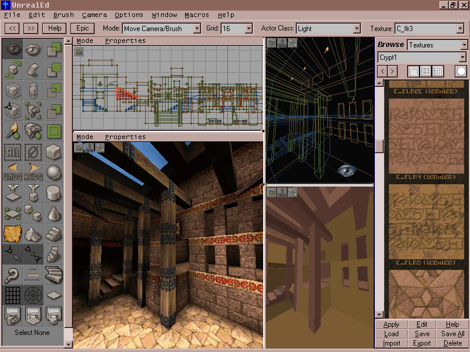
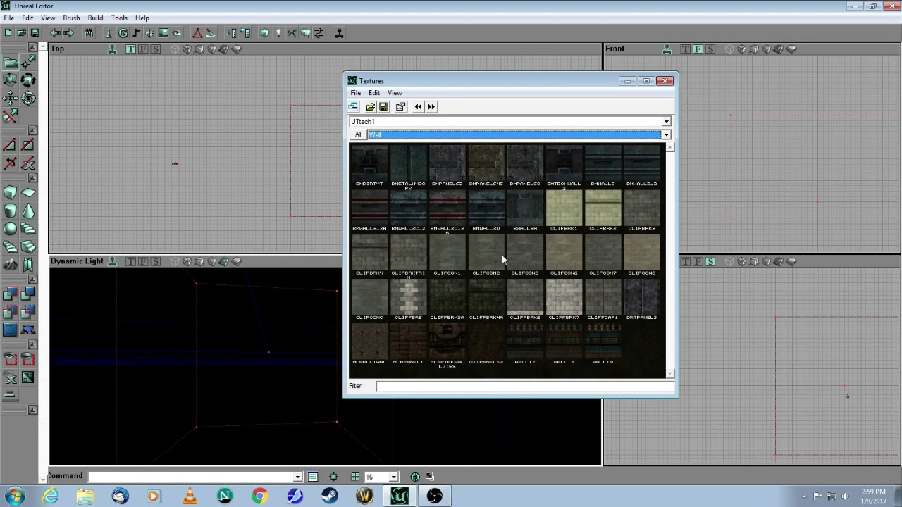
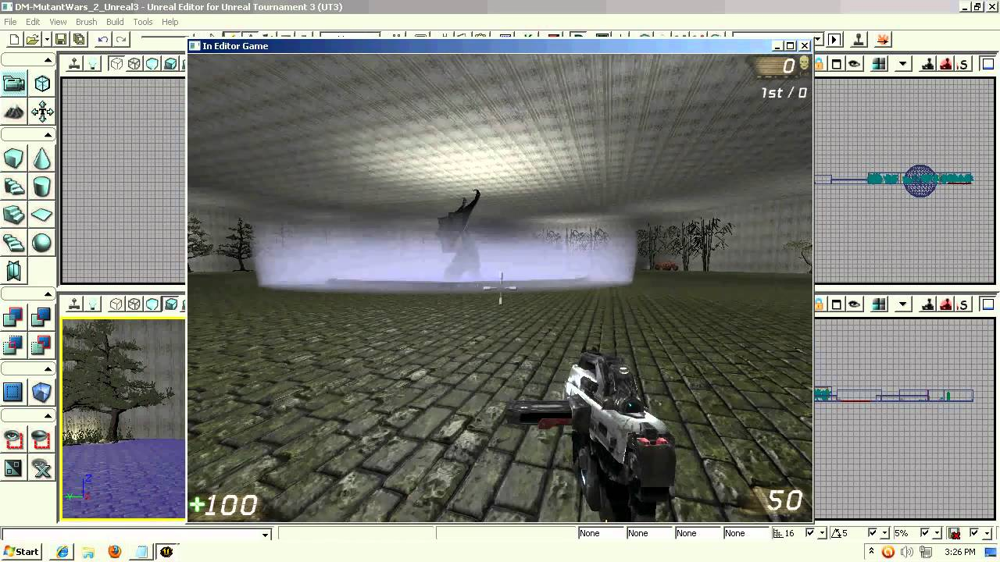
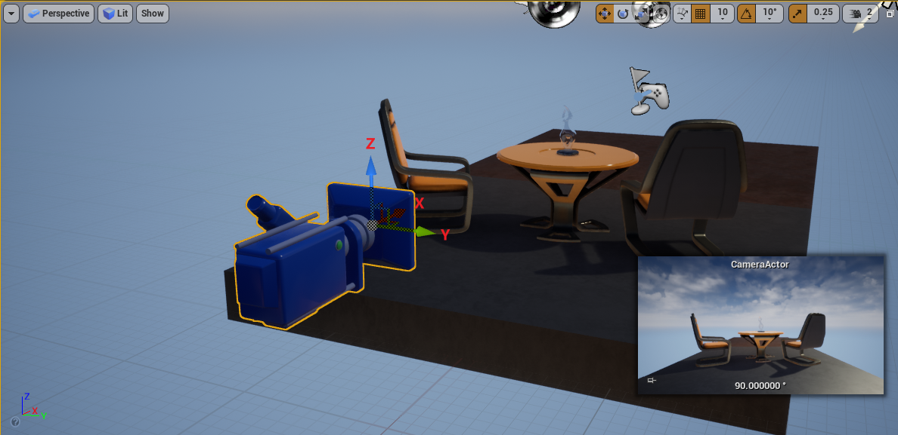

# Chapter 01: 개요 및 기초

> 원문: https://www.cnblogs.com/timlly/p/13877623.html
> 시리즈: 剖析虚幻渲染体系 (Unreal 렌더링 시스템 분석)

---

## 목차

1. [엔진 발전 역사](#1-엔진-발전-역사)
2. [렌더링 체계 개요](#2-렌더링-체계-개요)
3. [C++ 언어 기능 및 기초](#3-c-언어-기능-및-기초)
4. [컨테이너 및 수학 라이브러리](#4-컨테이너-및-수학-라이브러리)
5. [좌표 공간 시스템](#5-좌표-공간-시스템)
6. [메모리 관리 시스템](#6-메모리-관리-시스템)
7. [가비지 컬렉션](#7-가비지-컬렉션)
8. [메모리 배리어](#8-메모리-배리어)
9. [엔진 오브젝트 계층 구조](#9-엔진-오브젝트-계층-구조)
10. [엔진 시작 파이프라인](#10-엔진-시작-파이프라인)

---

## 1. 엔진 발전 역사

### 1.1 Unreal Engine 1 (1995)

- 컬러 라이팅, 충돌 감지
- 씬 에디터
- 소프트 렌더러 → Glide API


*Unreal Engine 초대 에디터 인터페이스*

---

### 1.2 Unreal Engine 2 (1998)

- 향상된 툴체인, 파티클 시스템
- Karma physics engine 기반 물리 시뮬레이션


*Unreal Engine 2 에디터 인터페이스*


*UE2 기반 게임 Killing Floor 화면*

---

### 1.3 Unreal Engine 3 (2004)

- 객체지향 설계
- 프로그래머블 렌더링 파이프라인
- HDR 렌더링, 파괴 가능 환경
- 실시간 GI 솔루션


*Unreal Engine 3 에디터 인터페이스*


*Batman: Arkham City 게임 화면*

---

### 1.4 Unreal Engine 4 (2008)

- PBR 워크플로우
- 디퍼드 렌더링
- 실시간 레이트레이싱 (4.22+)
- Blueprint 시스템
- 2015년 오픈소스화


*UE4 에디터 인터페이스*


*UE4.22 실시간 레이트레이싱 화면*


*Final Fantasy VII Remake - UE4 기반*


*UE4로 렌더링된 영화급 버추얼 캐릭터*

---

### 1.5 Unreal Engine 5 (2021)

- **Nanite**: 수십억 폴리곤 지원
- **Lumen**: 동적 글로벌 일루미네이션
- Chaos 물리 엔진


*"Lumen in the Land of Nanite" 데모 화면*

---

## 2. 렌더링 체계 개요

### 렌더링 발전의 핵심 철학

> "소프트웨어와 하드웨어 기술 발전에 순응하여, 제한된 하드웨어 자원을 충분히 활용하고, 더 빠르고 좋게 더 사실적이거나 스타일화된 화면을 렌더링한다."

### 기술 발전 타임라인


*DirectX 11의 테셀레이션, 컴퓨트 셰이더 등 신기능*


*CPU 코어 주파수 성장 (1970-2011) - 무어의 법칙과 한계*


*2006년 전후 CPU 성능과 코어 수 변화*

### Frame Graph (RDG)


*Frame Graph(RDG)는 엔진 기능 모듈과 GPU 리소스를 분리하여 메모리, VRAM, Pass 스케줄링 최적화*

### 실시간 레이트레이싱


*UE 4.22 실시간 레이트레이싱 발표 - "Troll" 데모 (Epic Games & Goodbye Kansas Studios)*

---

## 3. C++ 언어 기능 및 기초

### 3.1 Lambda 표현식

UE는 명령 큐잉을 위해 C++11 람다를 광범위하게 사용합니다.

```cpp
ENQUEUE_RENDER_COMMAND(AddPrimitiveCommand)(
    [Params = MoveTemp(Params), Scene, PrimitiveSceneInfo](FRHICommandListImmediate& RHICmdList)
    {
        SceneProxy->CreateRenderThreadResources();
        Scene->AddPrimitiveSceneInfo_RenderThread(PrimitiveSceneInfo, PreviousTransform);
    });
```

### 3.2 스마트 포인터 시스템

| UE 타입 | C++ 표준 동등물 | 용도 |
|---------|-----------------|------|
| **TSharedPtr** | shared_ptr | 참조 카운팅 소유권 |
| **TUniquePtr** | unique_ptr | 독점 소유권, 이동 가능 |
| **TWeakPtr** | weak_ptr | 비소유 참조, 순환 참조 방지 |
| **TSharedRef** | — | null이 될 수 없는 공유 포인터 |

### 3.3 델리게이트 시스템

```cpp
DECLARE_DELEGATE_OneParam(FOnEndCaptureDelegate, FRHICommandListImmediate*);
DECLARE_MULTICAST_DELEGATE(FOnMulticastDelegate, ParamType);

if (Delegate.IsBound())
    Delegate.Execute(Args);
```

### 3.4 네이밍 컨벤션

| 접두사 | 의미 | 예시 |
|--------|------|------|
| **U** | UObject 파생 클래스 | UStaticMesh |
| **A** | AActor 파생 클래스 | ACharacter |
| **S** | Slate 위젯 | SButton |
| **I** | 인터페이스 | IInputProcessor |
| **E** | 열거형 | EBlendMode |
| **F** | 구조체/일반 클래스 | FVector |
| **T** | 템플릿 | TArray |
| **b** | Boolean 변수 | bPendingDestruction |


*C++ 컴포넌트 변수에 주석 추가 시 UE 컴파일 시스템이 캡처하여 에디터 툴팁에 적용*

---

## 4. 컨테이너 및 수학 라이브러리

### 4.1 핵심 컨테이너 (UE vs STL)

| 컨테이너 | UE | STL | 주요 차이점 |
|----------|----|----|-------------|
| **배열** | TArray | vector | 성장 전략: 3/8 비례 + 16 상수 |
| **연결 리스트** | TDoubleLinkedList | list | 침투적 구조 |
| **해시 맵** | TMap | unordered_map | TSparseArray를 통한 정렬 |
| **집합** | TSet | set | 해시 기반 버킷팅 |
| **큐** | TQueue | queue | Lock-free MPSC/SPSC 모드 |

### 4.2 TArray 성장 전략

```cpp
SizeType DefaultCalculateSlackGrow(SizeType NumElements, SizeType NumAllocatedElements, ...)
{
    if (NumAllocatedElements == 0)
        Grow = 4;
    else
        Grow = NumElements + 3 * NumElements / 8 + 16;
    return Grow;
}
```

### 4.3 벡터 압축 (3D → 2D)


*단위 구 → 팔면체 → 2D 정사각형 투영*

```cpp
// Engine\Shaders\Private\DeferredShadingCommon.ush
float2 UnitVectorToOctahedron(float3 N)
{
    N.xy /= dot(1, abs(N));
    if (N.z <= 0)
        N.xy = (1 - abs(N.yx)) * sign(N.xy);
    return N.xy;
}
```

### 4.4 핵심 수학 타입

| 타입 | 설명 |
|------|------|
| **FMatrix** | 4x4 행렬 |
| **FQuat** | 쿼터니언 (회전) |
| **FVector** | 3D 벡터 |
| **FVector2D** | 2D 벡터 |
| **FVector4** | 4D 벡터 (동차 좌표) |
| **FRotator** | 오일러 각 (Pitch, Yaw, Roll) |
| **FBoxSphereBounds** | AABB + 구체 경계 |

---

## 5. 좌표 공간 시스템

UE는 **왼손 좌표계**를 사용합니다 (DirectX와 동일).


*UE 카메라 뷰의 기본 좌표계 방향*

### 8가지 핵심 좌표 공간

| 공간 | 별칭 | 속성 | 변환 |
|------|------|------|------|
| **Tangent** | 정점별 기저 | 직교 정규 | TangentToLocal |
| **Local** | ObjectSpace | 직교 | LocalToWorld |
| **World** | — | 월드 좌표 | WorldToView |
| **TranslatedWorld** | — | World - Camera.Position | BasePass 계산 |
| **View** | CameraSpace | 카메라 원점 | ViewToClip |
| **Clip** | HomogeneousCoordinates | 투영 후 | W = View.Z |
| **Screen** | NDC | [-1,1] xy, [0,1] z | 원근 분할 |
| **Viewport** | WindowCoordinates | 픽셀 좌표 | 화면 매핑 |

### Tangent Space


*모델 정점의 탄젠트 공간 - 각 정점마다 고유한 탄젠트 공간 보유*


*정점에서 직교 탄젠트 공간의 3축(T, B, N) 계산 공식*

**Tangent Space의 장점:**
1. 노말 맵 재사용성
2. 스켈레탈 애니메이션 노말 보정
3. 노말 맵 압축 (XY만 저장)

---

## 6. 메모리 관리 시스템

### 6.1 할당자 계층 구조

```
FMalloc (추상 기본 클래스)
├─ FMallocAnsi        (stdlib malloc/free)
├─ FMallocBinned      (기본값, 42개 블록 크기 풀)
├─ FMallocBinned2     (단순화된 비닝)
├─ FMallocBinned3     (64비트 전용, 스레드 캐시)
├─ FMallocTBB         (Intel Threading Building Blocks)
└─ FMallocStomp       (디버그용 가드 페이지)
```

### 6.2 FMallocBinned 전략

| 크기 범위 | 전략 | 상세 |
|-----------|------|------|
| **0 ~ 32KB** | Small 블록 | `PoolTable[42]` (8B → 32KB) |
| **32 ~ 96KB** | Medium 블록 | `PagePoolTable[2]` (3 또는 6 페이지) |
| **> 96KB** | 직접 OS 할당 | 해시 버킷으로 추적 |

### 6.3 플랫폼별 기본값

| 플랫폼 | 기본 할당자 |
|--------|-------------|
| **Windows** | Binned, TBB (에디터), Binned3 (64비트) |
| **Android/Apple/Linux** | Binned |

---

## 7. 가비지 컬렉션

### Mark-Sweep 알고리즘 (3단계)

| 단계 | 영문명 | 설명 |
|------|--------|------|
| **1단계** | Reachability Analysis | 루트부터 순회, 도달 가능 객체 마킹 |
| **2단계** | Unreachable Collection | 마킹 안 된 객체 수집 |
| **3단계** | Incremental Purge | 수집된 객체 파괴 |

```cpp
void CollectGarbageInternal(EObjectFlags KeepFlags, bool bPerformFullPurge)
{
    TagUsedRealtimeGC.PerformReachabilityAnalysis(KeepFlags, bForceSingleThreaded, bWithClusters);
    GatherUnreachableObjects(bForceSingleThreaded);
    IncrementalPurgeGarbage(false);
    FMemory::Trim();
}
```

---

## 8. 메모리 배리어

### 컴파일 타임 배리어

| 컴파일러 | 구문 |
|----------|------|
| **GCC** | `__sync_synchronize()` |
| **MSVC** | `_ReadWriteBarrier()` |
| **C11/C++11** | `atomic_signal_fence(memory_order_acq_rel)` |

### 하드웨어 메모리 배리어

| 배리어 타입 | 방지하는 재배열 |
|-------------|-----------------|
| **LoadLoad** | 읽기 후 읽기 |
| **StoreStore** | 쓰기 후 쓰기 |
| **LoadStore** | 읽기 후 쓰기 |
| **StoreLoad** | 쓰기 후 읽기 (범용) |

---

## 9. 엔진 오브젝트 계층 구조

### UObject 계층


*UObject 상속 구조*

```
UObject (모든 반사 가능 타입의 기반)
├─ 메타데이터, 리플렉션(UClass), GC 지원, 직렬화
│
├─ AActor (월드에 배치 가능)
│  ├─ ACharacter (플레이어/NPC)
│  ├─ AController (입력/AI)
│  ├─ APawn (물리적 캐릭터)
│  └─ ALight (조명)
│
└─ UActorComponent (Actor에 부착 가능)
   ├─ USceneComponent (트랜스폼)
   │  └─ UPrimitiveComponent (렌더링, 물리)
   │     └─ UMeshComponent
   │        ├─ UStaticMeshComponent
   │        └─ USkeletalMeshComponent
   └─ UActorComponent (비공간적)
```

### World/Level/Engine 구조

```
UEngine
├─ GEngine (전역 싱글톤)
│
├─ UWorld
│  ├─ Persistent Level (ULevel)
│  ├─ Streaming Levels
│  ├─ FScene (렌더링 데이터)
│  └─ PhysicsScene
│
└─ Renderer, Physics, Audio 시스템
```

---

## 10. 엔진 시작 파이프라인

### Phase 1: 사전 초기화 (PreInit)

| 순서 | 작업 |
|------|------|
| 1 | 시작 화면 표시 |
| 2 | 스레드 설정 |
| 3 | 코어 모듈 로드 |
| 4 | 메모리, I/O 초기화 |
| 5 | RHI 설정 |
| 6 | 에셋/셰이더 캐시 |

### Phase 2: 엔진 초기화 (Init)

- GEngine 인스턴스 생성
- 서브시스템 초기화
- 맵 로드

### Phase 3: 메인 루프 (Tick)

```
1. 스레드 하트비트
2. 틱 가능 객체 업데이트
3. 렌더링 명령 플러시
4. 게임 로직 틱
5. 물리 시뮬레이션
6. 애니메이션 업데이트
7. 렌더링
8. OS 이벤트 처리
```

### Phase 4: 엔진 종료 (Exit)

- 렌더 명령 플러시
- 액터/월드 파괴
- 모듈 언로드
- GPU 리소스 해제

---

## 요약

| 계층 | 책임 | 핵심 클래스 |
|------|------|-------------|
| **Gameplay** | 로직, 입력, 물리 | AActor, APawn |
| **Rendering** | 씬 구성, GPU 명령 | FScene, FPrimitiveSceneProxy |
| **RHI** | API 추상화 | FRHICommandList |
| **Platform** | OS/HW 인터페이스 | FPlatformMemory |
| **Core** | 메모리, 리플렉션 | FMemory, TArray, UObject |

---

## 참고 자료

- 원문: https://www.cnblogs.com/timlly/p/13877623.html
- Unreal Engine 공식 문서: https://docs.unrealengine.com/
- Epic Games GitHub: https://github.com/EpicGames/UnrealEngine
