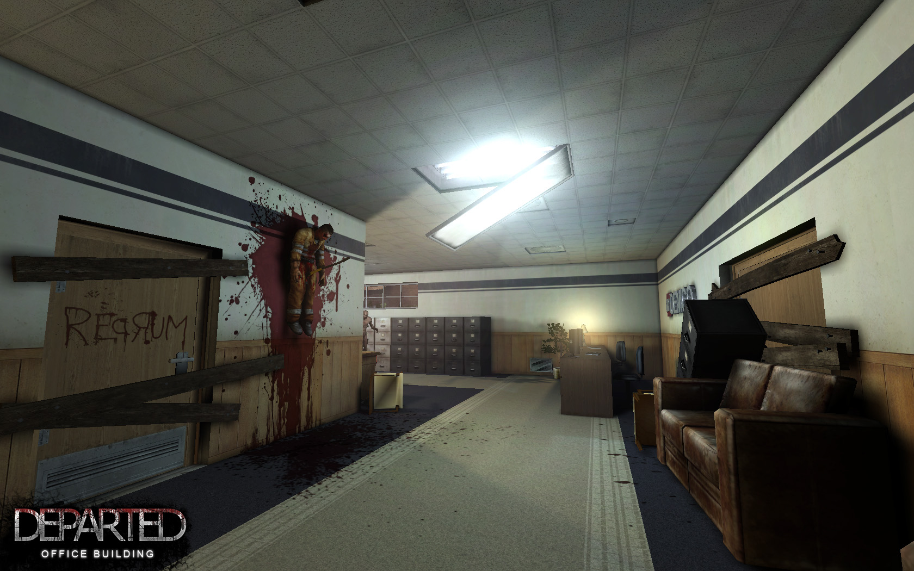
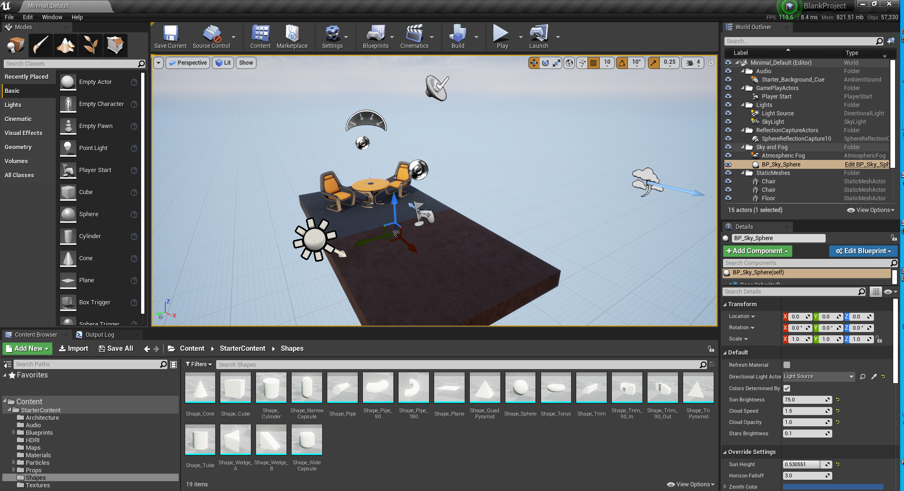
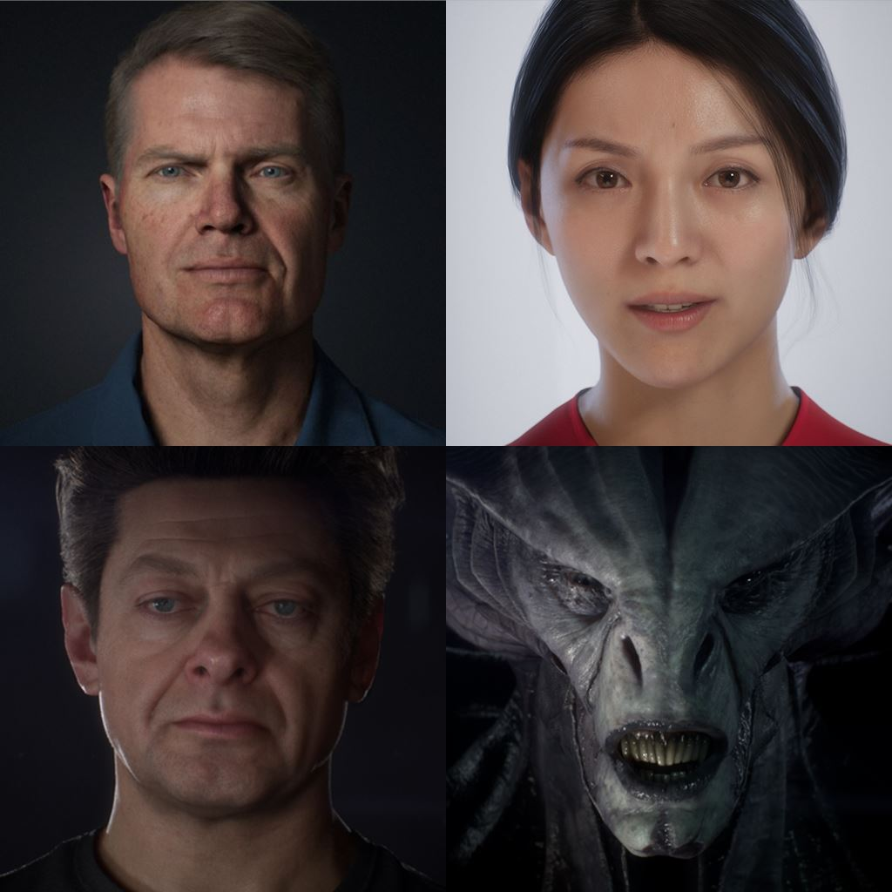

# 01. 엔진 발전 역사

> Unreal Engine의 25년 역사와 각 버전별 기술 혁신

---

## 목차

1. [Unreal Engine 1 (1995)](#1-unreal-engine-1-1995)
2. [Unreal Engine 2 (1998)](#2-unreal-engine-2-1998)
3. [Unreal Engine 3 (2004)](#3-unreal-engine-3-2004)
4. [Unreal Engine 4 (2008)](#4-unreal-engine-4-2008)
5. [Unreal Engine 5 (2021)](#5-unreal-engine-5-2021)
6. [버전별 기술 비교](#6-버전별-기술-비교)

---

## 1. Unreal Engine 1 (1995) {#1-unreal-engine-1-1995}

### 1.1 탄생 배경

Unreal Engine은 1995년 Tim Sweeney가 개발을 시작했습니다. 당시 3D 게임 엔진 기술이 초기 단계였으며, id Software의 Quake 엔진과 경쟁하며 발전했습니다.

### 1.2 핵심 기술

| 기술 | 설명 |
|------|------|
| **컬러 라이팅** | 당시로서는 혁신적인 컬러 조명 시스템 |
| **충돌 감지** | BSP 기반 공간 분할 및 충돌 처리 |
| **씬 에디터** | 최초의 통합 레벨 에디터 UnrealEd |
| **소프트 렌더러** | 초기 소프트웨어 렌더링, 이후 Glide API 지원 |

### 1.3 렌더링 아키텍처

```cpp
// UE1 시대의 단순한 렌더링 루프 (의사 코드)
void RenderFrame()
{
    // BSP 트리 순회
    TraverseBSPTree(RootNode);

    // 가시 표면 수집
    for (each visible surface)
    {
        // 소프트웨어 래스터라이저
        RasterizeSurface(surface);

        // 라이트맵 적용
        ApplyLightmap(surface);
    }

    // 프레임 버퍼 스왑
    SwapBuffers();
}
```

### 1.4 대표 게임

- **Unreal (1998)** - 엔진의 이름이 된 첫 게임
- **Unreal Tournament (1999)** - 멀티플레이어 FPS의 새 지평


*Unreal Engine 초대 에디터 인터페이스 - 당시로서는 혁신적인 통합 개발 환경*

---

## 2. Unreal Engine 2 (1998) {#2-unreal-engine-2-1998}

### 2.1 주요 개선사항

UE2는 향상된 툴체인과 물리 시뮬레이션을 도입했습니다.

| 기능 | 설명 |
|------|------|
| **Karma Physics** | MathEngine의 물리 엔진 통합 |
| **파티클 시스템** | 캐스케이드 파티클 에디터의 전신 |
| **스켈레탈 애니메이션** | 본 기반 캐릭터 애니메이션 |
| **Matinee** | 시네마틱 시퀀스 툴 |

### 2.2 렌더링 개선

```cpp
// UE2의 향상된 머티리얼 시스템 (의사 코드)
class UMaterial
{
    // 다중 텍스처 레이어 지원
    UTexture* DiffuseTexture;
    UTexture* DetailTexture;
    UTexture* BumpMap;

    // 블렌딩 모드
    EBlendMode BlendMode;

    // 환경 매핑
    bool bEnvironmentMap;
};
```

### 2.3 대표 게임

- **Unreal Tournament 2003/2004** - 향상된 그래픽과 물리
- **Killing Floor** - UE2 기반 좀비 서바이벌
- **Splinter Cell** - 스텔스 게임의 표준


*Unreal Engine 2 에디터 - 더욱 정교해진 레벨 디자인 도구*


*UE2 기반 게임 Killing Floor - 당시 기준 뛰어난 그래픽*

---

## 3. Unreal Engine 3 (2004) {#3-unreal-engine-3-2004}

### 3.1 패러다임 전환

UE3는 프로그래머블 셰이더 시대를 본격적으로 열었습니다.

| 혁신 | 설명 |
|------|------|
| **프로그래머블 파이프라인** | Shader Model 3.0+ 활용 |
| **HDR 렌더링** | 고동적 범위 조명 |
| **실시간 GI** | Lightmass 글로벌 일루미네이션 |
| **파괴 가능 환경** | 동적 메시 파괴 시스템 |

### 3.2 머티리얼 노드 에디터

UE3에서 노드 기반 머티리얼 에디터가 도입되었습니다:

```cpp
// UE3 머티리얼 표현식 시스템
class UMaterialExpression
{
public:
    // 노드 연결
    TArray<FExpressionInput> Inputs;
    TArray<FExpressionOutput> Outputs;

    // 컴파일 결과
    virtual int32 Compile(FMaterialCompiler* Compiler) = 0;
};

// 텍스처 샘플 노드
class UMaterialExpressionTextureSample : public UMaterialExpression
{
    UTexture* Texture;
    FExpressionInput Coordinates;

    virtual int32 Compile(FMaterialCompiler* Compiler) override
    {
        int32 CoordCode = Coordinates.Compile(Compiler);
        return Compiler->TextureSample(Texture, CoordCode);
    }
};
```

### 3.3 Kismet 비주얼 스크립팅

Blueprint의 전신인 Kismet이 도입되었습니다:

```
┌─────────────────────────────────────────────────┐
│                 Kismet 시퀀스                    │
├─────────────────────────────────────────────────┤
│                                                 │
│  [Player Enter] ──→ [Delay 2s] ──→ [Play Sound] │
│         │                              │        │
│         │                              ▼        │
│         └──────────────────→ [Spawn Enemy]      │
│                                                 │
└─────────────────────────────────────────────────┘
```

### 3.4 대표 게임

- **Gears of War 시리즈** - UE3의 대표작
- **Mass Effect 시리즈** - RPG의 새 기준
- **Batman: Arkham 시리즈** - 액션 어드벤처의 정점
- **Bioshock 시리즈** - 몰입형 시뮬레이션


*Unreal Engine 3 에디터 - 현대적 게임 개발 환경의 시작*


*Batman: Arkham City - UE3의 표현력을 보여주는 대표작*

---

## 4. Unreal Engine 4 (2008) {#4-unreal-engine-4-2008}

### 4.1 현대적 렌더링

UE4는 물리 기반 렌더링(PBR)과 디퍼드 셰이딩을 표준으로 채택했습니다.

| 기술 | 설명 |
|------|------|
| **PBR 워크플로우** | 에너지 보존, BRDF 기반 셰이딩 |
| **디퍼드 렌더링** | G-Buffer 기반 다중 광원 처리 |
| **실시간 레이트레이싱** | RTX 지원 (4.22+) |
| **템포럴 AA** | 시간적 안티앨리어싱 |

### 4.2 Blueprint 시스템

Kismet을 완전히 대체하는 강력한 비주얼 스크립팅:

```cpp
// Blueprint에서 호출 가능한 함수 선언
UFUNCTION(BlueprintCallable, Category = "Combat")
void DealDamage(AActor* Target, float DamageAmount)
{
    if (Target && Target->Implements<UDamageable>())
    {
        IDamageable::Execute_ApplyDamage(Target, DamageAmount, this);
    }
}

// Blueprint에서 구현 가능한 이벤트
UFUNCTION(BlueprintNativeEvent, Category = "Combat")
void OnDamageReceived(float Amount, AActor* Instigator);
```

### 4.3 렌더링 파이프라인

```
┌─────────────────────────────────────────────────────────────────┐
│                    UE4 Deferred Rendering Pipeline               │
├─────────────────────────────────────────────────────────────────┤
│                                                                 │
│  Scene Data ──→ Z-PrePass ──→ Base Pass ──→ G-Buffer            │
│                                                │                │
│                                                ▼                │
│                              ┌─────────────────────────────┐    │
│                              │   G-Buffer Contents         │    │
│                              │   - Scene Color             │    │
│                              │   - World Normal            │    │
│                              │   - Metallic/Specular       │    │
│                              │   - Roughness               │    │
│                              │   - Base Color              │    │
│                              └─────────────────────────────┘    │
│                                                │                │
│                                                ▼                │
│                              Lighting Pass ──→ Scene Color      │
│                                                │                │
│                                                ▼                │
│                              Post Process ──→ Final Frame       │
│                                                                 │
└─────────────────────────────────────────────────────────────────┘
```

### 4.4 2015년 오픈소스화

Epic Games는 2015년 UE4 소스 코드를 GitHub에 공개했습니다:

- **학습 자료**: 산업 수준의 게임 엔진 코드 학습 가능
- **커스터마이징**: 엔진 수정 및 확장 가능
- **커뮤니티**: 활발한 개발자 생태계 형성

### 4.5 대표 게임

- **Fortnite** - Battle Royale 장르 정의
- **Final Fantasy VII Remake** - AAA JRPG
- **Kingdom Hearts III** - 액션 RPG
- **Star Wars Jedi 시리즈** - 액션 어드벤처


*UE4 에디터 - 현대적이고 직관적인 인터페이스*


*UE4.22 실시간 레이트레이싱 - RTX 기술 도입*


*Final Fantasy VII Remake - UE4의 표현력*


*UE4로 렌더링된 영화급 버추얼 캐릭터*

---

## 5. Unreal Engine 5 (2021) {#5-unreal-engine-5-2021}

### 5.1 차세대 기술

UE5는 그래픽스의 새로운 패러다임을 제시했습니다.

#### Nanite - 가상화된 마이크로폴리곤 지오메트리

```cpp
// Nanite 시스템 개념 (의사 코드)
class FNaniteSystem
{
public:
    // 클러스터 기반 LOD
    void BuildClusterHierarchy(FStaticMesh* Mesh)
    {
        // 메시를 128 삼각형 클러스터로 분할
        TArray<FCluster> Clusters = ClusterizeMesh(Mesh, 128);

        // 계층적 LOD 그래프 구축
        BuildDAG(Clusters);

        // GPU 가시 클러스터 버퍼 생성
        CreateGPUBuffers(Clusters);
    }

    // 런타임 렌더링
    void Render(const FViewInfo& View)
    {
        // GPU 컬링 - 수십억 폴리곤 처리
        DispatchCullClusters(View);

        // 소프트웨어 래스터라이저
        DispatchRasterize();

        // 가시성 버퍼 생성
        DispatchMaterialPass();
    }
};
```

#### Lumen - 동적 글로벌 일루미네이션

```cpp
// Lumen GI 시스템 개념 (의사 코드)
class FLumenSystem
{
public:
    // 소프트웨어 레이트레이싱
    void TraceGlobalIllumination()
    {
        // 스크린 스페이스 트레이싱
        ScreenSpaceTrace();

        // 서피스 캐시 업데이트
        UpdateSurfaceCache();

        // 라디언스 캐시 계산
        ComputeRadianceCache();

        // 최종 조합
        CompositeFinalGather();
    }

    // 반사 처리
    void TraceReflections()
    {
        // 하이브리드 트레이싱: HW RT + SW RT 조합
        if (bHardwareRayTracingEnabled)
            HardwareRayTrace();
        else
            SoftwareRayTrace();
    }
};
```

### 5.2 기타 주요 기능

| 기능 | 설명 |
|------|------|
| **Virtual Shadow Maps** | 고해상도 그림자 |
| **World Partition** | 대규모 오픈 월드 스트리밍 |
| **Chaos Physics** | 새로운 물리 엔진 |
| **MetaSounds** | 프로시저럴 오디오 |
| **Mass Entity** | ECS 기반 대규모 시뮬레이션 |

### 5.3 대표 게임

- **Fortnite Chapter 4+** - UE5 마이그레이션
- **The Matrix Awakens** - 기술 데모
- **Black Myth: Wukong** - AAA 액션 RPG


*"Lumen in the Land of Nanite" 데모 - UE5의 혁신적 기술 시연*

---

## 6. 버전별 기술 비교 {#6-버전별-기술-비교}

### 6.1 렌더링 기술 발전

| 버전 | 렌더링 방식 | 조명 | AA |
|------|------------|------|-----|
| UE1 | Software | 라이트맵 | 없음 |
| UE2 | Fixed Function | 라이트맵 + 버텍스 | 없음 |
| UE3 | Programmable | HDR + Lightmass | FXAA |
| UE4 | Deferred PBR | 다중 광원 | TAA |
| UE5 | Nanite + Lumen | 동적 GI | TSR |

### 6.2 메시 처리 발전

```
UE1-3: 전통적 메시
┌──────────────────┐
│   Static Mesh    │
│   - LOD 0~4      │
│   - 수동 전환     │
└──────────────────┘

UE4: 향상된 LOD
┌──────────────────┐
│   Static Mesh    │
│   - Auto LOD     │
│   - HLOD         │
│   - Instancing   │
└──────────────────┘

UE5: Nanite
┌──────────────────┐
│   Nanite Mesh    │
│   - 수십억 폴리곤 │
│   - GPU Driven   │
│   - 자동 LOD     │
└──────────────────┘
```

### 6.3 핵심 지표 비교

| 지표 | UE3 | UE4 | UE5 |
|------|-----|-----|-----|
| 최대 광원 수 | ~4 (Forward) | 수천 (Deferred) | 무제한 (Lumen) |
| 메시 폴리곤 | 수만 | 수십만 | 수십억 (Nanite) |
| GI 방식 | 베이크 | 베이크 + LPV | 실시간 (Lumen) |
| 그림자 | Shadow Map | CSM + DFAO | VSM |

---

## 요약

Unreal Engine은 25년 이상의 역사를 통해 게임 엔진 기술을 선도해왔습니다:

1. **UE1-2**: 3D 게임 엔진의 기초 확립
2. **UE3**: 프로그래머블 셰이더 시대 개척
3. **UE4**: PBR과 디퍼드 렌더링 표준화
4. **UE5**: Nanite/Lumen으로 차세대 진입

---

## 다음 문서

[02. 렌더링 체계 개요](02-rendering-overview.md)에서 UE 렌더링 철학과 기술 발전을 살펴봅니다.
---

<div style="display: flex; justify-content: space-between; align-items: center; padding: 16px 0;">
  <a href="../" style="text-decoration: none;">← 이전: Ch.01 개요</a>
  <a href="../02-rendering-overview/" style="text-decoration: none;">다음: 02. 렌더링 체계 개요 →</a>
</div>
