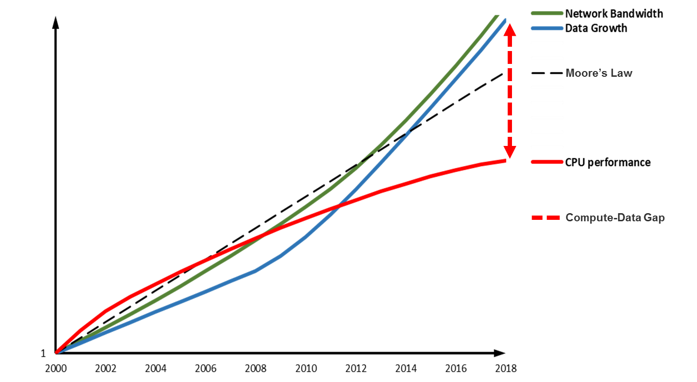

# 02. 렌더링 체계 개요

> Unreal Engine 렌더링 철학과 기술 발전 트렌드

---

## 목차

1. [렌더링 철학](#1-렌더링-철학)
2. [하드웨어 발전과 적응](#2-하드웨어-발전과-적응)
3. [그래픽 API 발전](#3-그래픽-api-발전)
4. [Frame Graph (RDG)](#4-frame-graph-rdg)
5. [실시간 레이트레이싱](#5-실시간-레이트레이싱)
6. [렌더링 아키텍처 계층](#6-렌더링-아키텍처-계층)

---

## 1. 렌더링 철학 {#1-렌더링-철학}

### 1.1 핵심 원칙

> "소프트웨어와 하드웨어 기술 발전에 순응하여, 제한된 하드웨어 자원을 충분히 활용하고, 더 빠르고 좋게 더 사실적이거나 스타일화된 화면을 렌더링한다."

이 철학은 UE 렌더링 시스템의 모든 설계 결정에 영향을 미칩니다:

| 원칙 | 설명 | 예시 |
|------|------|------|
| **하드웨어 활용** | GPU 기능 최대한 활용 | Compute Shader, Async Compute |
| **확장성** | 다양한 플랫폼 지원 | Mobile ~ High-end PC |
| **유연성** | 다양한 렌더링 스타일 | 포토리얼 ~ 스타일라이즈드 |
| **성능** | 실시간 렌더링 | 60fps+ 목표 |

### 1.2 렌더링 품질 요소

```
┌─────────────────────────────────────────────────────────────────┐
│                    렌더링 품질 결정 요소                          │
├─────────────────────────────────────────────────────────────────┤
│                                                                 │
│  ┌───────────────┐   ┌───────────────┐   ┌───────────────┐     │
│  │   지오메트리   │   │    라이팅     │   │   머티리얼    │     │
│  │   복잡도      │   │    정확도     │   │    디테일    │     │
│  └───────┬───────┘   └───────┬───────┘   └───────┬───────┘     │
│          │                   │                   │              │
│          └───────────────────┼───────────────────┘              │
│                              ▼                                  │
│                    ┌─────────────────┐                          │
│                    │   최종 이미지   │                          │
│                    │     품질       │                          │
│                    └────────┬────────┘                          │
│                             │                                   │
│          ┌──────────────────┼──────────────────┐                │
│          ▼                  ▼                  ▼                │
│  ┌───────────────┐  ┌───────────────┐  ┌───────────────┐       │
│  │  포스트 프로세스 │  │    AA/TAA     │  │  해상도/업스케일 │   │
│  └───────────────┘  └───────────────┘  └───────────────┘       │
│                                                                 │
└─────────────────────────────────────────────────────────────────┘
```

---

## 2. 하드웨어 발전과 적응 {#2-하드웨어-발전과-적응}

### 2.1 무어의 법칙과 한계


*CPU 코어 주파수 성장 (1970-2011) - 무어의 법칙과 한계*

2006년경부터 단일 코어 성능 향상이 한계에 도달:

| 시기 | 트렌드 | 대응 |
|------|--------|------|
| ~2006 | 클럭 속도 증가 | 단일 스레드 최적화 |
| 2006~ | 멀티코어 | 병렬 처리 |
| 2016~ | 이종 컴퓨팅 | GPU/CPU 협업 |


*2006년 전후 CPU 성능과 코어 수 변화*

### 2.2 GPU 발전

```cpp
// GPU 기능 발전에 따른 UE 적응
enum class EGPUGeneration
{
    // DX9 세대
    ShaderModel2,    // 제한된 명령어, 고정 레지스터

    // DX10 세대
    ShaderModel4,    // Geometry Shader, 스트림 출력

    // DX11 세대
    ShaderModel5,    // 테셀레이션, Compute Shader

    // DX12/Vulkan 세대
    ShaderModel6,    // Wave Intrinsics, Mesh Shader

    // RT 세대
    ShaderModel6_5,  // DXR 1.1, Inline Ray Tracing
};

// 플랫폼별 기능 감지
class FGPUCapabilities
{
public:
    bool bSupportsTessellation;
    bool bSupportsComputeShaders;
    bool bSupportsRayTracing;
    bool bSupportsMeshShaders;
    bool bSupportsVariableRateShading;

    int32 MaxTextureSize;
    int32 MaxComputeWorkGroupSize;
    int32 RayTracingTier;
};
```

### 2.3 DirectX 기능 발전


*DirectX 11의 테셀레이션, 컴퓨트 셰이더 등 신기능*

| DX 버전 | 핵심 기능 | UE 활용 |
|---------|----------|---------|
| DX9 | 프로그래머블 셰이더 | 기본 렌더링 |
| DX10 | Geometry Shader | 파티클, 데칼 |
| DX11 | Tessellation, Compute | 지형, GPU 파티클 |
| DX12 | Low-level API | PSO 캐싱, 멀티스레딩 |

---

## 3. 그래픽 API 발전 {#3-그래픽-api-발전}

### 3.1 API 추상화 계층

UE는 RHI(Rendering Hardware Interface)로 다양한 API를 추상화합니다:

```cpp
// RHI 추상화 계층
class FRHICommandList
{
public:
    // 플랫폼 독립적 명령
    void SetRenderTargets(...);
    void SetViewport(...);
    void DrawPrimitive(...);

    // 내부적으로 플랫폼별 구현 호출
    // D3D12: ID3D12GraphicsCommandList
    // Vulkan: VkCommandBuffer
    // Metal: MTLRenderCommandEncoder
};

// 플랫폼별 RHI 구현
class FD3D12CommandList : public FRHICommandList { ... };
class FVulkanCommandList : public FRHICommandList { ... };
class FMetalCommandList : public FRHICommandList { ... };
```

### 3.2 지원 API 목록

| API | 플랫폼 | 특징 |
|-----|--------|------|
| **D3D11** | Windows | 호환성 우선 |
| **D3D12** | Windows, Xbox | 저수준 제어 |
| **Vulkan** | Windows, Linux, Android | 크로스 플랫폼 |
| **Metal** | macOS, iOS | Apple 최적화 |
| **OpenGL ES** | Android, 웹 | 모바일/호환성 |

---

## 4. Frame Graph (RDG) {#4-frame-graph-rdg}

### 4.1 개념

Frame Graph (Render Dependency Graph)는 프레임의 렌더링 패스와 리소스 의존성을 그래프로 표현합니다.


*Frame Graph(RDG)는 엔진 기능 모듈과 GPU 리소스를 분리하여 메모리, VRAM, Pass 스케줄링 최적화*

### 4.2 RDG 구조

```cpp
// RDG 빌더 예시
void FDeferredShadingSceneRenderer::RenderBasePass(FRDGBuilder& GraphBuilder)
{
    // 렌더 타겟 선언
    FRDGTextureRef SceneColor = GraphBuilder.CreateTexture(
        FRDGTextureDesc::Create2D(Extent, PF_FloatRGBA),
        TEXT("SceneColor"));

    FRDGTextureRef SceneDepth = GraphBuilder.CreateTexture(
        FRDGTextureDesc::Create2D(Extent, PF_DepthStencil),
        TEXT("SceneDepth"));

    // 패스 추가
    FBasePassParameters* PassParameters = GraphBuilder.AllocParameters<FBasePassParameters>();
    PassParameters->RenderTargets[0] = FRenderTargetBinding(SceneColor, ERenderTargetLoadAction::EClear);
    PassParameters->RenderTargets.DepthStencil = FDepthStencilBinding(SceneDepth, ...);

    GraphBuilder.AddPass(
        RDG_EVENT_NAME("BasePass"),
        PassParameters,
        ERDGPassFlags::Raster,
        [this, &View](FRHICommandList& RHICmdList)
        {
            RenderBasePassInternal(RHICmdList, View);
        });
}
```

### 4.3 RDG 장점

| 장점 | 설명 |
|------|------|
| **자동 리소스 관리** | 생명주기 자동 추적 |
| **메모리 앨리어싱** | 리소스 재사용 최적화 |
| **패스 컬링** | 미사용 패스 자동 제거 |
| **병렬 실행** | 의존성 기반 스케줄링 |
| **디버깅** | 그래프 시각화 |

### 4.4 리소스 생명주기

```
┌─────────────────────────────────────────────────────────────────┐
│                    RDG 리소스 생명주기                           │
├─────────────────────────────────────────────────────────────────┤
│                                                                 │
│  Frame Start                                                    │
│       │                                                         │
│       ▼                                                         │
│  ┌─────────────┐                                                │
│  │ 리소스 선언  │ ← GraphBuilder.CreateTexture()                 │
│  └──────┬──────┘                                                │
│         │                                                       │
│         ▼                                                       │
│  ┌─────────────┐   ┌─────────────┐   ┌─────────────┐           │
│  │  Pass A     │──→│  Pass B     │──→│  Pass C     │           │
│  │  (Write)    │   │  (Read)     │   │  (Read)     │           │
│  └─────────────┘   └─────────────┘   └─────────────┘           │
│                                              │                  │
│                                              ▼                  │
│                                      ┌─────────────┐            │
│                                      │ 리소스 해제  │            │
│                                      └─────────────┘            │
│                                              │                  │
│                                              ▼                  │
│                                         Frame End               │
│                                                                 │
└─────────────────────────────────────────────────────────────────┘
```

---

## 5. 실시간 레이트레이싱 {#5-실시간-레이트레이싱}

### 5.1 UE4.22+ RTX 지원


*UE 4.22 실시간 레이트레이싱 발표 - "Troll" 데모 (Epic Games & Goodbye Kansas Studios)*

### 5.2 레이트레이싱 기능

```cpp
// UE 레이트레이싱 기능 플래그
struct FRayTracingFeatures
{
    // 반사
    bool bRayTracedReflections = true;

    // 그림자
    bool bRayTracedShadows = true;

    // 앰비언트 오클루전
    bool bRayTracedAmbientOcclusion = true;

    // 글로벌 일루미네이션
    bool bRayTracedGlobalIllumination = true;

    // 반투명
    bool bRayTracedTranslucency = false;

    // 스카이 라이트
    bool bRayTracedSkyLight = true;
};

// 레이 생성 셰이더 예시
[shader("raygeneration")]
void RayGenShader()
{
    uint2 PixelCoord = DispatchRaysIndex().xy;
    float2 UV = (PixelCoord + 0.5) / DispatchRaysDimensions().xy;

    // 레이 설정
    RayDesc Ray;
    Ray.Origin = CameraPosition;
    Ray.Direction = CalculateRayDirection(UV);
    Ray.TMin = 0.0;
    Ray.TMax = 10000.0;

    // 레이 트레이싱 실행
    RayPayload Payload;
    TraceRay(
        AccelerationStructure,
        RAY_FLAG_NONE,
        0xFF,
        0,  // Hit Group Index
        1,  // Multiplier
        0,  // Miss Shader Index
        Ray,
        Payload
    );

    // 결과 저장
    OutputTexture[PixelCoord] = Payload.Color;
}
```

### 5.3 하이브리드 렌더링

UE5에서는 래스터라이제이션과 레이트레이싱을 조합합니다:

```
┌─────────────────────────────────────────────────────────────────┐
│                    하이브리드 렌더링 파이프라인                    │
├─────────────────────────────────────────────────────────────────┤
│                                                                 │
│  ┌──────────────────────────────────────────────────────┐       │
│  │              래스터라이제이션 (Nanite)               │       │
│  │  - G-Buffer 생성                                     │       │
│  │  - 기본 지오메트리 렌더링                             │       │
│  └───────────────────────┬──────────────────────────────┘       │
│                          │                                      │
│          ┌───────────────┼───────────────┐                      │
│          ▼               ▼               ▼                      │
│  ┌─────────────┐ ┌─────────────┐ ┌─────────────┐               │
│  │  RT 반사    │ │  RT 그림자  │ │   RT GI     │               │
│  │  (선택적)   │ │  (선택적)   │ │  (Lumen)    │               │
│  └──────┬──────┘ └──────┬──────┘ └──────┬──────┘               │
│         │               │               │                       │
│         └───────────────┼───────────────┘                       │
│                         ▼                                       │
│                 ┌─────────────┐                                 │
│                 │  최종 합성  │                                 │
│                 └─────────────┘                                 │
│                                                                 │
└─────────────────────────────────────────────────────────────────┘
```

---

## 6. 렌더링 아키텍처 계층 {#6-렌더링-아키텍처-계층}

### 6.1 5계층 구조

```
┌─────────────────────────────────────────────────────────────────┐
│                    UE 렌더링 아키텍처 계층                        │
├─────────────────────────────────────────────────────────────────┤
│                                                                 │
│  ┌─────────────────────────────────────────────────────────┐   │
│  │  Layer 5: Application (게임/에디터)                      │   │
│  │  - UWorld, AActor, UPrimitiveComponent                   │   │
│  └────────────────────────────┬────────────────────────────┘   │
│                               │                                 │
│  ┌────────────────────────────▼────────────────────────────┐   │
│  │  Layer 4: Scene Representation                           │   │
│  │  - FScene, FPrimitiveSceneProxy, FMaterialRenderProxy    │   │
│  └────────────────────────────┬────────────────────────────┘   │
│                               │                                 │
│  ┌────────────────────────────▼────────────────────────────┐   │
│  │  Layer 3: Renderer                                       │   │
│  │  - FSceneRenderer, FMeshDrawCommand, Shader System       │   │
│  └────────────────────────────┬────────────────────────────┘   │
│                               │                                 │
│  ┌────────────────────────────▼────────────────────────────┐   │
│  │  Layer 2: RHI (Rendering Hardware Interface)             │   │
│  │  - FRHICommandList, FRHITexture, FRHIBuffer             │   │
│  └────────────────────────────┬────────────────────────────┘   │
│                               │                                 │
│  ┌────────────────────────────▼────────────────────────────┐   │
│  │  Layer 1: Graphics API                                   │   │
│  │  - D3D12, Vulkan, Metal, OpenGL                          │   │
│  └─────────────────────────────────────────────────────────┘   │
│                                                                 │
└─────────────────────────────────────────────────────────────────┘
```

### 6.2 각 계층의 책임

| 계층 | 책임 | 핵심 클래스 |
|------|------|-------------|
| **Application** | 게임 로직, 입력, 물리 | AActor, UComponent |
| **Scene** | 렌더링 데이터 구성 | FScene, FSceneProxy |
| **Renderer** | 렌더링 로직, 패스 실행 | FSceneRenderer |
| **RHI** | API 추상화 | FRHICommandList |
| **Graphics API** | 하드웨어 통신 | D3D12, Vulkan |

### 6.3 데이터 흐름

```cpp
// 데이터 흐름 예시
void RenderingDataFlow()
{
    // 1. Application Layer - 게임 오브젝트
    UStaticMeshComponent* MeshComp = Actor->GetComponentByClass<UStaticMeshComponent>();

    // 2. Scene Layer - 렌더링 프록시 생성
    FPrimitiveSceneProxy* Proxy = MeshComp->CreateSceneProxy();
    Scene->AddPrimitive(Proxy);

    // 3. Renderer Layer - 드로우 명령 생성
    FMeshBatch MeshBatch;
    Proxy->GetDynamicMeshElements(Views, MeshBatch);

    FMeshDrawCommand DrawCommand;
    MeshPassProcessor->AddMeshBatch(MeshBatch, DrawCommand);

    // 4. RHI Layer - 명령 기록
    RHICmdList.SetPipelineState(PSO);
    RHICmdList.SetVertexBuffer(VB);
    RHICmdList.DrawIndexedPrimitive(IB, ...);

    // 5. Graphics API - GPU 실행
    // (RHI 내부에서 처리)
}
```

---

## 요약

| 주제 | 핵심 내용 |
|------|----------|
| **철학** | 하드웨어 활용 극대화, 확장성, 성능 |
| **RDG** | 선언적 렌더링, 자동 리소스 관리 |
| **RT** | 하이브리드 렌더링, 품질과 성능 균형 |
| **계층** | 5계층 구조로 관심사 분리 |

---

## 다음 문서

[03. C++ 언어 기능](03-cpp-fundamentals.md)에서 UE C++ 프로그래밍 기초를 살펴봅니다.
---

<div style="display: flex; justify-content: space-between; align-items: center; padding: 16px 0;">
  <a href="../01-engine-history/" style="text-decoration: none;">← 이전: 01. 엔진 발전 역사</a>
  <a href="../03-cpp-fundamentals/" style="text-decoration: none;">다음: 03. C++ 언어 기능 및 기초 →</a>
</div>
