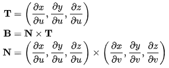

# 05. 좌표 공간 시스템

> UE의 8가지 좌표 공간과 변환 체인

---

## 목차

1. [좌표계 기본](#1-좌표계-기본)
2. [8가지 핵심 좌표 공간](#2-8가지-핵심-좌표-공간)
3. [Tangent Space](#3-tangent-space)
4. [변환 행렬](#4-변환-행렬)
5. [셰이더에서의 좌표 변환](#5-셰이더에서의-좌표-변환)
6. [실용적 응용](#6-실용적-응용)

---

## 1. 좌표계 기본 {#1-좌표계-기본}

### 1.1 왼손 좌표계

UE는 **왼손 좌표계**를 사용합니다 (DirectX와 동일):


*UE 카메라 뷰의 기본 좌표계 방향*

| 축 | 방향 | 색상 (에디터) |
|----|------|--------------|
| **X** | 전방 (Forward) | 빨강 |
| **Y** | 우측 (Right) | 녹색 |
| **Z** | 상단 (Up) | 파랑 |

### 1.2 왼손 vs 오른손 좌표계

```
왼손 좌표계 (UE, DirectX)      오른손 좌표계 (OpenGL)
        Z (Up)                        Y (Up)
        │                             │
        │                             │
        │                             │
        └───── Y (Right)              └───── X (Right)
       /                             /
      /                             /
     X (Forward)                   Z (Forward, 화면 밖으로)
```

### 1.3 각도 단위

| 시스템 | 단위 | 범위 |
|--------|------|------|
| **FRotator** | 도(Degree) | Pitch/Yaw/Roll: -180° ~ 180° |
| **FQuat** | 라디안(내부) | -1 ~ 1 (정규화된 쿼터니언) |
| **셰이더** | 라디안 | 삼각함수 사용 |

```cpp
// 도 ↔ 라디안 변환
float Radians = FMath::DegreesToRadians(Degrees);
float Degrees = FMath::RadiansToDegrees(Radians);

// 상수
constexpr float PI = 3.14159265359f;
constexpr float TWO_PI = 6.28318530718f;
constexpr float HALF_PI = 1.57079632679f;
```

---

## 2. 8가지 핵심 좌표 공간 {#2-8가지-핵심-좌표-공간}

### 2.1 변환 체인 개요

```
┌─────────────────────────────────────────────────────────────────────────┐
│                        좌표 공간 변환 체인                                │
├─────────────────────────────────────────────────────────────────────────┤
│                                                                         │
│  ┌──────────┐   TangentToLocal   ┌──────────┐                          │
│  │ Tangent  │ ─────────────────→ │  Local   │                          │
│  │  Space   │                    │  Space   │                          │
│  └──────────┘                    └────┬─────┘                          │
│                                       │                                 │
│                                       │ LocalToWorld                    │
│                                       ▼                                 │
│                                 ┌──────────┐                            │
│                                 │  World   │                            │
│                                 │  Space   │                            │
│                                 └────┬─────┘                            │
│                                      │                                  │
│                    ┌─────────────────┼─────────────────┐                │
│                    │                 │                 │                │
│                    ▼                 ▼                 │                │
│             ┌────────────┐    ┌────────────┐           │                │
│             │ Translated │    │    View    │←──────────┘                │
│             │   World    │    │   Space    │  WorldToView               │
│             └────────────┘    └─────┬──────┘                            │
│                                     │                                   │
│                                     │ ViewToClip                        │
│                                     ▼                                   │
│                               ┌──────────┐                              │
│                               │   Clip   │                              │
│                               │  Space   │                              │
│                               └────┬─────┘                              │
│                                    │                                    │
│                                    │ Perspective Division               │
│                                    ▼                                    │
│                               ┌──────────┐                              │
│                               │  Screen  │  (NDC)                       │
│                               │  Space   │                              │
│                               └────┬─────┘                              │
│                                    │                                    │
│                                    │ Viewport Transform                 │
│                                    ▼                                    │
│                               ┌──────────┐                              │
│                               │ Viewport │                              │
│                               │  Space   │  (픽셀 좌표)                  │
│                               └──────────┘                              │
│                                                                         │
└─────────────────────────────────────────────────────────────────────────┘
```

### 2.2 각 좌표 공간 상세

| 공간 | 별칭 | 속성 | 원점 |
|------|------|------|------|
| **Tangent** | Texture Space | 정점별 직교 정규 기저 | 각 정점 |
| **Local** | Object Space, Model Space | 메시 로컬 좌표 | 메시 피벗 |
| **World** | World Space | 절대 월드 좌표 | 월드 원점 |
| **TranslatedWorld** | Camera-Relative | World - CameraPos | 카메라 위치 |
| **View** | Camera Space, Eye Space | 카메라 기준 | 카메라 |
| **Clip** | Homogeneous Coordinates | 동차 좌표 (XYZW) | — |
| **Screen** | NDC (Normalized Device Coordinates) | xy: [-1,1], z: [0,1] | 화면 중심 |
| **Viewport** | Window Coordinates, Pixel Coordinates | 픽셀 단위 | 좌상단 |

### 2.3 TranslatedWorld의 목적

```cpp
// 문제: 월드 좌표가 매우 클 때 부동소수점 정밀도 문제
// 예: 원점에서 10km 떨어진 위치의 작은 물체 렌더링

// 해결: 카메라 위치를 원점으로 이동
FVector TranslatedWorldPosition = WorldPosition - View.ViewOrigin;

// 장점:
// 1. 카메라 근처 오브젝트의 정밀도 향상
// 2. Z-fighting 감소
// 3. 대규모 월드 지원 (Origin Rebasing)
```

---

## 3. Tangent Space {#3-tangent-space}

### 3.1 개념

Tangent Space는 각 정점에 정의되는 로컬 좌표계입니다:


*모델 정점의 탄젠트 공간 - 각 정점마다 고유한 탄젠트 공간 보유*

| 축 | 이름 | 방향 |
|----|------|------|
| **T** | Tangent | 텍스처 U 방향 |
| **B** | Bitangent (Binormal) | 텍스처 V 방향 |
| **N** | Normal | 표면 법선 |

### 3.2 계산 공식


*정점에서 직교 탄젠트 공간의 3축(T, B, N) 계산 공식*

```cpp
// 삼각형의 탄젠트/바이탄젠트 계산
void CalculateTangentBasis(
    const FVector& P0, const FVector& P1, const FVector& P2,
    const FVector2D& UV0, const FVector2D& UV1, const FVector2D& UV2,
    FVector& OutTangent, FVector& OutBitangent)
{
    // 위치 차이
    FVector Edge1 = P1 - P0;
    FVector Edge2 = P2 - P0;

    // UV 차이
    FVector2D DeltaUV1 = UV1 - UV0;
    FVector2D DeltaUV2 = UV2 - UV0;

    // 행렬식
    float Det = DeltaUV1.X * DeltaUV2.Y - DeltaUV2.X * DeltaUV1.Y;
    float InvDet = 1.0f / Det;

    // 탄젠트
    OutTangent = (Edge1 * DeltaUV2.Y - Edge2 * DeltaUV1.Y) * InvDet;
    OutTangent.Normalize();

    // 바이탄젠트
    OutBitangent = (Edge2 * DeltaUV1.X - Edge1 * DeltaUV2.X) * InvDet;
    OutBitangent.Normalize();
}
```

### 3.3 TBN 행렬

```cpp
// TBN 행렬 구성
FMatrix ConstructTBNMatrix(const FVector& T, const FVector& B, const FVector& N)
{
    // 열 벡터로 구성
    return FMatrix(
        FPlane(T.X, B.X, N.X, 0),
        FPlane(T.Y, B.Y, N.Y, 0),
        FPlane(T.Z, B.Z, N.Z, 0),
        FPlane(0, 0, 0, 1)
    );
}

// Tangent → World 변환
FVector TangentToWorld(const FVector& TangentNormal, const FMatrix& TBN)
{
    return TBN.TransformVector(TangentNormal);
}

// World → Tangent 변환 (TBN의 전치 = 역행렬, 직교 정규 기저)
FVector WorldToTangent(const FVector& WorldNormal, const FMatrix& TBN)
{
    return TBN.GetTransposed().TransformVector(WorldNormal);
}
```

### 3.4 Tangent Space의 장점

1. **노말 맵 재사용성**: 동일한 노말 맵을 다른 메시에 적용 가능
2. **스켈레탈 애니메이션**: 본 변형 시 노말 자동 보정
3. **노말 맵 압축**: Z 성분 생략 가능 (sqrt(1 - x² - y²)로 복원)
4. **미러링 처리**: 좌우 대칭 UV도 올바르게 처리

```cpp
// 셰이더에서 노말 맵 샘플링
float3 SampleNormalMap(Texture2D NormalMap, SamplerState Sampler, float2 UV)
{
    // 노말 맵 샘플 (BC5 압축 - RG만 저장)
    float2 NormalXY = NormalMap.Sample(Sampler, UV).rg * 2.0 - 1.0;

    // Z 복원
    float NormalZ = sqrt(saturate(1.0 - dot(NormalXY, NormalXY)));

    return float3(NormalXY, NormalZ);
}
```

---

## 4. 변환 행렬 {#4-변환-행렬}

### 4.1 LocalToWorld (Model Matrix)

```cpp
// 오브젝트의 월드 변환 행렬
FMatrix GetLocalToWorldMatrix(const FTransform& Transform)
{
    // Scale → Rotate → Translate 순서
    FMatrix ScaleMatrix = FScaleMatrix(Transform.GetScale3D());
    FMatrix RotationMatrix = FRotationMatrix(Transform.GetRotation().Rotator());
    FMatrix TranslationMatrix = FTranslationMatrix(Transform.GetLocation());

    return ScaleMatrix * RotationMatrix * TranslationMatrix;
}

// UE에서는 FTransform::ToMatrixWithScale() 사용
FMatrix LocalToWorld = ActorTransform.ToMatrixWithScale();
```

### 4.2 WorldToView (View Matrix)

```cpp
// 뷰 행렬 구성
FMatrix ConstructViewMatrix(
    const FVector& EyePosition,
    const FVector& LookAtPosition,
    const FVector& UpVector)
{
    // 카메라 축 계산
    FVector Forward = (LookAtPosition - EyePosition).GetSafeNormal();
    FVector Right = FVector::CrossProduct(UpVector, Forward).GetSafeNormal();
    FVector Up = FVector::CrossProduct(Forward, Right);

    // 뷰 행렬 = 회전 × 이동의 역
    FMatrix Rotation(
        FPlane(Right.X, Up.X, Forward.X, 0),
        FPlane(Right.Y, Up.Y, Forward.Y, 0),
        FPlane(Right.Z, Up.Z, Forward.Z, 0),
        FPlane(0, 0, 0, 1)
    );

    FMatrix Translation = FTranslationMatrix(-EyePosition);

    return Translation * Rotation;
}
```

### 4.3 ViewToClip (Projection Matrix)

```cpp
// 원근 투영 행렬
FMatrix ConstructPerspectiveMatrix(
    float HalfFOVRadians,
    float AspectRatio,
    float NearPlane,
    float FarPlane)
{
    float TanHalfFOV = FMath::Tan(HalfFOVRadians);

    // Reversed-Z (UE 기본) - 더 나은 깊이 정밀도
    return FMatrix(
        FPlane(1.0f / (AspectRatio * TanHalfFOV), 0, 0, 0),
        FPlane(0, 1.0f / TanHalfFOV, 0, 0),
        FPlane(0, 0, 0, 1),  // Reversed-Z: Near→1, Far→0
        FPlane(0, 0, NearPlane, 0)
    );

    // 일반 Z (참고용)
    // FPlane(0, 0, FarPlane / (FarPlane - NearPlane), 1),
    // FPlane(0, 0, -(FarPlane * NearPlane) / (FarPlane - NearPlane), 0)
}

// 직교 투영 행렬
FMatrix ConstructOrthoMatrix(
    float Width, float Height,
    float NearPlane, float FarPlane)
{
    return FMatrix(
        FPlane(2.0f / Width, 0, 0, 0),
        FPlane(0, 2.0f / Height, 0, 0),
        FPlane(0, 0, 1.0f / (FarPlane - NearPlane), 0),
        FPlane(0, 0, -NearPlane / (FarPlane - NearPlane), 1)
    );
}
```

### 4.4 Reversed-Z의 장점

```
일반 Z 버퍼:
Near ────────────────────────────────────── Far
  0                                          1
  │████████│                                 │  ← 정밀도 집중
  근거리에 정밀도 집중

Reversed-Z 버퍼:
Near ────────────────────────────────────── Far
  1                                          0
  │        │████████████████████████████████│  ← 정밀도 분산
  더 균일한 정밀도 분포 (부동소수점 특성 활용)
```

---

## 5. 셰이더에서의 좌표 변환 {#5-셰이더에서의-좌표-변환}

### 5.1 버텍스 셰이더 변환

```hlsl
// 버텍스 셰이더의 좌표 변환
void MainVS(
    in float3 LocalPosition : POSITION,
    in float3 LocalNormal : NORMAL,
    in float4 LocalTangent : TANGENT,
    out float4 OutClipPosition : SV_POSITION,
    out float3 OutWorldPosition : WORLDPOS,
    out float3 OutWorldNormal : NORMAL,
    out float3 OutWorldTangent : TANGENT)
{
    // Local → World
    float4x4 LocalToWorld = GetPrimitiveData(PrimitiveId).LocalToWorld;
    OutWorldPosition = mul(float4(LocalPosition, 1.0), LocalToWorld).xyz;

    // 노말/탄젠트 변환 (역전치 행렬 사용)
    float3x3 LocalToWorldIT = GetPrimitiveData(PrimitiveId).LocalToWorldInverseTranspose;
    OutWorldNormal = normalize(mul(LocalNormal, LocalToWorldIT));
    OutWorldTangent = normalize(mul(LocalTangent.xyz, (float3x3)LocalToWorld));

    // World → TranslatedWorld → Clip
    float3 TranslatedWorldPosition = OutWorldPosition - View.PreViewTranslation;
    OutClipPosition = mul(float4(TranslatedWorldPosition, 1.0), View.TranslatedWorldToClip);
}
```

### 5.2 픽셀 셰이더에서 월드 위치 복원

```hlsl
// 뎁스에서 월드 위치 복원
float3 ReconstructWorldPosition(float2 ScreenUV, float SceneDepth)
{
    // Screen UV → Clip Space
    float4 ClipPosition;
    ClipPosition.x = ScreenUV.x * 2.0 - 1.0;
    ClipPosition.y = 1.0 - ScreenUV.y * 2.0;  // Y 뒤집기
    ClipPosition.z = SceneDepth;
    ClipPosition.w = 1.0;

    // Clip → View
    float4 ViewPosition = mul(ClipPosition, View.ClipToView);
    ViewPosition /= ViewPosition.w;

    // View → World
    float3 WorldPosition = mul(ViewPosition, View.ViewToTranslatedWorld).xyz;
    WorldPosition += View.PreViewTranslation;

    return WorldPosition;
}
```

### 5.3 노말 맵 적용

```hlsl
// 탄젠트 스페이스 노말을 월드 스페이스로 변환
float3 ApplyNormalMap(
    float3 TangentNormal,
    float3 WorldNormal,
    float3 WorldTangent,
    float TangentSign)
{
    // TBN 행렬 구성
    float3 N = normalize(WorldNormal);
    float3 T = normalize(WorldTangent - N * dot(N, WorldTangent));  // Gram-Schmidt
    float3 B = cross(N, T) * TangentSign;

    float3x3 TBN = float3x3(T, B, N);

    // Tangent → World
    return normalize(mul(TangentNormal, TBN));
}
```

---

## 6. 실용적 응용 {#6-실용적-응용}

### 6.1 스크린 좌표 → 월드 레이

```cpp
// 마우스 위치에서 월드 레이 계산
void DeprojectScreenToWorld(
    const FVector2D& ScreenPosition,
    const FSceneView* View,
    FVector& OutOrigin,
    FVector& OutDirection)
{
    // 스크린 → NDC
    FVector2D NDC;
    NDC.X = (ScreenPosition.X / View->UnscaledViewRect.Width()) * 2.0f - 1.0f;
    NDC.Y = 1.0f - (ScreenPosition.Y / View->UnscaledViewRect.Height()) * 2.0f;

    // 근/원 평면의 월드 위치
    FMatrix InvViewProjection = View->ViewProjectionMatrix.Inverse();

    FVector4 NearPoint = InvViewProjection.TransformFVector4(FVector4(NDC.X, NDC.Y, 0, 1));
    FVector4 FarPoint = InvViewProjection.TransformFVector4(FVector4(NDC.X, NDC.Y, 1, 1));

    NearPoint /= NearPoint.W;
    FarPoint /= FarPoint.W;

    OutOrigin = FVector(NearPoint);
    OutDirection = (FVector(FarPoint) - OutOrigin).GetSafeNormal();
}
```

### 6.2 월드 좌표 → 스크린 좌표

```cpp
// 월드 위치를 스크린 좌표로 변환
FVector2D ProjectWorldToScreen(
    const FVector& WorldPosition,
    const FSceneView* View)
{
    // World → Clip
    FVector4 ClipPosition = View->ViewProjectionMatrix.TransformFVector4(
        FVector4(WorldPosition, 1.0f));

    // 원근 분할
    FVector2D NDC(ClipPosition.X / ClipPosition.W, ClipPosition.Y / ClipPosition.W);

    // NDC → 스크린 (픽셀)
    FVector2D ScreenPosition;
    ScreenPosition.X = (NDC.X + 1.0f) * 0.5f * View->UnscaledViewRect.Width();
    ScreenPosition.Y = (1.0f - NDC.Y) * 0.5f * View->UnscaledViewRect.Height();

    return ScreenPosition;
}
```

### 6.3 뷰 방향 벡터

```hlsl
// 픽셀의 뷰 방향 계산
float3 GetViewDirection(float3 WorldPosition)
{
    return normalize(WorldPosition - View.WorldCameraOrigin);
}

// 반사 벡터 계산
float3 GetReflectionVector(float3 ViewDirection, float3 WorldNormal)
{
    return reflect(ViewDirection, WorldNormal);
}
```

---

## 요약

| 좌표 공간 | 용도 | 변환 행렬 |
|-----------|------|----------|
| **Tangent** | 노말 맵핑 | TBN Matrix |
| **Local** | 메시 데이터 | LocalToWorld |
| **World** | 물리, 로직 | WorldToView |
| **View** | 컬링, 라이팅 | ViewToClip |
| **Clip** | 클리핑 | Perspective Division |
| **Screen** | 후처리 | Viewport Transform |

---

## 다음 문서

[06. 메모리 관리 시스템](06-memory-management.md)에서 UE의 메모리 할당자와 GC를 살펴봅니다.
