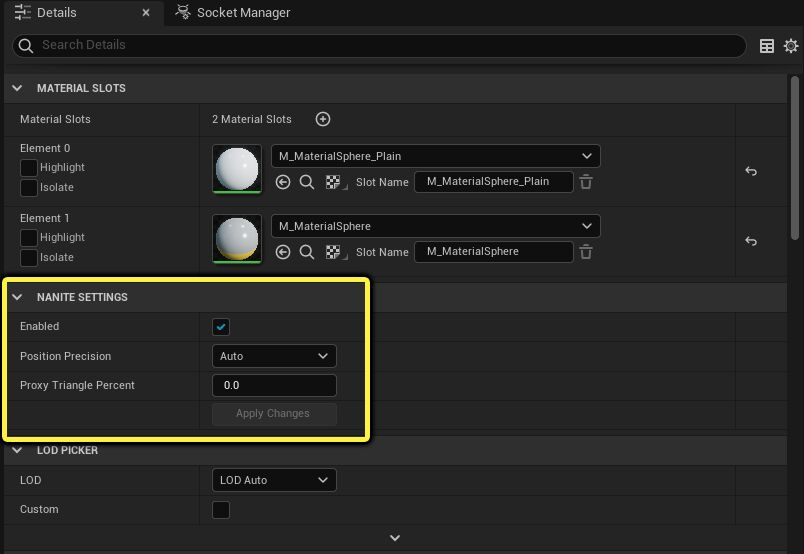
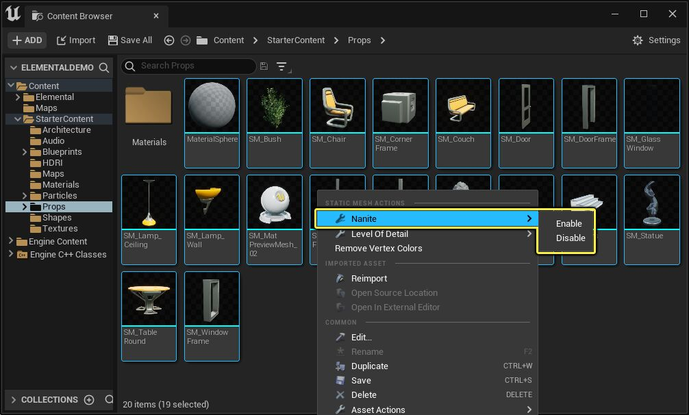
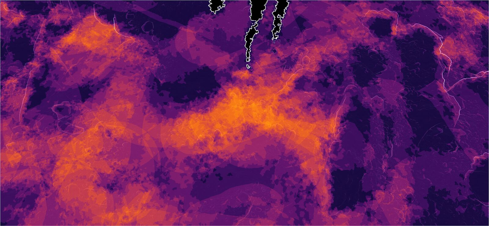
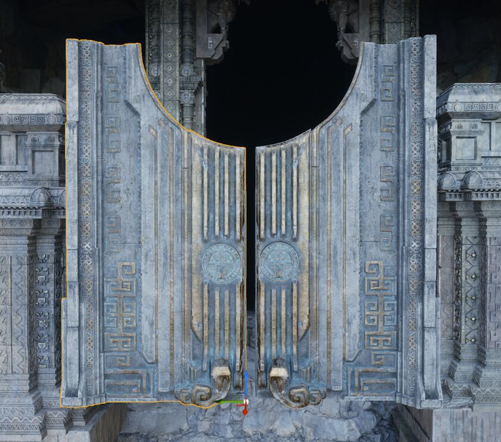
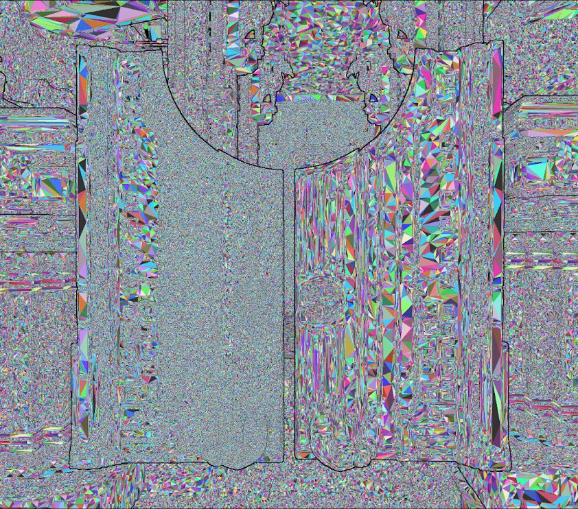
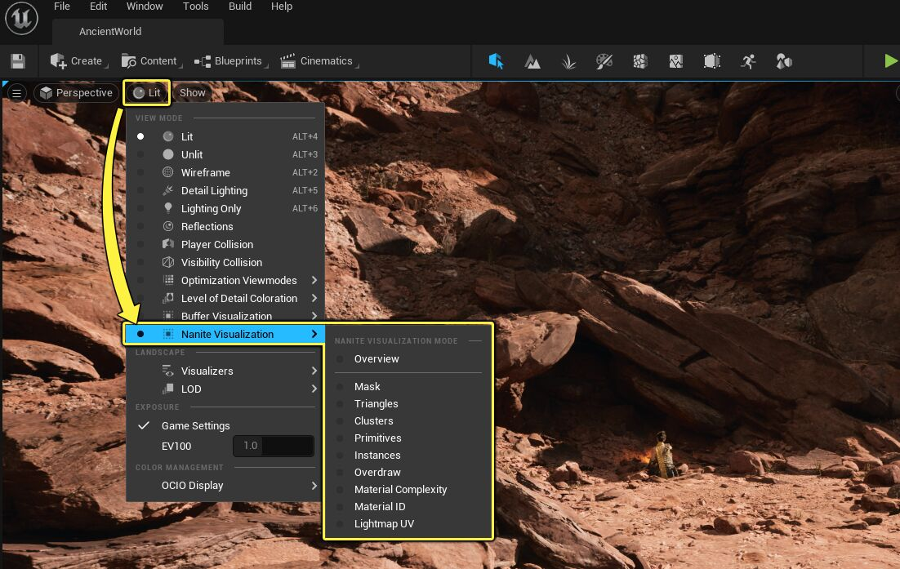
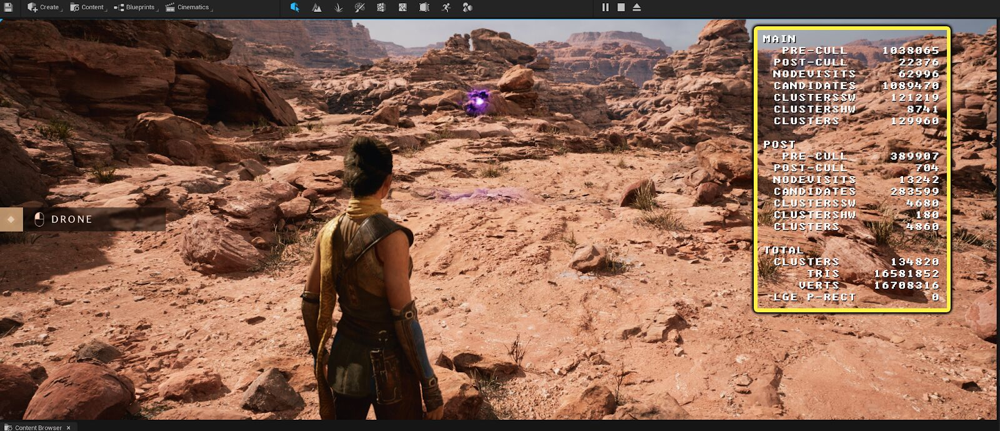
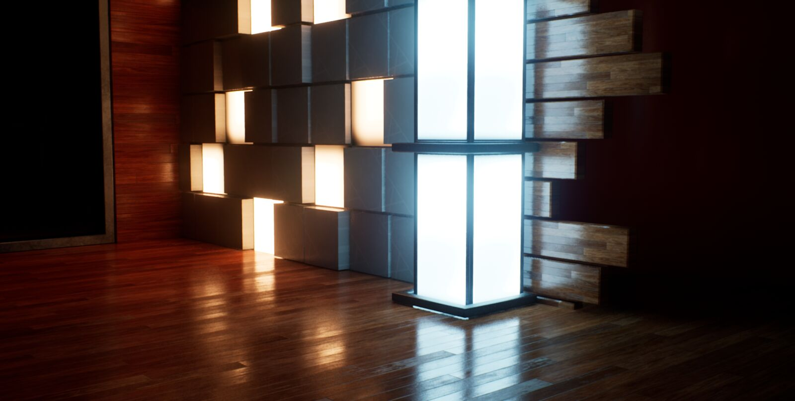
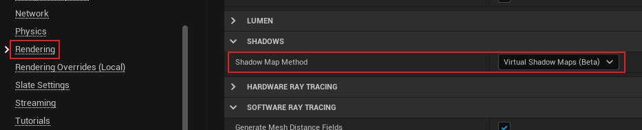

# Nanite 가상화 지오메트리

Nanite의 핵심 기술과 구현을 심층 분석합니다.

---

## Nanite란?

Nanite는 UE5의 **가상화 지오메트리 시스템**으로, 수십억 개의 폴리곤을 실시간으로 렌더링할 수 있게 합니다.


*Nanite 가상화 지오메트리 데모*

### 핵심 아이디어


*기존 LOD 방식과 Nanite 방식 비교*

```
기존 방식의 문제:
┌─────────────────────────────────────────────────────────────────┐
│  고폴리 모델 (수백만 폴리곤)                                      │
│       │                                                         │
│       ▼                                                         │
│  ┌──────────────────────────────────────────┐                   │
│  │ 수동 최적화 과정                          │                   │
│  │                                          │                   │
│  │  1. 리토폴로지 (폴리곤 감소)              │                   │
│  │  2. LOD 생성 (4-8개 레벨)                │                   │
│  │  3. 노멀맵 베이킹                        │                   │
│  │  4. 임포스터 생성                        │                   │
│  │                                          │                   │
│  │  → 아티스트 시간 소모                     │                   │
│  │  → 품질 저하                             │                   │
│  │  → 팝핑 아티팩트                         │                   │
│  └──────────────────────────────────────────┘                   │
└─────────────────────────────────────────────────────────────────┘

Nanite 방식:
┌─────────────────────────────────────────────────────────────────┐
│  고폴리 모델 (수십억 폴리곤도 가능)                               │
│       │                                                         │
│       ▼                                                         │
│  ┌──────────────────────────────────────────┐                   │
│  │ Nanite 자동 처리                          │                   │
│  │                                          │                   │
│  │  1. 클러스터 분할 (자동)                  │                   │
│  │  2. DAG 생성 (연속적 LOD)                │                   │
│  │  3. 스트리밍 데이터 (온디맨드)            │                   │
│  │                                          │                   │
│  │  → 아티스트 개입 불필요                   │                   │
│  │  → 원본 품질 유지                        │                   │
│  │  → 부드러운 전환                         │                   │
│  └──────────────────────────────────────────┘                   │
└─────────────────────────────────────────────────────────────────┘
```

---

## 데이터 구조

### 클러스터 (Cluster)


*Nanite 클러스터 구조*

```cpp
// Nanite의 기본 렌더링 단위
struct FCluster
{
    // 바운딩 정보
    FVector3f BoundsCenter;
    float BoundsSphereRadius;

    // LOD 관련
    float LODError;              // 화면 공간 최대 오차 (픽셀)
    float EdgeLength;            // 평균 에지 길이

    // 지오메트리 데이터
    uint32 NumTriangles;         // 최대 128개
    uint32 NumVertices;          // 최대 256개
    uint32 DataOffset;           // 압축 데이터 오프셋

    // 계층 구조
    uint32 GroupIndex;           // 소속 그룹
    uint32 GroupPartIndex;       // 그룹 내 위치
};

// 클러스터 사이즈 선택 이유
// - 128 삼각형: GPU 웨이브프론트 크기에 최적화
// - 너무 작으면: 오버헤드 증가
// - 너무 크면: 세밀한 컬링 불가
```

### 클러스터 그룹 (Cluster Group)


*LOD 전환을 위한 클러스터 그룹*

```cpp
// LOD 전환을 위한 그룹 구조
struct FClusterGroup
{
    // 이 그룹에 속한 클러스터들
    TArray<uint32> ClusterIndices;

    // LOD 전환 임계값
    float LODErrorMin;    // 이 오차 이하면 자식으로
    float LODErrorMax;    // 이 오차 이상이면 부모로

    // 부모-자식 관계
    uint32 ParentGroupIndex;
    TArray<uint32> ChildGroupIndices;

    // 바운딩 정보
    FBox Bounds;
    float MaxLODError;
};
```

### DAG (Directed Acyclic Graph) 구조


*Nanite DAG 계층 구조*

```
┌─────────────────────────────────────────────────────────────────┐
│                    Nanite DAG 구조                               │
├─────────────────────────────────────────────────────────────────┤
│                                                                 │
│  LOD Level 0 (최저 해상도)                                       │
│  ┌─────────────────────────────────────────────────┐            │
│  │  Group 0: [Cluster 0]                           │            │
│  │  (전체 메시를 128개 삼각형으로)                   │            │
│  └────────────────────────┬────────────────────────┘            │
│                           │                                     │
│                           ▼                                     │
│  LOD Level 1                                                    │
│  ┌──────────────────┐  ┌──────────────────┐                     │
│  │ Group 1          │  │ Group 2          │                     │
│  │ [Cluster 1,2,3]  │  │ [Cluster 4,5,6]  │                     │
│  └────────┬─────────┘  └────────┬─────────┘                     │
│           │                     │                               │
│           ▼                     ▼                               │
│  LOD Level 2                                                    │
│  ┌────┐┌────┐┌────┐┌────┐┌────┐┌────┐┌────┐┌────┐              │
│  │Cl7 ││Cl8 ││Cl9 ││Cl10││Cl11││Cl12││Cl13││Cl14│              │
│  └────┘└────┘└────┘└────┘└────┘└────┘└────┘└────┘              │
│           │                     │                               │
│           ▼                     ▼                               │
│  ...      (더 상세한 레벨들)                                     │
│           │                     │                               │
│           ▼                     ▼                               │
│  LOD Level N (원본 해상도)                                       │
│  ┌─┐┌─┐┌─┐┌─┐┌─┐┌─┐┌─┐┌─┐┌─┐┌─┐┌─┐┌─┐┌─┐┌─┐┌─┐┌─┐            │
│  │ ││ ││ ││ ││ ││ ││ ││ ││ ││ ││ ││ ││ ││ ││ ││ │ ...        │
│  └─┘└─┘└─┘└─┘└─┘└─┘└─┘└─┘└─┘└─┘└─┘└─┘└─┘└─┘└─┘└─┘            │
│  (원본 삼각형들)                                                 │
│                                                                 │
│  ※ 각 레벨에서 동일 영역의 클러스터들은 서로 대체 가능           │
│  ※ 화면에서의 오차에 따라 적절한 레벨 선택                       │
│                                                                 │
└─────────────────────────────────────────────────────────────────┘
```

---

## GPU 컬링 파이프라인

### 2-Pass 컬링


*Nanite GPU 컬링 파이프라인*

```cpp
// Pass 1: 인스턴스 컬링
[numthreads(64, 1, 1)]
void InstanceCullingCS(uint ThreadID : SV_DispatchThreadID)
{
    FNaniteInstance Instance = InstanceBuffer[ThreadID];

    // Frustum Culling
    if (!IntersectsFrustum(Instance.Bounds, ViewFrustum))
        return;

    // HZB Occlusion Culling
    float2 ScreenSize = ProjectBounds(Instance.Bounds);
    float HZBDepth = SampleHZB(Instance.Bounds);
    if (IsOccluded(Instance.Bounds, HZBDepth))
        return;

    // 통과한 인스턴스 기록
    uint Index;
    InterlockedAdd(VisibleInstanceCount, 1, Index);
    VisibleInstances[Index] = Instance;
}

// Pass 2: 클러스터 컬링 (BVH 순회)
[numthreads(64, 1, 1)]
void ClusterCullingCS(uint GroupID : SV_GroupID, uint ThreadID : SV_GroupThreadID)
{
    // 워크 큐에서 노드 가져오기
    FBVHNode Node = WorkQueue.Pop();

    // 노드 가시성 테스트
    if (!IsNodeVisible(Node))
        return;

    if (Node.IsLeaf())
    {
        // 리프 노드 = 클러스터
        FCluster Cluster = Clusters[Node.ClusterIndex];

        // LOD 선택
        float ScreenError = ComputeScreenError(Cluster.LODError);

        if (ScreenError < LODThreshold)
        {
            // 충분히 상세함 → 렌더링
            OutputCluster(Cluster);
        }
        else if (Cluster.HasChildren())
        {
            // 더 상세한 자식 필요 → 자식을 큐에 추가
            for (uint Child : Cluster.Children)
                WorkQueue.Push(Child);
        }
        else
        {
            // 더 상세한 데이터 없음 → 현재 클러스터 렌더링
            OutputCluster(Cluster);
        }
    }
    else
    {
        // 내부 노드 → 자식들을 큐에 추가
        WorkQueue.Push(Node.LeftChild);
        WorkQueue.Push(Node.RightChild);
    }
}
```

### Persistent Threads 패턴


*워크 스틸링 기반 영구 스레드 패턴*

```cpp
// 워크 스틸링 기반 영구 스레드
[numthreads(64, 1, 1)]
void PersistentCullingCS(uint ThreadID : SV_GroupThreadID)
{
    // 모든 작업이 완료될 때까지 루프
    while (true)
    {
        // 로컬 큐에서 작업 가져오기
        FWorkItem Work;
        if (LocalQueue.TryPop(Work))
        {
            ProcessWork(Work);
        }
        // 로컬 큐 비었으면 글로벌 큐에서 훔쳐오기
        else if (GlobalQueue.TrySteal(Work))
        {
            ProcessWork(Work);
        }
        // 모든 작업 완료 확인
        else if (AllWorkDone())
        {
            break;
        }
        // 아직 작업 중인 스레드 있음 → 대기
    }
}
```

---

## 소프트웨어 래스터라이저

### 왜 소프트웨어인가?


*하드웨어 vs 소프트웨어 래스터라이저 비교*

```
┌─────────────────────────────────────────────────────────────────┐
│              하드웨어 vs 소프트웨어 래스터라이저                   │
├─────────────────────────────────────────────────────────────────┤
│                                                                 │
│  하드웨어 래스터라이저 (기존)                                     │
│  ┌─────────────────────────────────────────────────────────┐   │
│  │                                                         │   │
│  │  장점:                                                   │   │
│  │  - 대형 삼각형에 매우 빠름                                │   │
│  │  - 하드웨어 최적화                                       │   │
│  │                                                         │   │
│  │  단점:                                                   │   │
│  │  - 작은 삼각형 비효율 (Quad Overshading)                 │   │
│  │  - Draw Call 오버헤드                                    │   │
│  │  - Vertex Shader 실행 필수                               │   │
│  │                                                         │   │
│  │  1픽셀 삼각형 → 4픽셀 처리 (75% 낭비)                    │   │
│  │  ┌─┬─┐                                                   │   │
│  │  │█│ │  █ = 실제 픽셀                                    │   │
│  │  ├─┼─┤  □ = 낭비되는 처리                                │   │
│  │  │ │ │                                                   │   │
│  │  └─┴─┘                                                   │   │
│  └─────────────────────────────────────────────────────────┘   │
│                                                                 │
│  소프트웨어 래스터라이저 (Nanite)                                │
│  ┌─────────────────────────────────────────────────────────┐   │
│  │                                                         │   │
│  │  장점:                                                   │   │
│  │  - 작은 삼각형에 효율적                                   │   │
│  │  - Draw Call 없음 (Compute Shader)                       │   │
│  │  - 정확한 1픽셀 처리                                     │   │
│  │  - 커스텀 최적화 가능                                    │   │
│  │                                                         │   │
│  │  단점:                                                   │   │
│  │  - 대형 삼각형에서 느림                                   │   │
│  │  - 멀티샘플링 복잡                                       │   │
│  │                                                         │   │
│  │  1픽셀 삼각형 → 1픽셀만 처리 (0% 낭비)                   │   │
│  │  ┌─┐                                                     │   │
│  │  │█│                                                     │   │
│  │  └─┘                                                     │   │
│  └─────────────────────────────────────────────────────────┘   │
│                                                                 │
└─────────────────────────────────────────────────────────────────┘
```

### 래스터라이저 구현


*소프트웨어 래스터라이제이션 과정*

```cpp
// Nanite 소프트웨어 래스터라이저 (간략화)
[numthreads(128, 1, 1)]
void SoftwareRasterCS(uint ClusterIndex : SV_GroupID, uint TriIndex : SV_GroupThreadID)
{
    FCluster Cluster = VisibleClusters[ClusterIndex];

    if (TriIndex >= Cluster.NumTriangles)
        return;

    // 삼각형 정점 로드
    FTriangle Tri = LoadTriangle(Cluster, TriIndex);

    // 클립 공간으로 변환
    float4 V0 = mul(float4(Tri.P0, 1), ViewProjection);
    float4 V1 = mul(float4(Tri.P1, 1), ViewProjection);
    float4 V2 = mul(float4(Tri.P2, 1), ViewProjection);

    // NDC로 변환
    V0.xyz /= V0.w; V1.xyz /= V1.w; V2.xyz /= V2.w;

    // 스크린 좌표로 변환
    float2 S0 = NDCToScreen(V0.xy);
    float2 S1 = NDCToScreen(V1.xy);
    float2 S2 = NDCToScreen(V2.xy);

    // 바운딩 박스 계산
    int2 MinPixel = floor(min3(S0, S1, S2));
    int2 MaxPixel = ceil(max3(S0, S1, S2));

    // 삼각형 크기에 따른 경로 선택
    int2 Size = MaxPixel - MinPixel;

    if (Size.x <= 1 && Size.y <= 1)
    {
        // 마이크로 삼각형: 직접 중심점 테스트
        RasterizeMicroTriangle(S0, S1, S2, V0.z);
    }
    else if (Size.x <= 8 && Size.y <= 8)
    {
        // 작은 삼각형: 직접 순회
        RasterizeSmallTriangle(S0, S1, S2, MinPixel, MaxPixel);
    }
    else
    {
        // 큰 삼각형: 하드웨어로 폴백
        // (실제로는 별도 패스에서 처리)
        QueueForHardwareRaster(Cluster, TriIndex);
    }
}

// 작은 삼각형 래스터라이제이션
void RasterizeSmallTriangle(float2 S0, float2 S1, float2 S2, int2 Min, int2 Max)
{
    // 에지 함수 계수 계산
    float3 Edge01 = ComputeEdgeFunction(S0, S1);
    float3 Edge12 = ComputeEdgeFunction(S1, S2);
    float3 Edge20 = ComputeEdgeFunction(S2, S0);

    // 모든 픽셀 순회
    for (int y = Min.y; y <= Max.y; y++)
    {
        for (int x = Min.x; x <= Max.x; x++)
        {
            float2 P = float2(x + 0.5, y + 0.5);

            // 에지 테스트
            float E0 = EdgeFunction(Edge01, P);
            float E1 = EdgeFunction(Edge12, P);
            float E2 = EdgeFunction(Edge20, P);

            if (E0 >= 0 && E1 >= 0 && E2 >= 0)
            {
                // 내부 픽셀
                float Depth = InterpolateDepth(E0, E1, E2);

                // Atomic depth test and write
                WritePixel(x, y, Depth, ClusterIndex, TriIndex);
            }
        }
    }
}
```

### Visibility Buffer


*Visibility Buffer 구조*

```cpp
// Visibility Buffer 구조
// 64비트 per pixel
struct FVisibilityData
{
    uint32 DepthInt;         // 깊이 (정수로 인코딩)
    uint32 InstanceID : 24;  // 인스턴스 ID
    uint32 TriangleID : 7;   // 클러스터 내 삼각형 ID
    uint32 ClusterID : 1;    // (나머지 비트로 인코딩)
};

// Atomic 기반 깊이 테스트
void WritePixel(int2 Pixel, float Depth, uint InstanceID, uint TriID)
{
    uint DepthInt = asuint(Depth);
    uint64_t PackedData = (uint64_t(DepthInt) << 32) | PackVisibility(InstanceID, TriID);

    // Atomic Min으로 깊이 테스트 + 쓰기를 원자적으로
    InterlockedMin(VisibilityBuffer[Pixel], PackedData);
}
```

---

## 머티리얼 평가

### Deferred Material Pass


*Deferred Material 평가 과정*

```cpp
// Visibility Buffer에서 G-Buffer 생성
[numthreads(8, 8, 1)]
void MaterialEvaluationCS(uint2 PixelCoord : SV_DispatchThreadID)
{
    // Visibility Buffer 읽기
    uint64_t VisData = VisibilityBuffer[PixelCoord];

    if (VisData == INVALID_VISIBILITY)
    {
        // 빈 픽셀
        return;
    }

    // 데이터 언팩
    uint InstanceID, ClusterID, TriangleID;
    float Depth;
    UnpackVisibility(VisData, InstanceID, ClusterID, TriangleID, Depth);

    // 인스턴스 데이터 로드
    FNaniteInstance Instance = InstanceBuffer[InstanceID];
    FCluster Cluster = ClusterBuffer[ClusterID];
    FTriangle Tri = LoadTriangle(Cluster, TriangleID);

    // 무게중심 좌표 재계산
    float3 Barycentrics = ComputeBarycentrics(PixelCoord, Tri, Instance.Transform);

    // 버텍스 어트리뷰트 보간
    float2 UV = InterpolateUV(Tri, Barycentrics);
    float3 Normal = InterpolateNormal(Tri, Barycentrics);
    float3 Tangent = InterpolateTangent(Tri, Barycentrics);

    // 머티리얼 평가
    FMaterial Material = MaterialBuffer[Instance.MaterialID];

    float3 BaseColor = SampleTexture(Material.BaseColorMap, UV);
    float Roughness = SampleTexture(Material.RoughnessMap, UV).r;
    float Metallic = SampleTexture(Material.MetallicMap, UV).r;

    // G-Buffer 출력
    GBufferA[PixelCoord] = float4(BaseColor, 1);
    GBufferB[PixelCoord] = EncodeNormal(Normal);
    GBufferC[PixelCoord] = float4(Metallic, Roughness, 0, 0);
}
```

### 머티리얼 정렬


*머티리얼별 픽셀 정렬*

```cpp
// 효율적인 머티리얼 평가를 위한 정렬
class FNaniteMaterialSort
{
    void SortPixelsByMaterial()
    {
        // Pass 1: 머티리얼별 픽셀 카운트
        [numthreads(8, 8, 1)]
        void CountMaterials(uint2 Pixel)
        {
            uint MaterialID = GetMaterialID(Pixel);
            InterlockedAdd(MaterialCounts[MaterialID], 1);
        }

        // Pass 2: Prefix Sum으로 오프셋 계산
        PrefixSum(MaterialCounts, MaterialOffsets);

        // Pass 3: 픽셀을 머티리얼별로 재정렬
        [numthreads(8, 8, 1)]
        void ScatterPixels(uint2 Pixel)
        {
            uint MaterialID = GetMaterialID(Pixel);
            uint Index;
            InterlockedAdd(MaterialOffsets[MaterialID], 1, Index);
            SortedPixels[Index] = Pixel;
        }

        // Pass 4: 머티리얼별로 평가 (캐시 효율적)
        for (uint MatID = 0; MatID < NumMaterials; MatID++)
        {
            uint Start = MaterialRanges[MatID].Start;
            uint Count = MaterialRanges[MatID].Count;

            EvaluateMaterial(MatID, SortedPixels + Start, Count);
        }
    }
};
```

---

## 스트리밍 시스템

### 온디맨드 로딩


*Nanite 스트리밍 시스템*

```cpp
// Nanite 스트리밍 관리자
class FNaniteStreamingManager
{
    // 페이지 기반 스트리밍
    static const uint32 PageSize = 128 * 1024;  // 128KB

    struct FStreamingPage
    {
        TArray<FCluster> Clusters;
        uint32 ResidentFrame;      // 마지막 사용 프레임
        bool bResident;            // 현재 GPU 메모리에 있는가
    };

    void UpdateStreaming(const FSceneView& View)
    {
        // 1. 필요한 페이지 결정
        TSet<uint32> RequiredPages;

        for (FNaniteInstance& Instance : VisibleInstances)
        {
            // 화면 크기에 따른 필요 LOD 계산
            float ScreenSize = ComputeScreenSize(Instance, View);
            uint32 RequiredLOD = ScreenSizeToLOD(ScreenSize);

            // 해당 LOD의 페이지들
            for (uint32 Page : Instance.GetPagesForLOD(RequiredLOD))
            {
                RequiredPages.Add(Page);
            }
        }

        // 2. 새로 필요한 페이지 요청
        for (uint32 PageID : RequiredPages)
        {
            if (!Pages[PageID].bResident)
            {
                RequestPage(PageID);
            }
        }

        // 3. 불필요한 페이지 해제
        for (FStreamingPage& Page : ResidentPages)
        {
            if (!RequiredPages.Contains(Page.ID))
            {
                if (CurrentFrame - Page.ResidentFrame > EvictionThreshold)
                {
                    EvictPage(Page);
                }
            }
        }
    }
};
```

### 우선순위 결정


*스트리밍 우선순위 계산*

```cpp
// 스트리밍 우선순위 계산
float ComputeStreamingPriority(FNaniteInstance& Instance, FStreamingPage& Page)
{
    // 화면에서의 크기
    float ScreenSize = Instance.ScreenSize;

    // 현재 로드된 LOD와 필요한 LOD의 차이
    float LODGap = RequiredLOD - CurrentLOD;

    // 시야 중심과의 거리
    float ViewCenterDistance = Distance(Instance.ScreenCenter, float2(0.5, 0.5));

    // 우선순위 공식
    float Priority = ScreenSize * 1000.0f
                   + LODGap * 100.0f
                   - ViewCenterDistance * 10.0f;

    return Priority;
}
```

---

## 제한사항 및 대안

### Nanite 미지원 기능

| 기능 | 상태 | 대안 |
|------|------|------|
| Skeletal Mesh | 미지원 | 전통적 메시 렌더링 |
| World Position Offset | 미지원 (5.4에서 일부 지원) | 버텍스 애니메이션 텍스처 |
| 투명 머티리얼 | 미지원 | Masked, Dithering |
| Vertex Colors | 부분 지원 | UV 기반 마스킹 |
| Tessellation | 불필요 | Nanite가 대체 |

### 폴백 메시

```cpp
// Nanite 메시의 폴백 설정
UCLASS()
class UNaniteSettings : public UObject
{
    // 폴백 메시 (Nanite 미지원 플랫폼용)
    UPROPERTY()
    UStaticMesh* FallbackMesh;

    // 폴백 시 LOD 바이어스
    UPROPERTY()
    float FallbackLODBias;

    // 폴백 트리거 거리
    UPROPERTY()
    float FallbackDistance;
};
```

---

## 성능 최적화

### 프로파일링 명령어


*Nanite 시각화 모드*

```cpp
// Nanite 통계 확인
stat Nanite

// 시각화 모드
r.Nanite.Visualize.Overview 1        // 전체 개요
r.Nanite.Visualize.Triangles 1       // 삼각형 히트맵
r.Nanite.Visualize.Clusters 1        // 클러스터 경계
r.Nanite.Visualize.Overdraw 1        // 오버드로우
r.Nanite.Visualize.MaterialDepth 1   // 머티리얼 복잡도
```

### 최적화 팁


*Nanite 최적화 가이드*

```cpp
// 1. 적절한 메시 크기
// 권장: 1만 ~ 100만 삼각형
// 너무 작은 메시는 오버헤드 증가

// 2. 인스턴싱 활용
// 동일 메시의 다중 인스턴스는 매우 효율적
for (int i = 0; i < 1000; i++)
{
    AddNaniteInstance(SharedMesh, Transforms[i]);  // 효율적
}

// 3. 머티리얼 최소화
// 메시당 머티리얼 수를 줄이면 배칭 향상

// 4. 텍스처 스트리밍 조정
r.Streaming.PoolSize=4000  // GPU 메모리 여유에 따라 조정
```

---

## 요약

| 구성 요소 | 역할 |
|----------|------|
| 클러스터 | 128 삼각형 단위의 기본 렌더링 블록 |
| DAG | 연속적 LOD를 위한 계층 구조 |
| GPU 컬링 | 2-Pass 컬링 (인스턴스 → 클러스터) |
| SW 래스터라이저 | 작은 삼각형 효율적 처리 |
| Visibility Buffer | 머티리얼 디퍼드 평가 지원 |
| 스트리밍 | 온디맨드 페이지 로딩 |

Nanite는 수십억 폴리곤의 실시간 렌더링을 가능하게 하며, 아티스트의 워크플로우를 단순화합니다.
---

<div style="display: flex; justify-content: space-between; align-items: center; padding: 16px 0;">
  <a href="../01-ue5-overview/" style="text-decoration: none;">← 이전: 01. UE5 렌더링 개요</a>
  <a href="../03-lumen/" style="text-decoration: none;">다음: 03. Lumen 글로벌 일루미네이션 →</a>
</div>
