# Lumen 글로벌 일루미네이션

UE5의 실시간 글로벌 일루미네이션 시스템 Lumen을 분석합니다.

---

## Lumen이란?

Lumen은 UE5의 **완전 동적 글로벌 일루미네이션 및 반사 시스템**입니다. 베이크 없이 실시간으로 간접광과 반사를 계산합니다.

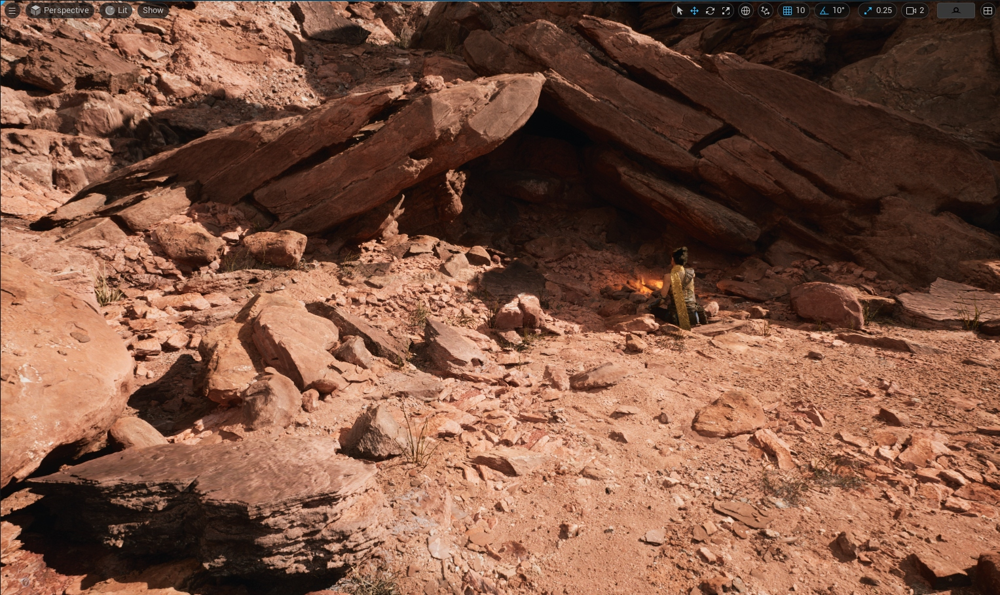
*Lumen 글로벌 일루미네이션 데모*

### 기존 방식과의 비교

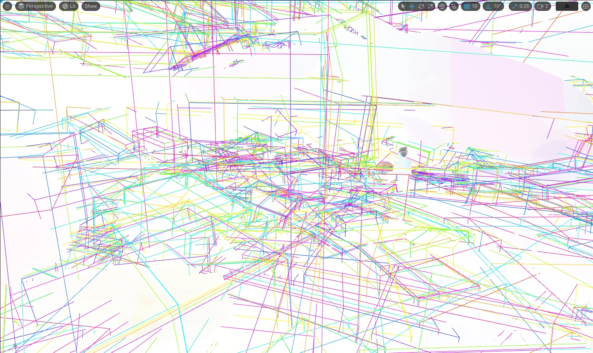
*기존 GI 방식과 Lumen 비교*

```
┌─────────────────────────────────────────────────────────────────┐
│                    GI 방식 비교                                  │
├─────────────────────────────────────────────────────────────────┤
│                                                                 │
│  베이크 라이트맵 (UE4 기본)                                       │
│  ┌─────────────────────────────────────────────────────────┐   │
│  │  [오프라인 계산] → [라이트맵 텍스처] → [런타임 샘플링]    │   │
│  │                                                         │   │
│  │  장점: 고품질, 저비용 런타임                              │   │
│  │  단점: 정적만 가능, 긴 베이킹 시간, 메모리 사용           │   │
│  └─────────────────────────────────────────────────────────┘   │
│                                                                 │
│  SSGI (Screen Space GI)                                         │
│  ┌─────────────────────────────────────────────────────────┐   │
│  │  [화면 정보만 사용] → [제한된 간접광]                      │   │
│  │                                                         │   │
│  │  장점: 빠름, 동적                                        │   │
│  │  단점: 화면 밖 정보 없음, 두꺼운 오브젝트 문제            │   │
│  └─────────────────────────────────────────────────────────┘   │
│                                                                 │
│  Lumen                                                          │
│  ┌─────────────────────────────────────────────────────────┐   │
│  │  [씬 표현 캐시] + [레이트레이싱] → [풀 GI]               │   │
│  │                                                         │   │
│  │  장점: 완전 동적, 화면 밖 포함, 고품질                    │   │
│  │  단점: 높은 GPU 비용                                     │   │
│  └─────────────────────────────────────────────────────────┘   │
│                                                                 │
└─────────────────────────────────────────────────────────────────┘
```

---

## 아키텍처 개요

### Lumen의 구성 요소

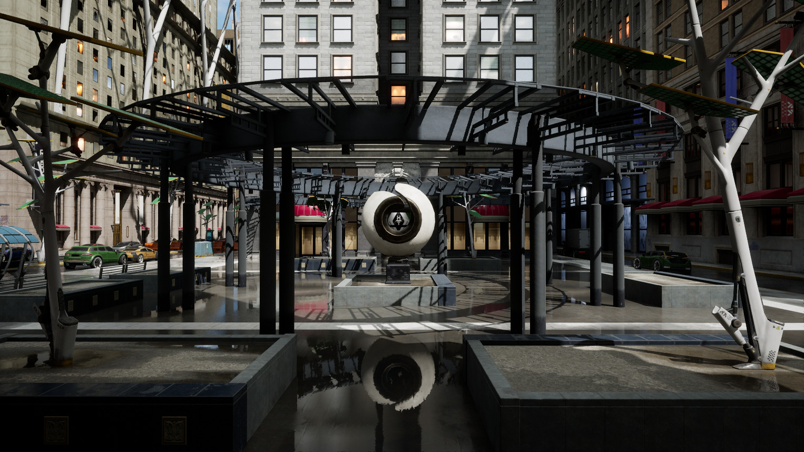
*Lumen 시스템 아키텍처*

```
┌─────────────────────────────────────────────────────────────────┐
│                    Lumen 아키텍처                                │
├─────────────────────────────────────────────────────────────────┤
│                                                                 │
│  ┌─────────────────────────────────────────────────────────┐   │
│  │                    Scene Representation                  │   │
│  │  ┌───────────────┐  ┌───────────────┐                   │   │
│  │  │  Mesh Cards   │  │ Surface Cache │                   │   │
│  │  │ (표면 간략화)  │  │ (라이팅 캐시)  │                   │   │
│  │  └───────────────┘  └───────────────┘                   │   │
│  └────────────────────────┬────────────────────────────────┘   │
│                           │                                     │
│                           ▼                                     │
│  ┌─────────────────────────────────────────────────────────┐   │
│  │                    Ray Tracing                           │   │
│  │  ┌───────────────┐  ┌───────────────┐                   │   │
│  │  │   Software    │  │   Hardware    │                   │   │
│  │  │   Tracing     │  │   Tracing     │                   │   │
│  │  │ (SDF/Cards)   │  │ (RTX/DXR)     │                   │   │
│  │  └───────────────┘  └───────────────┘                   │   │
│  └────────────────────────┬────────────────────────────────┘   │
│                           │                                     │
│                           ▼                                     │
│  ┌─────────────────────────────────────────────────────────┐   │
│  │                    Radiance Caching                      │   │
│  │  ┌───────────────┐  ┌───────────────┐                   │   │
│  │  │Screen Probes  │  │ World Probes  │                   │   │
│  │  │(화면 공간)     │  │ (월드 공간)    │                   │   │
│  │  └───────────────┘  └───────────────┘                   │   │
│  └────────────────────────┬────────────────────────────────┘   │
│                           │                                     │
│                           ▼                                     │
│  ┌─────────────────────────────────────────────────────────┐   │
│  │                    Final Gathering                       │   │
│  │  - Diffuse Indirect                                      │   │
│  │  - Specular Reflections                                  │   │
│  └─────────────────────────────────────────────────────────┘   │
│                                                                 │
└─────────────────────────────────────────────────────────────────┘
```

---

## Mesh Cards

### 개념

Mesh Cards는 메시 표면의 **간략화된 표현**입니다. 6방향 직교 투영으로 메시를 캡처합니다.

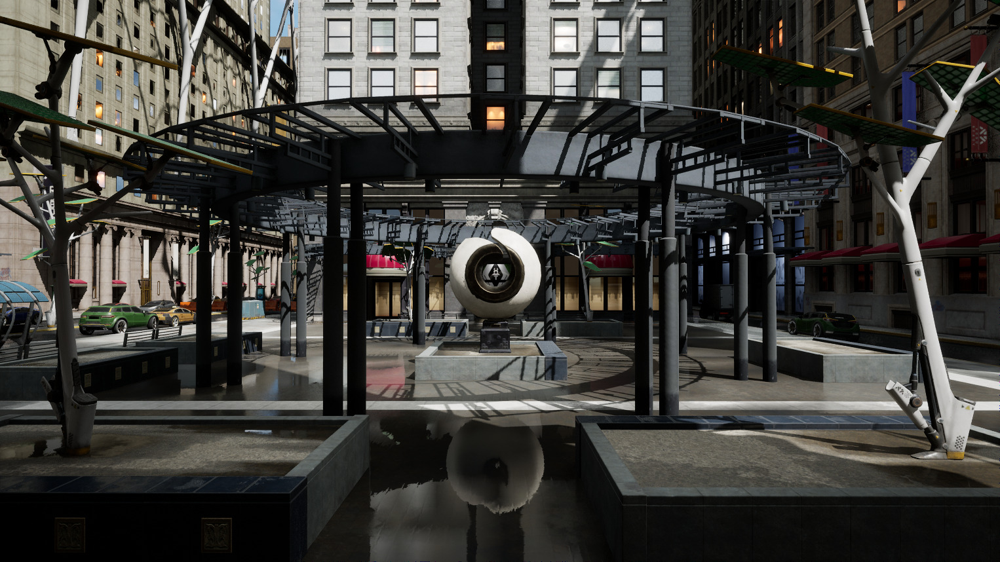
*Mesh Cards 생성 원리*

```cpp
// Mesh Card 생성
struct FLumenMeshCard
{
    // 카드 위치 및 방향
    FVector Origin;
    FVector AxisX, AxisY;    // 카드 평면
    FVector Normal;          // 카드 방향

    // 카드 크기
    float SizeX, SizeY;

    // Atlas 내 위치
    FIntPoint AtlasOffset;
    FIntPoint AtlasSize;

    // 속성
    bool bVisible;           // 현재 가시성
    float LastUsedTime;      // 마지막 사용 시간
};

// 메시당 6개의 기본 카드 (±X, ±Y, ±Z 방향)
class FLumenMeshCards
{
    TArray<FLumenMeshCard> Cards;  // 보통 6개

    void GenerateCards(UStaticMesh* Mesh)
    {
        FBox Bounds = Mesh->GetBoundingBox();

        // 6방향 카드 생성
        for (int Axis = 0; Axis < 3; Axis++)
        {
            for (int Sign = -1; Sign <= 1; Sign += 2)
            {
                FLumenMeshCard Card;
                Card.Normal = FVector::ZeroVector;
                Card.Normal[Axis] = Sign;

                // 바운딩 박스에서 카드 크기 결정
                SetupCardFromBounds(Card, Bounds, Axis, Sign);

                Cards.Add(Card);
            }
        }
    }
};
```

### Surface Cache

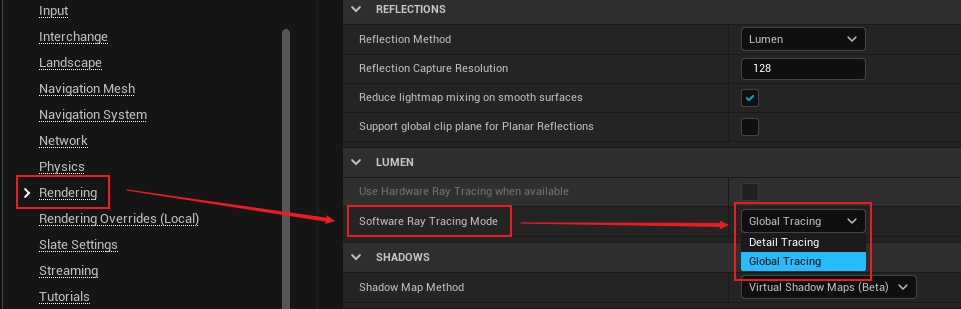
*Surface Cache 구조*

```cpp
// Surface Cache - 표면의 라이팅 정보 캐시
class FLumenSurfaceCache
{
    // Atlas 텍스처들
    FRDGTexture* DirectLightingAtlas;      // 직접광
    FRDGTexture* IndirectLightingAtlas;    // 간접광
    FRDGTexture* FinalLightingAtlas;       // 최종 (합산)

    // 카드별 할당 정보
    struct FCardAllocation
    {
        FIntPoint AtlasOffset;
        FIntPoint Resolution;    // 해상도 (가변)
        uint32 CardIndex;
    };
    TArray<FCardAllocation> Allocations;

    void UpdateSurfaceCache()
    {
        // 1. 직접광 업데이트 (자주)
        UpdateDirectLighting();

        // 2. 간접광 업데이트 (분산)
        UpdateIndirectLighting();

        // 3. 최종 합성
        CompositeFinalLighting();
    }
};
```

---

## 소프트웨어 레이트레이싱

### Signed Distance Fields (SDF)

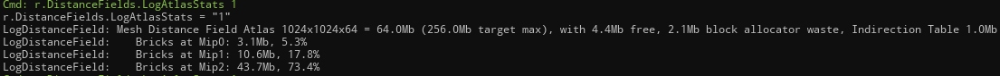
*Global Distance Field 구조*

```cpp
// Global Distance Field
class FGlobalDistanceField
{
    // 클립맵 구조 (다중 해상도)
    FRDGTexture* Clipmaps[NUM_CLIPMAP_LEVELS];

    // 클립맵 레벨별 설정
    struct FClipmapLevel
    {
        float VoxelSize;        // 복셀 크기
        FVector Center;         // 클립맵 중심
        float Extent;           // 범위
    };

    // SDF 샘플링
    float SampleDistance(FVector WorldPosition)
    {
        // 적절한 클립맵 레벨 선택
        int Level = SelectClipmapLevel(WorldPosition);

        // 트리니어 보간
        FVector UVW = WorldToUVW(WorldPosition, Level);
        return Clipmaps[Level].SampleLevel(UVW, 0);
    }
};

// SDF 기반 레이트레이싱
struct FSDFRayResult
{
    bool bHit;
    float HitDistance;
    FVector HitPosition;
    FVector HitNormal;
    uint32 MeshCardIndex;
};

FSDFRayResult TraceSDF(FVector Origin, FVector Direction, float MaxDistance)
{
    FSDFRayResult Result = {};
    float T = 0;

    // Sphere Tracing
    for (int Step = 0; Step < MAX_STEPS; Step++)
    {
        FVector P = Origin + Direction * T;
        float Distance = GlobalDistanceField.SampleDistance(P);

        if (Distance < SURFACE_THRESHOLD)
        {
            // 히트
            Result.bHit = true;
            Result.HitDistance = T;
            Result.HitPosition = P;
            Result.HitNormal = ComputeSDFNormal(P);
            Result.MeshCardIndex = FindNearestCard(P, Result.HitNormal);
            return Result;
        }

        T += Distance * 0.9f;  // 안전 계수

        if (T > MaxDistance)
            break;
    }

    return Result;
}
```

### Card Tracing

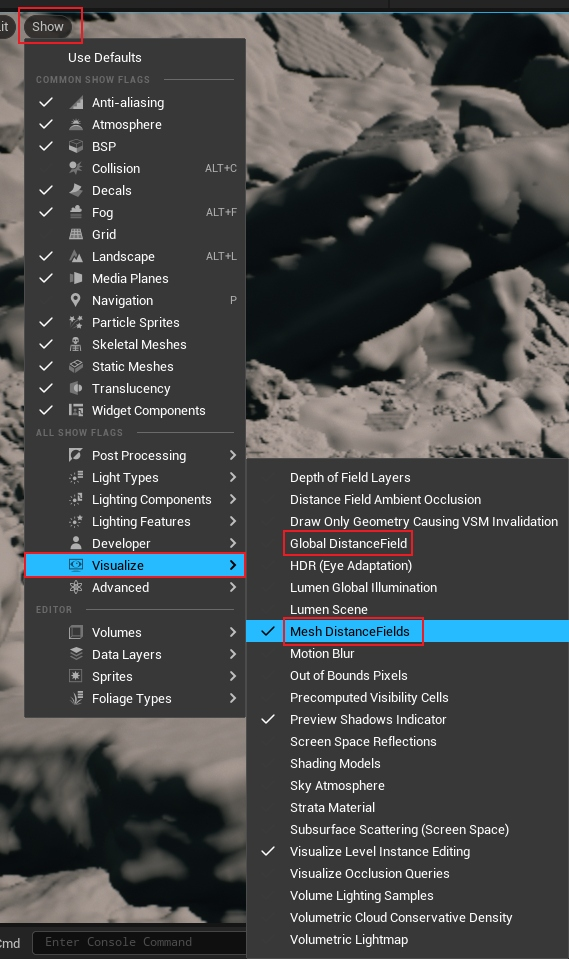
*Mesh Card 기반 트레이싱*

```cpp
// Mesh Card 기반 트레이싱
FLumenTraceResult TraceCards(FVector Origin, FVector Direction)
{
    FLumenTraceResult Result = {};
    float ClosestT = FLT_MAX;

    // 모든 카드에 대해 레이-평면 교차 테스트
    for (FLumenMeshCard& Card : VisibleCards)
    {
        float T;
        if (RayPlaneIntersect(Origin, Direction, Card.GetPlane(), T))
        {
            if (T > 0 && T < ClosestT)
            {
                // 카드 범위 내인지 확인
                FVector HitPoint = Origin + Direction * T;
                FVector2D LocalUV = Card.WorldToLocal(HitPoint);

                if (LocalUV.X >= 0 && LocalUV.X <= 1 &&
                    LocalUV.Y >= 0 && LocalUV.Y <= 1)
                {
                    ClosestT = T;
                    Result.bHit = true;
                    Result.CardIndex = Card.Index;
                    Result.HitUV = LocalUV;
                }
            }
        }
    }

    return Result;
}
```

---

## 하드웨어 레이트레이싱

### RTX/DXR 통합

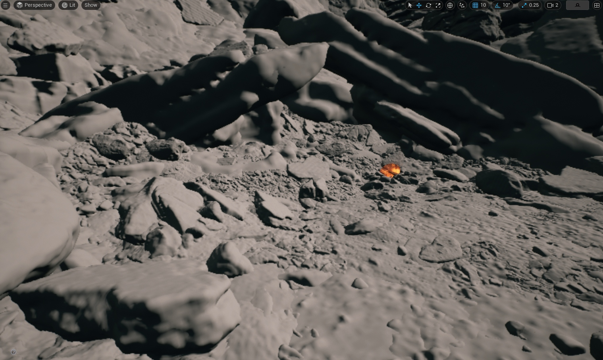
*RTX 하드웨어 레이트레이싱*

```cpp
// 하드웨어 RT 활성화 조건
bool ShouldUseHardwareRayTracing()
{
    return GRHISupportsRayTracing
        && CVarLumenHardwareRayTracing.GetValueOnRenderThread()
        && IsRayTracingEnabled();
}

// BLAS/TLAS 구성
class FLumenHardwareRayTracing
{
    // Top Level Acceleration Structure
    FRayTracingAccelerationStructure TLAS;

    // 씬 업데이트
    void UpdateAccelerationStructure(FScene* Scene)
    {
        TArray<FRayTracingGeometryInstance> Instances;

        for (FPrimitiveSceneProxy* Proxy : Scene->Primitives)
        {
            if (Proxy->HasRayTracingGeometry())
            {
                FRayTracingGeometryInstance Instance;
                Instance.Geometry = Proxy->GetRayTracingGeometry();
                Instance.Transform = Proxy->GetLocalToWorld();
                Instance.Mask = Proxy->GetRayTracingMask();
                Instances.Add(Instance);
            }
        }

        TLAS.Build(Instances);
    }
};

// 하드웨어 RT 셰이더
[shader("raygeneration")]
void LumenHardwareRayGen()
{
    uint2 PixelCoord = DispatchRaysIndex().xy;

    // 레이 생성
    RayDesc Ray;
    Ray.Origin = GetCameraPosition();
    Ray.Direction = GetRayDirection(PixelCoord);
    Ray.TMin = 0.0f;
    Ray.TMax = 10000.0f;

    // 트레이싱
    FLumenPayload Payload = (FLumenPayload)0;
    TraceRay(TLAS, RAY_FLAG_NONE, 0xFF, 0, 0, 0, Ray, Payload);

    // 결과 저장
    if (Payload.HitT > 0)
    {
        OutputRadiance[PixelCoord] = Payload.Radiance;
    }
}

[shader("closesthit")]
void LumenClosestHit(inout FLumenPayload Payload, FHitAttributes Attrs)
{
    // 히트 위치에서 Surface Cache 샘플링
    FVector WorldPos = WorldRayOrigin() + WorldRayDirection() * RayTCurrent();
    FVector Normal = GetHitNormal(Attrs);

    // Surface Cache에서 라이팅 읽기
    Payload.Radiance = SampleSurfaceCache(WorldPos, Normal);
    Payload.HitT = RayTCurrent();
}
```

---

## Screen Space Probes

### 프로브 배치

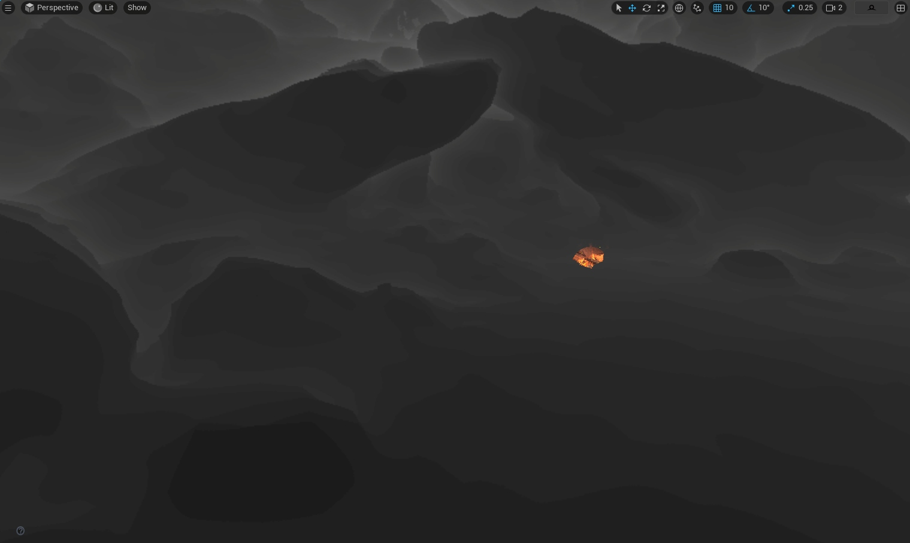
*화면 공간 프로브 배치*

```cpp
// 화면 공간 프로브 시스템
class FLumenScreenProbes
{
    // 프로브 그리드 (화면을 16x16 타일로)
    static const int PROBE_SPACING = 16;

    struct FScreenProbe
    {
        float2 ScreenUV;         // 화면 위치
        float3 WorldPosition;    // 월드 위치
        float3 WorldNormal;      // 표면 노말
        float SceneDepth;        // 깊이

        // Radiance 샘플 (반구)
        float3 RadianceSamples[NUM_SAMPLES];
    };

    // 프로브 업데이트
    void UpdateProbes(FSceneView& View)
    {
        // 1. 프로브 위치 결정 (G-Buffer 기반)
        PlaceProbes(View);

        // 2. 레이 트레이싱 (분산)
        TraceProbeRays();

        // 3. Radiance 통합
        IntegrateRadiance();

        // 4. 시간적 필터링
        FilterTemporal();
    }
};
```

### 프로브 레이 트레이싱

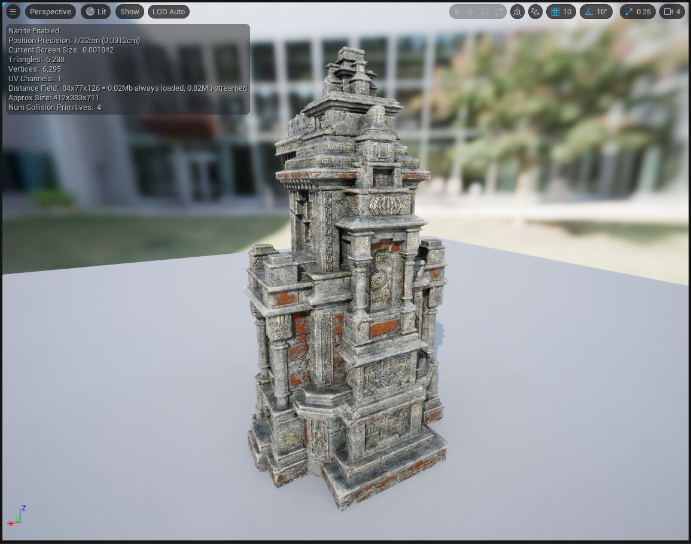
*프로브당 레이 트레이싱*

```cpp
// 프로브당 레이 트레이싱
[numthreads(8, 8, 1)]
void TraceScreenProbeRays(uint2 ProbeCoord : SV_DispatchThreadID)
{
    FScreenProbe Probe = LoadProbe(ProbeCoord);

    // 반구 위의 레이 방향 생성
    for (int i = 0; i < RAYS_PER_PROBE; i++)
    {
        // 코사인 가중 반구 샘플링
        float2 Xi = Hammersley(i, RAYS_PER_PROBE);
        float3 LocalDir = CosineSampleHemisphere(Xi);
        float3 WorldDir = TangentToWorld(LocalDir, Probe.WorldNormal);

        // 트레이싱 (SW 또는 HW)
        FLumenTraceResult Result = TraceLumenRay(Probe.WorldPosition, WorldDir);

        if (Result.bHit)
        {
            // Surface Cache에서 라이팅 샘플
            float3 Radiance = SampleSurfaceCache(Result.HitPosition, Result.HitNormal);
            Probe.RadianceSamples[i] = Radiance;
        }
        else
        {
            // 스카이라이트
            Probe.RadianceSamples[i] = SampleSkyLight(WorldDir);
        }
    }

    // 결과 저장
    StoreProbeRadiance(ProbeCoord, Probe);
}
```

---

## Radiance Cache

### World Space Radiance Cache

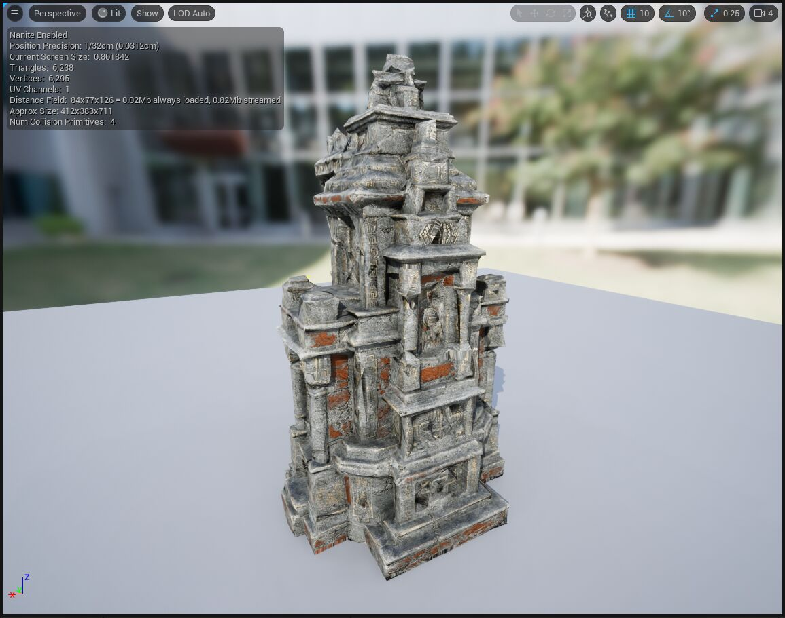
*월드 공간 Radiance 캐시*

```cpp
// 월드 공간 Radiance 캐시
class FLumenRadianceCache
{
    // 클립맵 구조
    struct FRadianceCacheClipmap
    {
        FRDGTexture* ProbeAtlas;     // 프로브 라이팅
        FRDGTexture* ProbeOcclusion; // 오클루전
        FVector Center;
        float VoxelSize;
    };
    TArray<FRadianceCacheClipmap> Clipmaps;

    // 프로브 배치 (적응형)
    struct FRadianceProbe
    {
        FVector Position;
        FSHVector3 Radiance;  // SH 계수
        float Validity;       // 유효성
    };

    // 프로브 업데이트 (분산)
    void UpdateProbes()
    {
        // 프레임당 일부 프로브만 업데이트
        int NumToUpdate = TotalProbes / UPDATE_PERIOD;

        for (int i = 0; i < NumToUpdate; i++)
        {
            int ProbeIndex = (FrameNumber * NumToUpdate + i) % TotalProbes;
            UpdateProbe(Probes[ProbeIndex]);
        }
    }
};
```

### Final Gathering

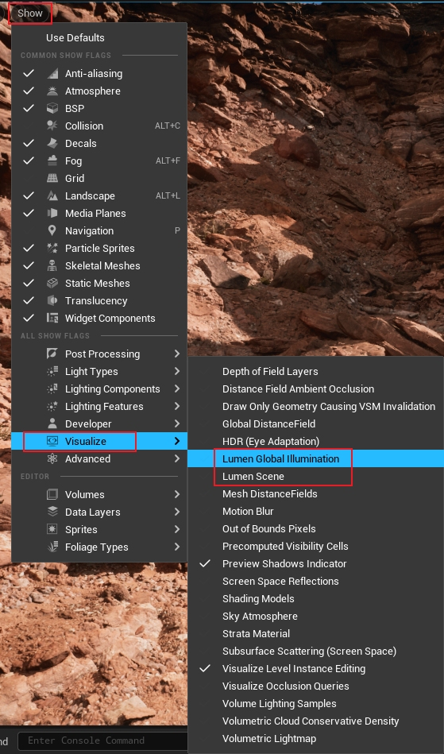
*최종 간접광 계산*

```cpp
// 최종 간접광 계산
[numthreads(8, 8, 1)]
void LumenFinalGatherCS(uint2 PixelCoord : SV_DispatchThreadID)
{
    // G-Buffer 읽기
    float3 WorldPos = GetWorldPosition(PixelCoord);
    float3 Normal = GetWorldNormal(PixelCoord);
    float Roughness = GetRoughness(PixelCoord);

    // 1. Diffuse 간접광 (Screen Probes에서)
    float3 DiffuseIndirect = float3(0, 0, 0);
    {
        // 가까운 Screen Probes 찾기
        int2 ProbeCoords[4];
        float Weights[4];
        GetNearestProbes(PixelCoord, ProbeCoords, Weights);

        // 보간
        for (int i = 0; i < 4; i++)
        {
            FScreenProbe Probe = LoadProbe(ProbeCoords[i]);
            DiffuseIndirect += Probe.IntegratedRadiance * Weights[i];
        }
    }

    // 2. Specular 반사
    float3 SpecularIndirect = float3(0, 0, 0);
    if (Roughness < 0.4f)  // 거친 표면은 Diffuse로 근사
    {
        // 반사 레이 트레이싱
        float3 ViewDir = normalize(CameraPos - WorldPos);
        float3 ReflectDir = reflect(-ViewDir, Normal);

        FLumenTraceResult Result = TraceLumenRay(WorldPos, ReflectDir);
        if (Result.bHit)
        {
            SpecularIndirect = SampleSurfaceCache(Result.HitPosition, Result.HitNormal);
        }
        else
        {
            SpecularIndirect = SampleSkyLight(ReflectDir);
        }
    }

    // 3. 최종 합성
    float3 FinalIndirect = DiffuseIndirect * (1 - Metallic) + SpecularIndirect * Specular;

    IndirectLightingOutput[PixelCoord] = FinalIndirect;
}
```

---

## 시간적 안정성

### Temporal Filtering

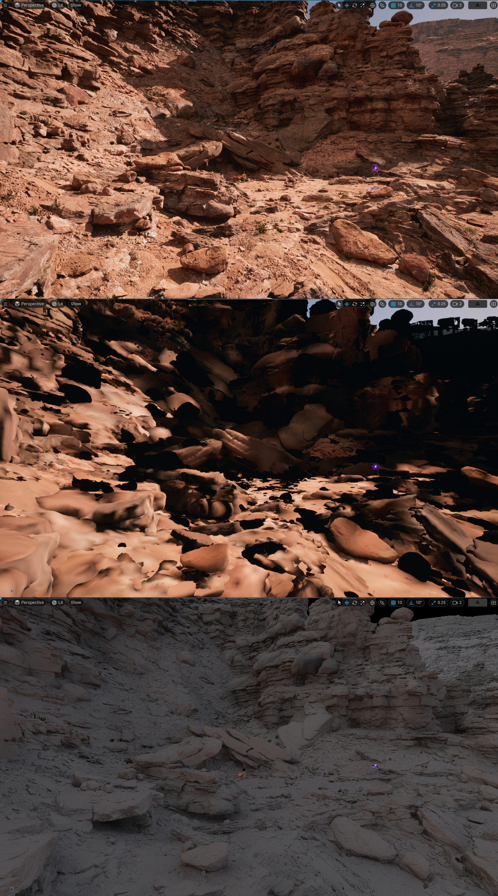
*시간적 필터링으로 노이즈 제거*

```cpp
// 시간적 필터링으로 노이즈 제거
class FLumenTemporalFilter
{
    FRDGTexture* HistoryRadiance;
    FRDGTexture* HistoryVariance;

    void Filter(FRDGTexture* CurrentRadiance)
    {
        // 리프로젝션
        [numthreads(8, 8, 1)]
        void TemporalFilterCS(uint2 PixelCoord)
        {
            float3 CurrentColor = CurrentRadiance.Load(PixelCoord);

            // 모션 벡터로 히스토리 위치 계산
            float2 Motion = MotionVectorTexture.Load(PixelCoord);
            float2 HistoryUV = (PixelCoord + 0.5f) / Resolution - Motion;

            // 히스토리 유효성 검사
            bool bValidHistory = IsHistoryValid(PixelCoord, HistoryUV);

            if (bValidHistory)
            {
                float3 HistoryColor = HistoryRadiance.Sample(HistoryUV);

                // 컬러 클램핑 (고스팅 방지)
                float3 NearMin, NearMax;
                ComputeColorBounds(PixelCoord, NearMin, NearMax);
                HistoryColor = clamp(HistoryColor, NearMin, NearMax);

                // 블렌딩
                float BlendFactor = 0.95f;  // 히스토리 가중치
                OutputRadiance[PixelCoord] = lerp(CurrentColor, HistoryColor, BlendFactor);
            }
            else
            {
                // 히스토리 무효 → 현재 값 사용
                OutputRadiance[PixelCoord] = CurrentColor;
            }
        }
    }
};
```

---

## 설정 및 최적화

### 품질 설정

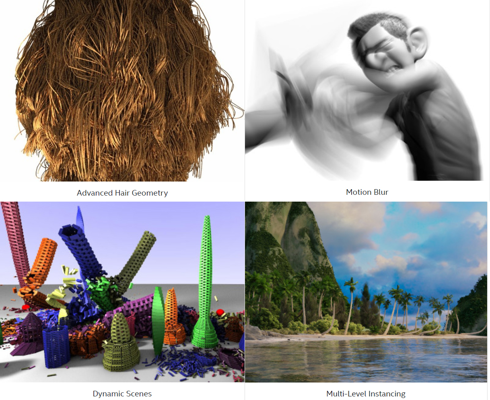
*Lumen 품질 설정*

```ini
; Project Settings
[/Script/Engine.RendererSettings]
; Lumen 활성화
r.Lumen.DiffuseIndirect.Allow=1
r.Lumen.Reflections.Allow=1

; 하드웨어 RT (RTX GPU용)
r.Lumen.HardwareRayTracing=1
r.Lumen.HardwareRayTracing.LightingMode=2  ; 0=Surface Cache, 1=Hit Lighting, 2=Far Field

; 품질 설정
r.Lumen.TraceMeshSDFs=1
r.Lumen.ScreenProbeGather.RadianceCache.Clipmaps=4
```

### 성능 팁

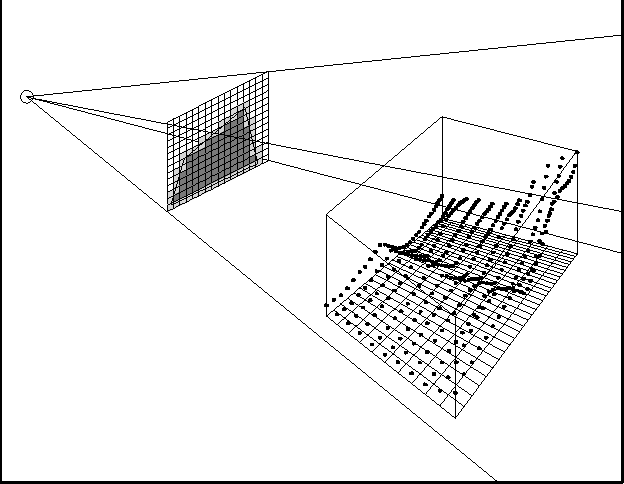
*Lumen 최적화 가이드*

```cpp
// 1. 메시 카드 품질 조정
// 프로젝트 세팅 > Rendering > Lumen
LumenMeshCardMinSize = 0.5f;      // 최소 카드 크기
LumenMaxCardDistanceFromCamera = 10000.0f;  // 최대 거리

// 2. Surface Cache 해상도
r.Lumen.SurfaceCache.Resolution=1024

// 3. 프로브 밀도
r.Lumen.ScreenProbeGather.ScreenSpaceTracingDownsampleFactor=1  // 낮을수록 고품질

// 4. 반사 품질
r.Lumen.Reflections.MaxRoughnessToTrace=0.4f  // 거친 표면은 근사
```

### 디버그 시각화

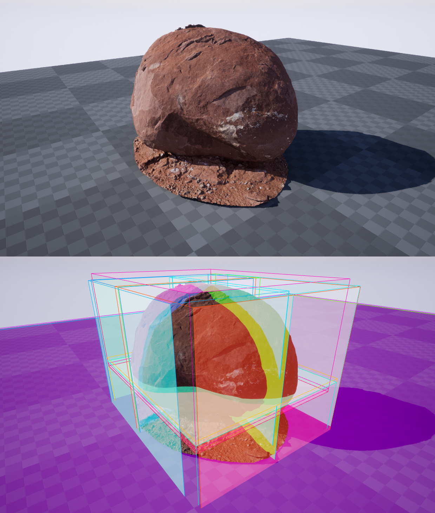
*Lumen 디버그 시각화*

```cpp
// Lumen 시각화 명령어
r.Lumen.Visualize.Mode=1              // GI 시각화
r.Lumen.Visualize.CardPlacement=1     // 카드 배치
r.Lumen.Visualize.SurfaceCache=1      // Surface Cache
r.Lumen.Visualize.ScreenProbeGather=1 // Screen Probes
```

---

## 제한사항

| 제한 | 설명 | 대안 |
|------|------|------|
| 투명 오브젝트 | GI 영향 제한적 | 별도 처리 필요 |
| 얇은 오브젝트 | SDF 정확도 저하 | 투사이드 설정 |
| 실내 작은 공간 | Detail Tracing 필요 | 설정 조정 |
| 빠른 움직임 | 지연 발생 가능 | 속도 제한 |

---

## 요약

| 구성 요소 | 역할 |
|----------|------|
| Mesh Cards | 메시 표면의 간략화된 표현 |
| Surface Cache | 표면의 라이팅 정보 캐시 |
| SDF Tracing | 소프트웨어 레이트레이싱 |
| HW Ray Tracing | RTX 기반 고품질 트레이싱 |
| Screen Probes | 화면 공간 간접광 수집 |
| Radiance Cache | 월드 공간 라이팅 캐시 |
| Temporal Filter | 시간적 노이즈 제거 |

Lumen은 완전 동적 GI를 제공하여 아티스트의 반복 작업을 크게 단축시킵니다.
---

<div style="display: flex; justify-content: space-between; align-items: center; padding: 16px 0;">
  <a href="../02-nanite/" style="text-decoration: none;">← 이전: 02. Nanite 가상화 지오메트리</a>
  <a href="../04-virtual-shadow-maps/" style="text-decoration: none;">다음: 04. Virtual Shadow Maps →</a>
</div>
