# Virtual Shadow Maps

UE5의 고해상도 동적 그림자 시스템 Virtual Shadow Maps을 분석합니다.

---

## Virtual Shadow Maps란?

Virtual Shadow Maps (VSM)은 UE5의 **가상 텍스처 기반 그림자 시스템**입니다. 최대 16K x 16K 가상 해상도로 매우 상세한 그림자를 제공합니다.

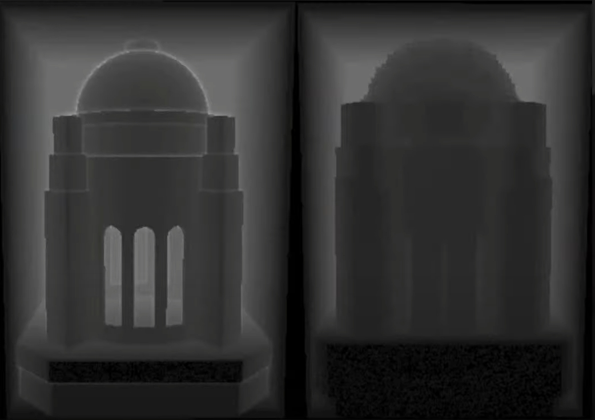
*Virtual Shadow Maps 개요*

### 기존 그림자 방식의 문제

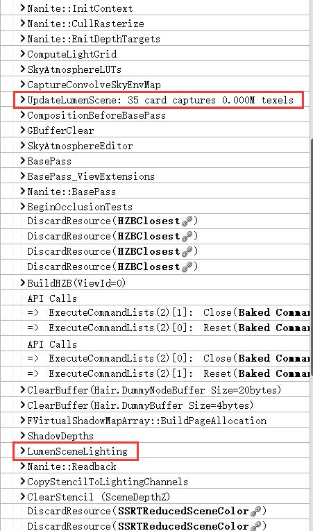
*Cascaded Shadow Maps vs Virtual Shadow Maps*

```
┌─────────────────────────────────────────────────────────────────┐
│                    기존 그림자 방식의 문제                        │
├─────────────────────────────────────────────────────────────────┤
│                                                                 │
│  Cascaded Shadow Maps (CSM)                                     │
│  ┌─────────────────────────────────────────────────────────┐   │
│  │                                                         │   │
│  │  ┌────┬────┬────┬────┐                                   │   │
│  │  │ C0 │ C1 │ C2 │ C3 │  각 캐스케이드: 2048x2048        │   │
│  │  └────┴────┴────┴────┘                                   │   │
│  │   ↑    ↑    ↑    ↑                                      │   │
│  │  가까움 ────────→ 멀리                                   │   │
│  │                                                         │   │
│  │  문제점:                                                 │   │
│  │  - 캐스케이드 경계에서 품질 급락                          │   │
│  │  - 먼 거리 해상도 부족                                   │   │
│  │  - 많은 오브젝트 → 많은 Draw Call                        │   │
│  │  - 동적 광원당 별도 맵 필요                              │   │
│  │                                                         │   │
│  └─────────────────────────────────────────────────────────┘   │
│                                                                 │
│  Virtual Shadow Maps (VSM)                                       │
│  ┌─────────────────────────────────────────────────────────┐   │
│  │                                                         │   │
│  │  가상 텍스처: 16384 x 16384                              │   │
│  │  ┌──────────────────────────────────────┐               │   │
│  │  │  ┌──┬──┬──┬──┬──┬──┬──┬──┐          │               │   │
│  │  │  │  │  │  │▓▓│▓▓│  │  │  │ ← 필요한 │               │   │
│  │  │  ├──┼──┼──┼──┼──┼──┼──┼──┤   타일만 │               │   │
│  │  │  │  │  │▓▓│▓▓│▓▓│▓▓│  │  │   할당   │               │   │
│  │  │  ├──┼──┼──┼──┼──┼──┼──┼──┤          │               │   │
│  │  │  │  │▓▓│▓▓│▓▓│▓▓│▓▓│▓▓│  │          │               │   │
│  │  │  └──┴──┴──┴──┴──┴──┴──┴──┘          │               │   │
│  │  └──────────────────────────────────────┘               │   │
│  │                                                         │   │
│  │  장점:                                                   │   │
│  │  - 연속적 해상도 (캐스케이드 경계 없음)                   │   │
│  │  - 필요한 부분만 렌더링                                  │   │
│  │  - Nanite와 완벽 통합                                    │   │
│  │  - 정적 지오메트리 캐싱                                  │   │
│  │                                                         │   │
│  └─────────────────────────────────────────────────────────┘   │
│                                                                 │
└─────────────────────────────────────────────────────────────────┘
```

---

## 아키텍처

### 가상 텍스처 구조

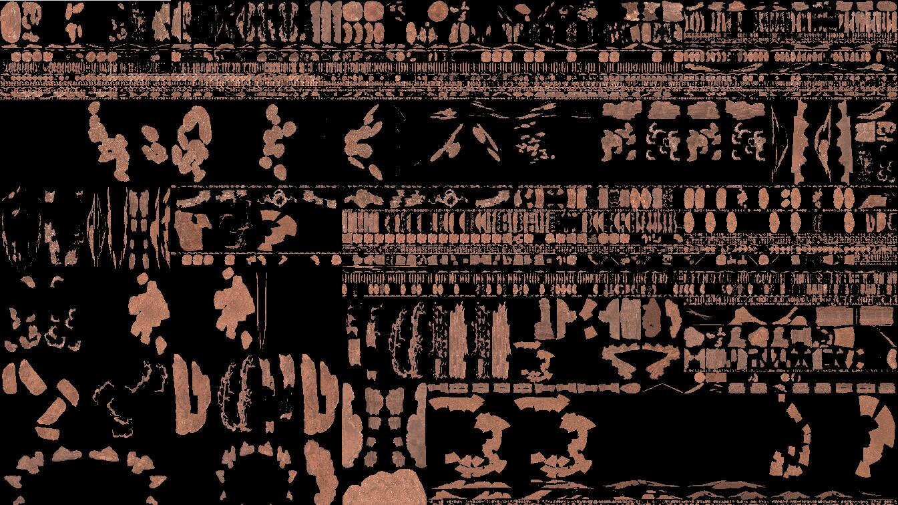
*Virtual Shadow Map 가상 텍스처 구조*

```cpp
// Virtual Shadow Map 구조
class FVirtualShadowMap
{
    // 가상 해상도 (Directional: 16384 x 16384)
    static const int32 VirtualResolution = 16384;
    static const int32 PageSize = 128;  // 물리 페이지 크기

    // 페이지 테이블
    struct FPageTableEntry
    {
        uint32 PhysicalPageIndex : 20;  // 물리 페이지 인덱스
        uint32 bMapped : 1;             // 매핑 여부
        uint32 bDirty : 1;              // 업데이트 필요
        uint32 LODLevel : 4;            // 클립맵 레벨
    };

    // 물리 페이지 풀
    FRDGTexture* PhysicalPagePool;      // 깊이 데이터
    int32 PhysicalPoolSize;             // 보통 4096 x 4096

    // 페이지 테이블 (가상 → 물리 매핑)
    TArray<FPageTableEntry> PageTable;

    // 클립맵 레벨 (Directional Light용)
    struct FClipmapLevel
    {
        FMatrix ViewProjection;
        float Resolution;
        int32 PageOffset;
    };
    TArray<FClipmapLevel> ClipmapLevels;
};
```

### 광원 유형별 구조

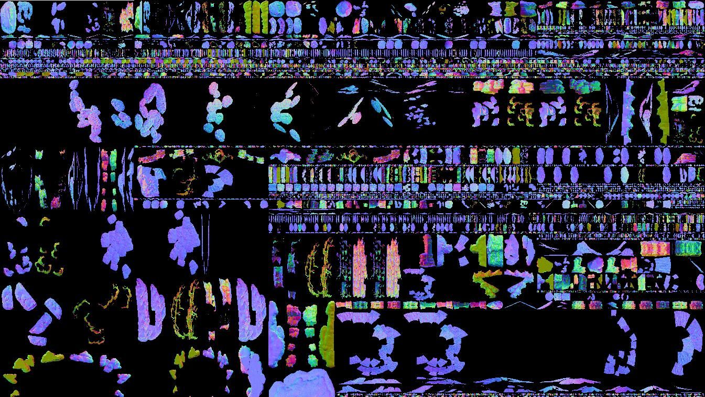
*광원 유형별 Virtual Shadow Map 구조*

```
┌─────────────────────────────────────────────────────────────────┐
│                    광원 유형별 VSM 구조                          │
├─────────────────────────────────────────────────────────────────┤
│                                                                 │
│  Directional Light (태양광)                                      │
│  ┌─────────────────────────────────────────────────────────┐   │
│  │                                                         │   │
│  │  클립맵 구조 (카메라 중심)                                │   │
│  │  ┌─────────────────────────────────────┐                │   │
│  │  │  Level 0: 가장 상세 (카메라 근처)    │                │   │
│  │  │    ┌───────┐                         │                │   │
│  │  │    │ L0    │                         │                │   │
│  │  │    └───┬───┘                         │                │   │
│  │  │  Level 1: ┌─────────┐                │                │   │
│  │  │           │   L1    │                │                │   │
│  │  │           └────┬────┘                │                │   │
│  │  │  Level 2:  ┌──────────────┐          │                │   │
│  │  │            │     L2       │          │                │   │
│  │  │            └──────────────┘          │                │   │
│  │  │  ...                                 │                │   │
│  │  └─────────────────────────────────────┘                │   │
│  │                                                         │   │
│  │  각 레벨: 16K x 16K 가상 해상도                          │   │
│  │  레벨 간 2배 범위 차이                                   │   │
│  │                                                         │   │
│  └─────────────────────────────────────────────────────────┘   │
│                                                                 │
│  Local Light (Point/Spot)                                       │
│  ┌─────────────────────────────────────────────────────────┐   │
│  │                                                         │   │
│  │  Point Light: 큐브맵 구조                                │   │
│  │  ┌───┬───┬───┐                                          │   │
│  │  │+X │+Y │+Z │  6면 × 가상 텍스처                       │   │
│  │  ├───┼───┼───┤                                          │   │
│  │  │-X │-Y │-Z │                                          │   │
│  │  └───┴───┴───┘                                          │   │
│  │                                                         │   │
│  │  Spot Light: 단일 방향                                   │   │
│  │  ┌─────────┐                                            │   │
│  │  │         │  1면 × 가상 텍스처                         │   │
│  │  │  Spot   │                                            │   │
│  │  │         │                                            │   │
│  │  └─────────┘                                            │   │
│  │                                                         │   │
│  └─────────────────────────────────────────────────────────┘   │
│                                                                 │
└─────────────────────────────────────────────────────────────────┘
```

---

## 페이지 관리

### 필요 페이지 결정

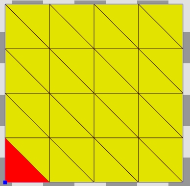
*페이지 요청 및 할당*

```cpp
// 프레임별 페이지 요청 수집
class FVirtualShadowMapPageManager
{
    void DetermineRequiredPages(FSceneView& View)
    {
        // 1. 화면 픽셀에서 필요한 페이지 결정
        [numthreads(8, 8, 1)]
        void MarkRequiredPagesCS(uint2 PixelCoord)
        {
            // G-Buffer에서 월드 위치
            float3 WorldPos = GetWorldPosition(PixelCoord);

            for (FLightSceneProxy* Light : AffectingLights)
            {
                // 섀도우 맵 UV 계산
                float2 ShadowUV = WorldToShadowUV(WorldPos, Light);

                // 필요한 해상도 결정 (화면에서의 픽셀 크기 기반)
                float ScreenPixelSize = ComputeScreenPixelSize(PixelCoord);
                int32 RequiredMipLevel = ComputeMipLevel(ScreenPixelSize);

                // 해당 페이지 마킹
                int2 PageCoord = ShadowUVToPage(ShadowUV, RequiredMipLevel);
                MarkPageRequired(Light, PageCoord, RequiredMipLevel);
            }
        }

        // 2. Nanite 클러스터에서 캐스터 페이지 결정
        for (FNaniteCluster& Cluster : ShadowCastingClusters)
        {
            for (FLightSceneProxy* Light : AffectingLights)
            {
                // 클러스터가 영향을 주는 페이지 마킹
                MarkCasterPages(Cluster, Light);
            }
        }
    }
};
```

### 페이지 할당 및 캐싱

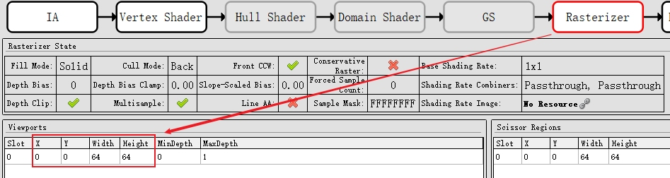
*페이지 할당 및 캐시 시스템*

```cpp
// 페이지 할당 시스템
class FVirtualShadowMapPageAllocator
{
    // 물리 페이지 풀
    TBitArray<> FreePages;
    int32 TotalPhysicalPages;

    // LRU 캐시
    struct FCachedPage
    {
        uint32 VirtualPageID;
        uint32 PhysicalPageIndex;
        uint32 LastUsedFrame;
        bool bStatic;  // 정적 지오메트리만 포함
    };
    TArray<FCachedPage> PageCache;

    uint32 AllocatePage(uint32 VirtualPageID, bool bStatic)
    {
        // 1. 캐시에서 찾기
        if (FCachedPage* Cached = FindInCache(VirtualPageID))
        {
            Cached->LastUsedFrame = CurrentFrame;
            return Cached->PhysicalPageIndex;
        }

        // 2. 프리 페이지 찾기
        int32 FreeIndex = FreePages.Find(true);
        if (FreeIndex != INDEX_NONE)
        {
            FreePages[FreeIndex] = false;
            AddToCache(VirtualPageID, FreeIndex, bStatic);
            return FreeIndex;
        }

        // 3. LRU 페이지 교체
        FCachedPage* Oldest = FindOldestPage();
        uint32 RecycledIndex = Oldest->PhysicalPageIndex;

        // 캐시 업데이트
        Oldest->VirtualPageID = VirtualPageID;
        Oldest->LastUsedFrame = CurrentFrame;
        Oldest->bStatic = bStatic;

        return RecycledIndex;
    }
};
```

---

## Nanite 통합

### GPU-Driven Shadow Rendering

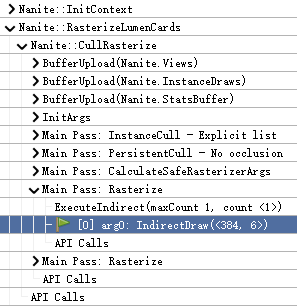
*Nanite와 VSM 통합*

```cpp
// Nanite 클러스터로 VSM 렌더링
class FVirtualShadowMapNaniteRenderer
{
    void RenderShadowMap(FRDGBuilder& GraphBuilder)
    {
        // 1. 페이지별 클러스터 컬링
        [numthreads(64, 1, 1)]
        void CullClustersForPage(uint PageIndex)
        {
            FVSMPage Page = Pages[PageIndex];
            FMatrix ShadowMatrix = Page.ViewProjection;

            for (FNaniteCluster& Cluster : AllClusters)
            {
                // Frustum 컬링
                if (IntersectsFrustum(Cluster.Bounds, ShadowMatrix))
                {
                    // 이 페이지에 영향을 주는 클러스터
                    AddClusterToPage(PageIndex, Cluster);
                }
            }
        }

        // 2. 소프트웨어 래스터라이제이션
        [numthreads(128, 1, 1)]
        void RasterizeShadowCS(uint ClusterIndex, uint TriIndex)
        {
            FNaniteCluster Cluster = VisibleClusters[ClusterIndex];
            FTriangle Tri = LoadTriangle(Cluster, TriIndex);

            // Shadow space로 변환
            float4 V0 = mul(float4(Tri.P0, 1), ShadowViewProj);
            float4 V1 = mul(float4(Tri.P1, 1), ShadowViewProj);
            float4 V2 = mul(float4(Tri.P2, 1), ShadowViewProj);

            // 물리 페이지 내 래스터라이제이션
            RasterizeToPhysicalPage(V0, V1, V2, PhysicalPageIndex);
        }
    }
};
```

### 정적 캐싱

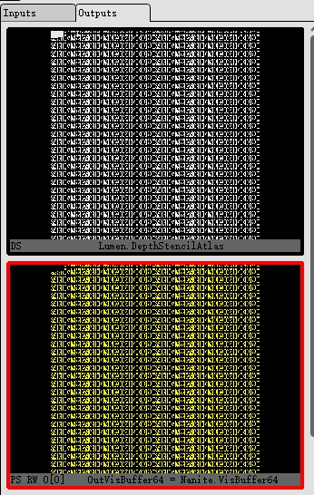
*정적 지오메트리 그림자 캐싱*

```cpp
// 정적 지오메트리 그림자 캐싱
class FVirtualShadowMapCaching
{
    void UpdateCache()
    {
        // 정적 페이지는 변경 시에만 업데이트
        for (FVSMPage& Page : Pages)
        {
            if (Page.bStatic)
            {
                // 정적 오브젝트 변화 감지
                bool bNeedsUpdate = false;

                for (FPrimitiveSceneProxy* Primitive : Page.StaticPrimitives)
                {
                    if (Primitive->HasMoved() || Primitive->HasChanged())
                    {
                        bNeedsUpdate = true;
                        break;
                    }
                }

                if (!bNeedsUpdate)
                {
                    // 캐시된 데이터 재사용
                    Page.bSkipRendering = true;
                    continue;
                }
            }

            // 동적 오브젝트 또는 변경된 정적 오브젝트
            RenderPage(Page);
        }
    }
};
```

---

## 샘플링 및 필터링

### 그림자 샘플링

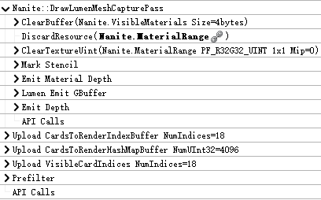
*Virtual Shadow Map 샘플링*

```cpp
// VSM 그림자 샘플링
float SampleVirtualShadowMap(float3 WorldPos, FLightData Light)
{
    // 1. Shadow UV 계산
    float4 ShadowCoord = mul(float4(WorldPos, 1), Light.ShadowMatrix);
    ShadowCoord.xyz /= ShadowCoord.w;
    float2 ShadowUV = ShadowCoord.xy * 0.5f + 0.5f;

    // 2. 적절한 Mip 레벨 선택
    float2 DDX = ddx(ShadowUV);
    float2 DDY = ddy(ShadowUV);
    float MipLevel = ComputeMipLevel(DDX, DDY);

    // 3. 페이지 테이블 조회
    int2 VirtualPage = floor(ShadowUV * VirtualResolution / PageSize);
    FPageTableEntry Entry = PageTable.Load(VirtualPage, MipLevel);

    if (!Entry.bMapped)
    {
        // 페이지 없음 → 그림자 없음으로 처리 또는 폴백
        return 1.0f;
    }

    // 4. 물리 페이지 내 UV 계산
    float2 PageUV = frac(ShadowUV * VirtualResolution / PageSize);
    float2 PhysicalUV = (Entry.PhysicalPage * PageSize + PageUV * PageSize) / PhysicalPoolSize;

    // 5. 깊이 비교
    float ShadowDepth = PhysicalShadowMap.SampleLevel(PhysicalUV, 0);
    float Depth = ShadowCoord.z;

    // Bias 적용
    float Bias = ComputeShadowBias(Light, WorldPos);

    return Depth - Bias <= ShadowDepth ? 1.0f : 0.0f;
}
```

### PCF 필터링

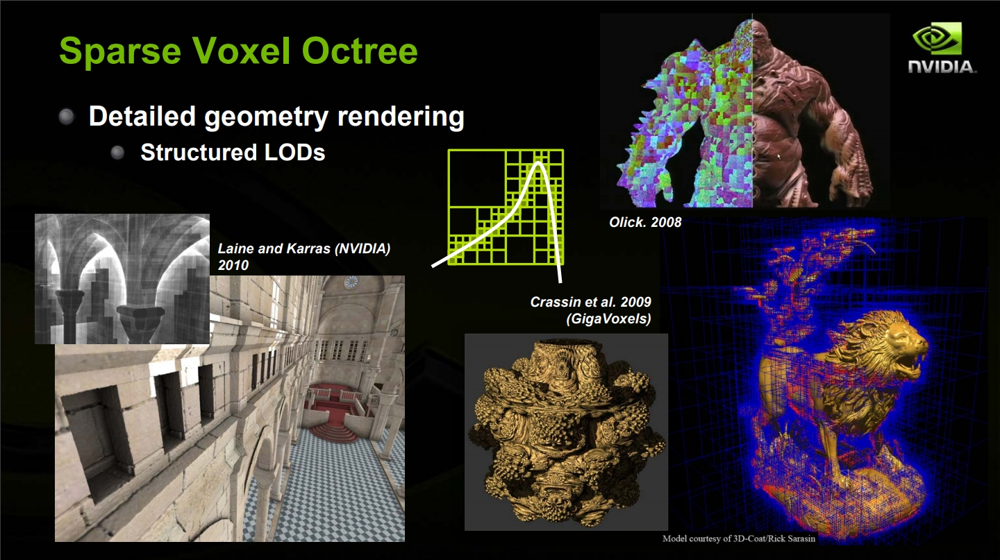
*Percentage Closer Filtering*

```cpp
// Percentage Closer Filtering
float SampleVSMWithPCF(float3 WorldPos, FLightData Light, int FilterSize)
{
    float Shadow = 0.0f;
    float TotalWeight = 0.0f;

    // 텍셀 크기 계산
    float2 TexelSize = 1.0f / (VirtualResolution >> MipLevel);

    // Poisson Disk 샘플링
    for (int i = 0; i < NUM_PCF_SAMPLES; i++)
    {
        float2 Offset = PoissonDisk[i] * FilterSize * TexelSize;
        float2 SampleUV = ShadowUV + Offset;

        // 페이지 경계 처리
        FPageSample Sample = SamplePageWithWrapping(SampleUV, MipLevel);

        if (Sample.bValid)
        {
            float SampleDepth = Sample.Depth;
            float Weight = PoissonWeights[i];

            Shadow += (Depth - Bias <= SampleDepth ? 1.0f : 0.0f) * Weight;
            TotalWeight += Weight;
        }
    }

    return TotalWeight > 0 ? Shadow / TotalWeight : 1.0f;
}
```

---

## 성능 최적화

### 페이지 예산 관리

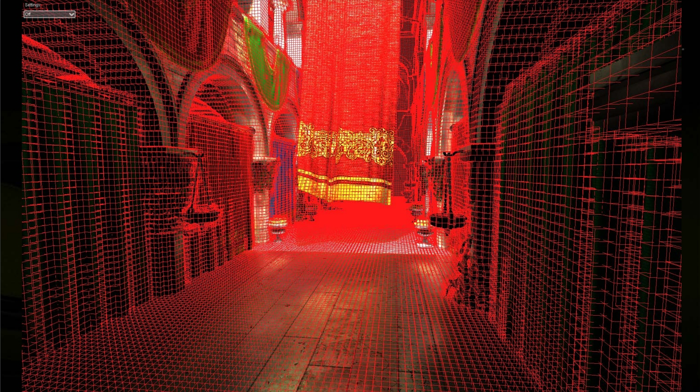
*메모리 예산 기반 페이지 관리*

```cpp
// 메모리 예산 기반 페이지 관리
class FVSMBudgetManager
{
    // 설정 가능한 예산
    int32 MaxPhysicalPages;          // 기본 4096개
    int32 MaxPagesPerFrame;          // 프레임당 최대 업데이트

    void EnforceBudget()
    {
        // 현재 요청된 페이지 수
        int32 RequestedPages = CountRequestedPages();

        if (RequestedPages > MaxPhysicalPages)
        {
            // 우선순위 기반 페이지 제거
            TArray<FPagePriority> Priorities;

            for (FVSMPage& Page : RequestedPages)
            {
                float Priority = ComputePriority(Page);
                Priorities.Add({Page, Priority});
            }

            // 정렬 후 하위 페이지 제거
            Priorities.Sort();

            int32 ToRemove = RequestedPages - MaxPhysicalPages;
            for (int32 i = 0; i < ToRemove; i++)
            {
                UnrequestPage(Priorities[i].Page);
            }
        }
    }

    float ComputePriority(FVSMPage& Page)
    {
        // 우선순위 요소:
        // - 화면에서의 크기
        // - 카메라 거리
        // - 정적/동적 여부
        // - 캐시 히트율

        float ScreenSize = Page.ScreenSpaceArea;
        float Distance = Page.DistanceToCamera;
        float StaticBonus = Page.bStatic ? 1.2f : 1.0f;

        return ScreenSize / Distance * StaticBonus;
    }
};
```

### 비동기 업데이트

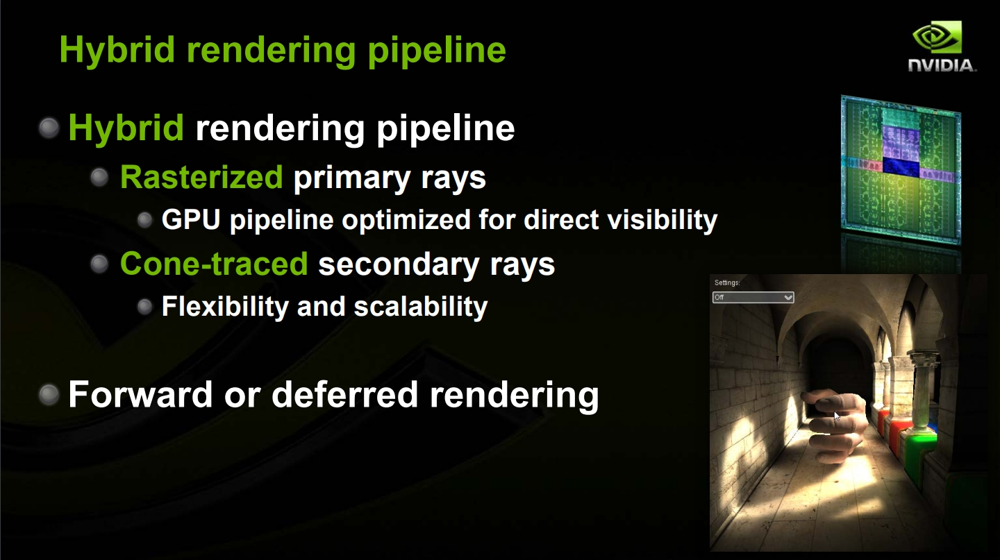
*시간 분산 업데이트*

```cpp
// 시간 분산 업데이트
class FVSMAsyncUpdater
{
    void DistributeUpdates()
    {
        // 정적 페이지: 변경 시에만
        // 동적 페이지: 매 프레임
        // 원거리 페이지: 낮은 빈도

        for (FVSMPage& Page : AllPages)
        {
            if (Page.bStatic && !Page.bDirty)
            {
                continue;  // 정적 캐시 유지
            }

            // 거리 기반 업데이트 빈도
            int32 UpdateFrequency = ComputeUpdateFrequency(Page.Distance);

            if (CurrentFrame % UpdateFrequency == Page.FrameOffset)
            {
                QueuePageUpdate(Page);
            }
        }
    }

    int32 ComputeUpdateFrequency(float Distance)
    {
        if (Distance < 1000.0f) return 1;      // 매 프레임
        if (Distance < 5000.0f) return 2;      // 격 프레임
        if (Distance < 10000.0f) return 4;     // 4프레임마다
        return 8;                               // 원거리
    }
};
```

---

## 설정 및 디버깅

### 프로젝트 설정

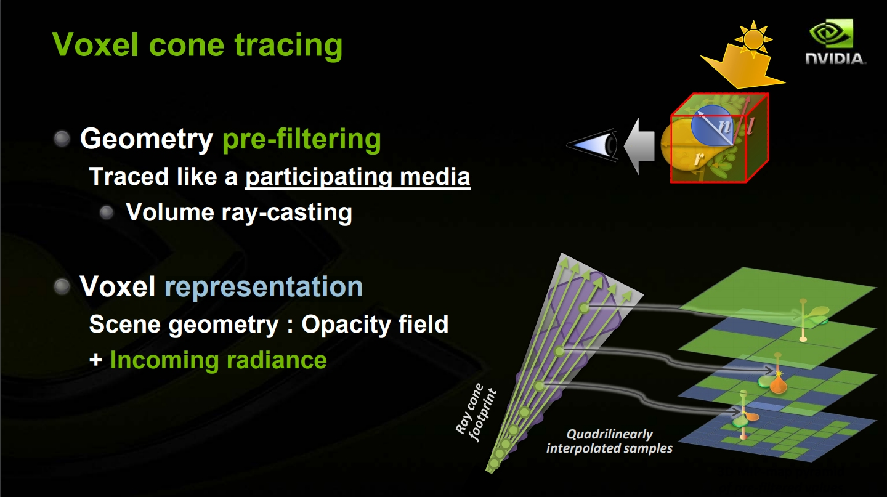
*Virtual Shadow Maps 프로젝트 설정*

```ini
; DefaultEngine.ini
[/Script/Engine.RendererSettings]
; VSM 활성화
r.Shadow.Virtual.Enable=1

; 물리 페이지 풀 크기 (VRAM 사용량)
r.Shadow.Virtual.MaxPhysicalPages=4096

; Directional Light 클립맵 레벨 수
r.Shadow.Virtual.Clipmap.NumLevels=12

; 해상도 바이어스
r.Shadow.Virtual.ResolutionLodBiasDirectional=0
r.Shadow.Virtual.ResolutionLodBiasLocal=0
```

### 디버그 시각화

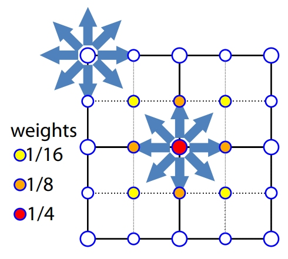
*VSM 디버그 시각화*

```cpp
// VSM 시각화 명령어
r.Shadow.Virtual.Visualize=1                    // 전체 시각화
r.Shadow.Virtual.Visualize.Mode=0               // 0=깊이, 1=페이지 ID, 2=Mip 레벨
r.Shadow.Virtual.ShowStats=1                    // 통계 표시

// 개별 광원 디버깅
ShowFlag.VirtualShadowMapsPerfStats 1
ShowFlag.VirtualShadowMapsVisualizations 1
```

### 일반적인 문제 해결

| 문제 | 원인 | 해결 |
|------|------|------|
| 그림자 팝핑 | 페이지 부족 | MaxPhysicalPages 증가 |
| 저해상도 그림자 | Mip 바이어스 | ResolutionLodBias 감소 |
| 그림자 누락 | 컬링 문제 | 캐스터 바운드 확인 |
| 높은 VRAM 사용 | 페이지 과다 | 예산 조정 |

---

## 요약

| 구성 요소 | 역할 |
|----------|------|
| 가상 텍스처 | 16K 해상도 그림자를 페이지 단위로 관리 |
| 페이지 테이블 | 가상 → 물리 페이지 매핑 |
| 클립맵 | Directional Light의 다중 해상도 |
| Nanite 통합 | GPU 주도 그림자 렌더링 |
| 정적 캐싱 | 변경 없는 지오메트리 재사용 |
| PCF 필터링 | 부드러운 그림자 경계 |

Virtual Shadow Maps는 Nanite와 함께 UE5의 고품질 그림자 시스템을 구성합니다.
---

<div style="display: flex; justify-content: space-between; align-items: center; padding: 16px 0;">
  <a href="../03-lumen/" style="text-decoration: none;">← 이전: 03. Lumen 글로벌 일루미네이션</a>
  <a href="../05-other-features/" style="text-decoration: none;">다음: 05. 기타 UE5 렌더링 기능 →</a>
</div>
