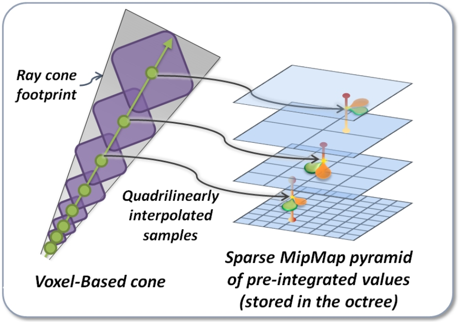
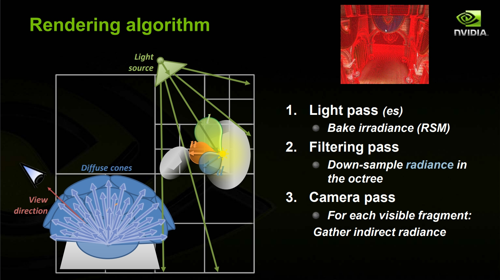
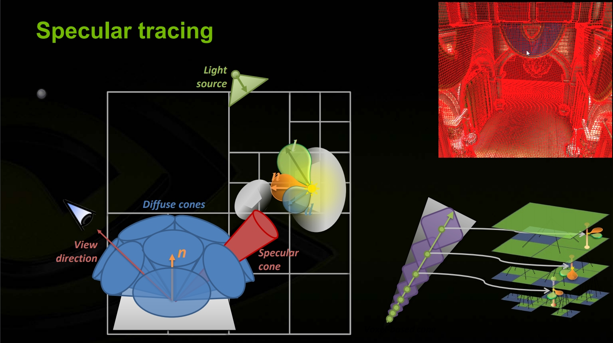
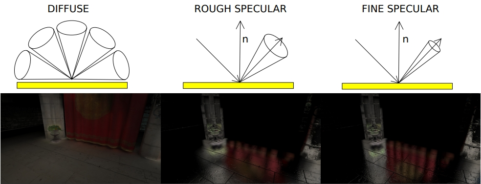
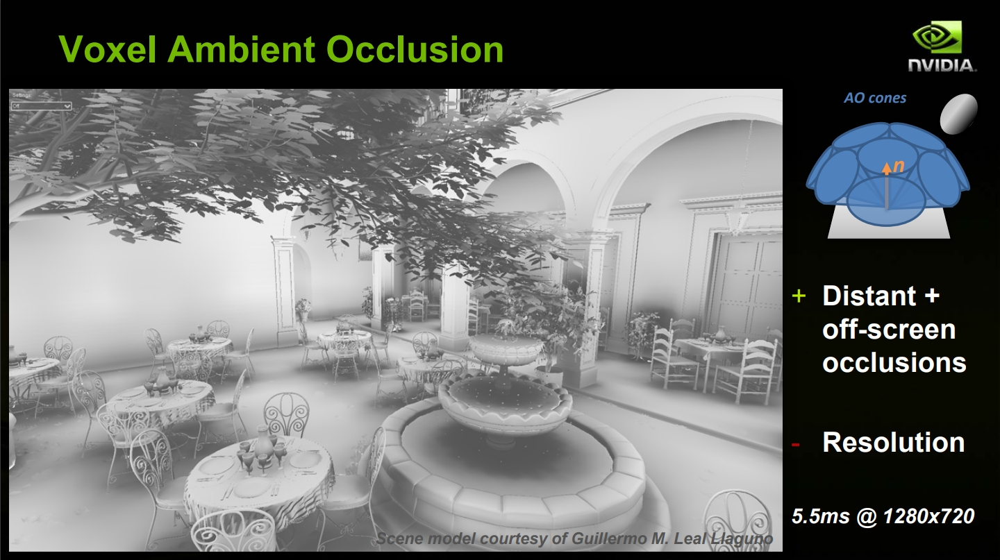
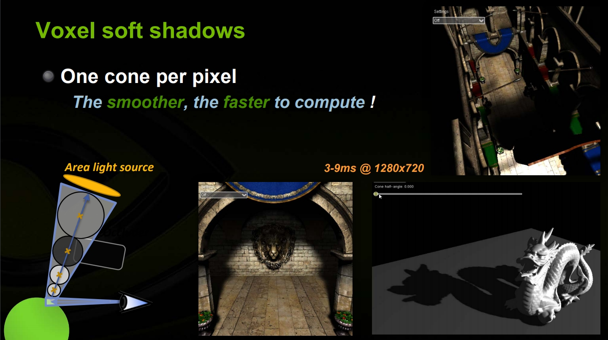
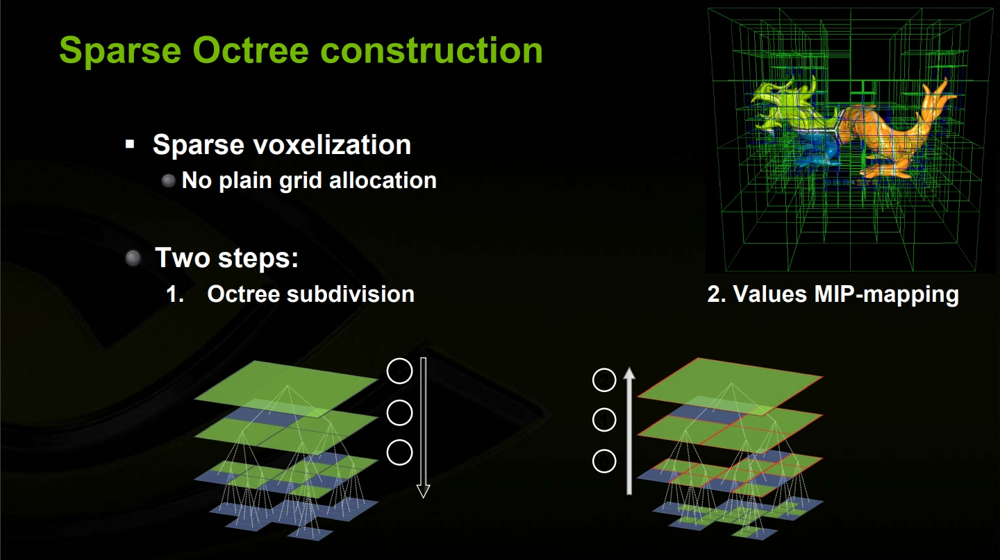
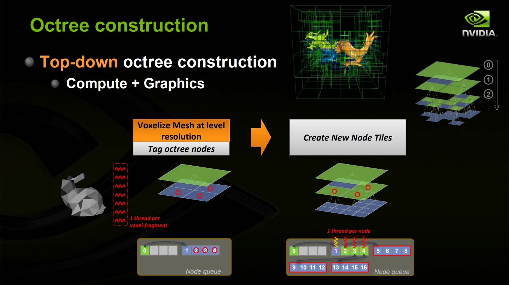
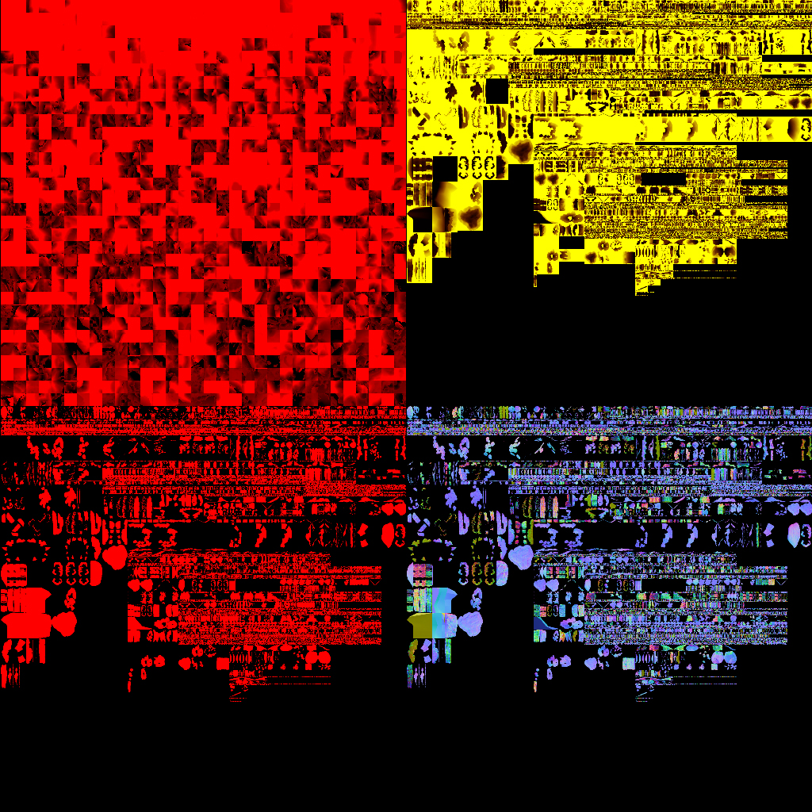
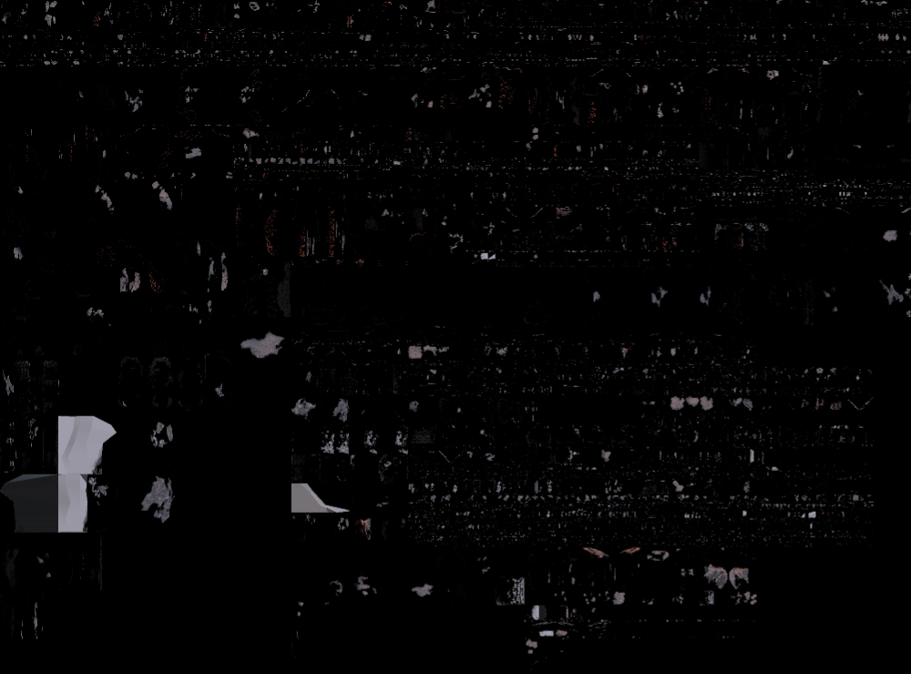

# 기타 UE5 렌더링 기능

TSR, Substrate, World Partition 등 UE5의 추가 렌더링 기능들을 분석합니다.

---

## TSR (Temporal Super Resolution)

### 개요

TSR은 UE5의 **템포럴 업스케일링 기술**로, 낮은 해상도에서 렌더링하고 고해상도로 재구성합니다.


*Temporal Super Resolution 개요*

```
┌─────────────────────────────────────────────────────────────────┐
│                    TSR 파이프라인                                │
├─────────────────────────────────────────────────────────────────┤
│                                                                 │
│  입력 (50-75% 해상도)                                            │
│  ┌──────────────────┐                                           │
│  │                  │  1080p 타겟 → 720p 렌더링                  │
│  │  Current Frame   │                                           │
│  │  (저해상도)       │                                           │
│  └────────┬─────────┘                                           │
│           │                                                     │
│           ▼                                                     │
│  ┌─────────────────────────────────────────────────────────┐   │
│  │                    TSR 처리                              │   │
│  │                                                         │   │
│  │  1. 히스토리 리프로젝션                                   │   │
│  │     - 모션 벡터 사용                                     │   │
│  │     - 디퍼드 리프로젝션                                   │   │
│  │                                                         │   │
│  │  2. 히스토리 검증                                        │   │
│  │     - 디스오클루전 감지                                   │   │
│  │     - 컬러 클램핑                                        │   │
│  │                                                         │   │
│  │  3. 업스케일 + 블렌딩                                    │   │
│  │     - 적응형 샤프닝                                      │   │
│  │     - 앤티에일리어싱                                     │   │
│  │                                                         │   │
│  │  4. 히스토리 업데이트                                    │   │
│  │                                                         │   │
│  └─────────────────────────────────────────────────────────┘   │
│           │                                                     │
│           ▼                                                     │
│  ┌──────────────────┐                                           │
│  │                  │                                           │
│  │  Output Frame    │  네이티브 해상도 (1080p)                   │
│  │  (고해상도)       │                                           │
│  └──────────────────┘                                           │
│                                                                 │
└─────────────────────────────────────────────────────────────────┘
```

### 구현 세부사항


*TSR 내부 파이프라인*

```cpp
// TSR 메인 클래스
class FTemporalSuperResolution
{
    // 설정
    struct FTSRSettings
    {
        float ScreenPercentage;      // 렌더링 해상도 비율 (0.5-1.0)
        ETSRQuality Quality;         // 품질 설정
        float Sharpness;             // 샤프닝 강도
        bool bEnableResponsiveAA;    // 빠른 움직임 대응
    };

    void Execute(FRDGBuilder& GraphBuilder, const FViewInfo& View)
    {
        // 1. 입력 텍스처 준비
        FRDGTextureRef InputColor = View.SceneColor;
        FRDGTextureRef InputDepth = View.SceneDepth;
        FRDGTextureRef InputVelocity = View.VelocityTexture;

        // 2. 히스토리 리프로젝션
        FRDGTextureRef ReprojectedHistory = GraphBuilder.CreateTexture(...);

        AddPass(GraphBuilder, [=](FRHICommandList& RHICmdList)
        {
            // 모션 벡터로 이전 프레임 위치 계산
            // 히스토리에서 샘플링
        });

        // 3. 히스토리 검증 및 거부
        FRDGTextureRef ValidatedHistory = GraphBuilder.CreateTexture(...);

        AddPass(GraphBuilder, [=](FRHICommandList& RHICmdList)
        {
            // 컬러 범위 체크
            // 디스오클루전 감지
            // 유효하지 않은 히스토리 거부
        });

        // 4. 업스케일 및 합성
        AddPass(GraphBuilder, [=](FRHICommandList& RHICmdList)
        {
            // 현재 프레임과 히스토리 블렌딩
            // 적응형 샤프닝
            // 출력
        });

        // 5. 히스토리 업데이트
        UpdateHistory(GraphBuilder, OutputColor);
    }
};

// TSR 셰이더 (간략화)
[numthreads(8, 8, 1)]
void TSRMainCS(uint2 DispatchThreadId : SV_DispatchThreadID)
{
    float2 OutputUV = (DispatchThreadId + 0.5f) / OutputResolution;
    float2 InputUV = OutputUV;  // ScreenPercentage 적용

    // 현재 프레임 샘플
    float3 CurrentColor = InputTexture.SampleLevel(InputUV, 0);

    // 모션 벡터로 히스토리 위치 계산
    float2 Velocity = VelocityTexture.SampleLevel(InputUV, 0);
    float2 HistoryUV = OutputUV - Velocity;

    // 히스토리 샘플 (bicubic)
    float3 HistoryColor = SampleHistoryBicubic(HistoryUV);

    // 컬러 클램핑 (고스팅 방지)
    float3 NearMin, NearMax;
    ComputeNeighborhoodMinMax(InputUV, NearMin, NearMax);
    HistoryColor = clamp(HistoryColor, NearMin, NearMax);

    // 블렌딩 (히스토리 가중치 높음)
    float BlendFactor = ComputeBlendFactor(Velocity, HistoryUV);
    float3 OutputColor = lerp(CurrentColor, HistoryColor, BlendFactor);

    // 샤프닝
    OutputColor = ApplySharpening(OutputColor, InputUV);

    OutputTexture[DispatchThreadId] = float4(OutputColor, 1);
}
```

### TSR vs TAA vs DLSS


*업스케일링 기술 비교*

| 기능 | TAA | TSR | DLSS |
|------|-----|-----|------|
| 업스케일링 | 제한적 | 지원 | 지원 |
| 하드웨어 요구 | 없음 | 없음 | RTX GPU |
| 품질 | 보통 | 좋음 | 매우 좋음 |
| 성능 향상 | 없음 | 30-50% | 50-100% |
| 고스팅 | 있음 | 적음 | 매우 적음 |

---

## Substrate (실험적)

### 개요

Substrate는 UE5의 **차세대 머티리얼 시스템**으로, 물리 기반 레이어드 머티리얼을 지원합니다.


*Substrate 머티리얼 시스템*

```
┌─────────────────────────────────────────────────────────────────┐
│                    기존 vs Substrate 머티리얼                    │
├─────────────────────────────────────────────────────────────────┤
│                                                                 │
│  기존 머티리얼 모델                                               │
│  ┌─────────────────────────────────────────────────────────┐   │
│  │                                                         │   │
│  │  단일 레이어: BaseColor, Metallic, Roughness, Normal    │   │
│  │                                                         │   │
│  │  ┌─────────────────────────────────────┐               │   │
│  │  │         Single Material              │               │   │
│  │  │  ┌─────┬─────┬─────┬─────┐          │               │   │
│  │  │  │ BC  │ M   │ R   │ N   │          │               │   │
│  │  │  └─────┴─────┴─────┴─────┘          │               │   │
│  │  └─────────────────────────────────────┘               │   │
│  │                                                         │   │
│  │  한계: 레이어 블렌딩, 복잡한 표면 표현 어려움              │   │
│  │                                                         │   │
│  └─────────────────────────────────────────────────────────┘   │
│                                                                 │
│  Substrate 머티리얼 모델                                         │
│  ┌─────────────────────────────────────────────────────────┐   │
│  │                                                         │   │
│  │  BSDF 레이어 스택                                        │   │
│  │                                                         │   │
│  │  ┌─────────────────────────────────────┐               │   │
│  │  │  Layer 3: Clear Coat (클리어 코트)   │               │   │
│  │  ├─────────────────────────────────────┤               │   │
│  │  │  Layer 2: Metallic Flake (금속 조각) │               │   │
│  │  ├─────────────────────────────────────┤               │   │
│  │  │  Layer 1: Base Paint (베이스 페인트) │               │   │
│  │  ├─────────────────────────────────────┤               │   │
│  │  │  Layer 0: Primer (프라이머)          │               │   │
│  │  └─────────────────────────────────────┘               │   │
│  │                                                         │   │
│  │  장점: 물리적으로 정확한 레이어 상호작용                   │   │
│  │                                                         │   │
│  └─────────────────────────────────────────────────────────┘   │
│                                                                 │
└─────────────────────────────────────────────────────────────────┘
```

### Substrate BSDF


*Substrate BSDF 레이어 시스템*

```cpp
// Substrate BSDF 노드
struct FSubstrateBSDF
{
    // 기본 속성
    float3 DiffuseAlbedo;
    float3 F0;              // 프레넬 반사율
    float Roughness;
    float3 Normal;

    // 확장 속성
    float Anisotropy;
    float3 AnisotropyDirection;
    float ClearCoatRoughness;
    float Fuzz;
    float FuzzRoughness;

    // BSDF 유형
    ESubstrateBSDFType Type;
};

// 레이어 블렌딩
FSubstrateBSDF BlendLayers(FSubstrateBSDF Bottom, FSubstrateBSDF Top, float BlendFactor)
{
    // 물리 기반 블렌딩 (에너지 보존)
    FSubstrateBSDF Result;

    // Fresnel 기반 레이어 가시성
    float TopFresnel = ComputeFresnel(Top.F0, ViewDir, Normal);
    float EffectiveBlend = BlendFactor * TopFresnel;

    // 확산 반사 블렌딩
    Result.DiffuseAlbedo = lerp(Bottom.DiffuseAlbedo * (1 - TopFresnel),
                                 Top.DiffuseAlbedo,
                                 EffectiveBlend);

    // 스페큘러 블렌딩
    Result.F0 = lerp(Bottom.F0, Top.F0, EffectiveBlend);
    Result.Roughness = lerp(Bottom.Roughness, Top.Roughness, EffectiveBlend);

    return Result;
}
```

### 활성화 방법

```ini
; DefaultEngine.ini
[/Script/Engine.RendererSettings]
; Substrate 활성화 (실험적)
r.Substrate=1

; Substrate 전용 설정
r.Substrate.MaxBSDFCount=4
r.Substrate.BytesPerPixel=128
```

---

## World Partition

### 개요

World Partition은 UE5의 **대규모 월드 스트리밍 시스템**입니다.


*World Partition 시스템*

```
┌─────────────────────────────────────────────────────────────────┐
│                    World Partition 구조                          │
├─────────────────────────────────────────────────────────────────┤
│                                                                 │
│  기존 레벨 스트리밍                                               │
│  ┌─────────────────────────────────────────────────────────┐   │
│  │                                                         │   │
│  │  수동 레벨 분할:                                         │   │
│  │  ┌─────┐ ┌─────┐ ┌─────┐                                │   │
│  │  │ L1  │ │ L2  │ │ L3  │  ...                           │   │
│  │  └─────┘ └─────┘ └─────┘                                │   │
│  │                                                         │   │
│  │  - 수동 레벨 분할 필요                                   │   │
│  │  - 레벨 경계 명확                                       │   │
│  │  - 확장성 제한                                          │   │
│  │                                                         │   │
│  └─────────────────────────────────────────────────────────┘   │
│                                                                 │
│  World Partition                                                 │
│  ┌─────────────────────────────────────────────────────────┐   │
│  │                                                         │   │
│  │  자동 그리드 기반 스트리밍:                               │   │
│  │  ┌──┬──┬──┬──┬──┬──┬──┬──┐                              │   │
│  │  │  │  │  │▓▓│▓▓│  │  │  │                              │   │
│  │  ├──┼──┼──┼──┼──┼──┼──┼──┤                              │   │
│  │  │  │  │▓▓│▓▓│▓▓│▓▓│  │  │   ▓ = 로드됨                │   │
│  │  ├──┼──┼──┼──┼──┼──┼──┼──┤                              │   │
│  │  │  │▓▓│▓▓│▓▓│▓▓│▓▓│▓▓│  │                              │   │
│  │  ├──┼──┼──┼──┼──┼──┼──┼──┤                              │   │
│  │  │  │  │▓▓│▓▓│▓▓│▓▓│  │  │   플레이어 주변만 로드        │   │
│  │  └──┴──┴──┴──┴──┴──┴──┴──┘                              │   │
│  │                                                         │   │
│  │  - 자동 셀 분할                                         │   │
│  │  - 거리 기반 스트리밍                                   │   │
│  │  - HLOD 통합                                            │   │
│  │                                                         │   │
│  └─────────────────────────────────────────────────────────┘   │
│                                                                 │
└─────────────────────────────────────────────────────────────────┘
```

### 핵심 컴포넌트


*World Partition 핵심 컴포넌트*

```cpp
// World Partition 액터 배치
UCLASS()
class APartitionActor : public AActor
{
    UPROPERTY()
    FGuid RuntimeGridGuid;  // 소속 그리드

    // 데이터 레이어 (선택적 스트리밍 그룹)
    UPROPERTY()
    TArray<UDataLayerAsset*> DataLayers;

    // HLOD 설정
    UPROPERTY()
    FWorldPartitionHLODSettings HLODSettings;
};

// 스트리밍 소스
class UWorldPartitionStreamingSource
{
    // 플레이어 위치 기반 스트리밍
    void UpdateStreamingState()
    {
        FVector PlayerLocation = GetPlayerLocation();

        // 로드해야 할 셀 결정
        TSet<FWorldPartitionStreamingCell*> CellsToLoad;

        for (FWorldPartitionStreamingCell& Cell : AllCells)
        {
            float Distance = FVector::Distance(PlayerLocation, Cell.Center);

            if (Distance < Cell.LoadingRange)
            {
                CellsToLoad.Add(&Cell);
            }
        }

        // 언로드할 셀 결정
        for (FWorldPartitionStreamingCell* LoadedCell : CurrentlyLoadedCells)
        {
            if (!CellsToLoad.Contains(LoadedCell))
            {
                QueueUnload(LoadedCell);
            }
        }

        // 로드 요청
        for (FWorldPartitionStreamingCell* Cell : CellsToLoad)
        {
            if (!CurrentlyLoadedCells.Contains(Cell))
            {
                QueueLoad(Cell);
            }
        }
    }
};
```

### HLOD (Hierarchical Level of Detail)


*World Partition HLOD 시스템*

```cpp
// World Partition HLOD
class FWorldPartitionHLOD
{
    // HLOD 레이어
    struct FHLODLayer
    {
        float LoadingDistance;
        EHLODLayerType Type;  // Instancing, Merged, Simplified
        TArray<FHLODActor*> Actors;
    };

    // HLOD 생성 (에디터 시간)
    void BuildHLOD()
    {
        for (FWorldPartitionCell& Cell : Cells)
        {
            // 셀 내 액터들을 HLOD로 변환
            TArray<AActor*> Actors = Cell.GetActors();

            // 메시 단순화
            FMeshMergeSettings MergeSettings;
            MergeSettings.TargetTriangleCount = 1000;

            UStaticMesh* SimplifiedMesh = CreateSimplifiedMesh(Actors, MergeSettings);

            // HLOD 액터 생성
            AHLODActor* HLODActor = CreateHLODActor(SimplifiedMesh);
            HLODActor->SourceCell = &Cell;

            Cell.HLODActor = HLODActor;
        }
    }

    // 런타임 HLOD 전환
    void UpdateHLOD(FVector ViewLocation)
    {
        for (FWorldPartitionCell& Cell : Cells)
        {
            float Distance = FVector::Distance(ViewLocation, Cell.Center);

            if (Distance > Cell.HLODDistance && Cell.bLoaded)
            {
                // 풀 디테일 → HLOD
                Cell.HideFullDetail();
                Cell.ShowHLOD();
            }
            else if (Distance <= Cell.HLODDistance && Cell.bShowingHLOD)
            {
                // HLOD → 풀 디테일
                Cell.HideHLOD();
                Cell.ShowFullDetail();
            }
        }
    }
};
```

---

## Path Tracing

### 레퍼런스 렌더러

UE5에는 **오프라인 품질의 패스 트레이싱** 렌더러가 포함되어 있습니다.


*Path Tracing 레퍼런스 렌더러*

```cpp
// Path Tracing 활성화
void EnablePathTracing()
{
    // 콘솔 명령
    // r.PathTracing.SPP=64           // Samples Per Pixel
    // r.PathTracing.MaxBounces=32    // 최대 바운스
}

// Path Tracing 셰이더
[shader("raygeneration")]
void PathTracingRayGen()
{
    uint2 PixelCoord = DispatchRaysIndex().xy;
    uint SampleIndex = PathTracingSampleIndex;

    // 픽셀 내 랜덤 위치
    float2 Jitter = GetStratifiedSample(PixelCoord, SampleIndex);
    float2 ScreenUV = (PixelCoord + Jitter) / ScreenResolution;

    // 카메라 레이 생성
    RayDesc Ray = GenerateCameraRay(ScreenUV);

    // 패스 트레이싱
    float3 Radiance = float3(0, 0, 0);
    float3 Throughput = float3(1, 1, 1);

    for (int Bounce = 0; Bounce < MaxBounces; Bounce++)
    {
        // 레이 트레이싱
        FPathTracingPayload Payload;
        TraceRay(TLAS, RAY_FLAG_NONE, 0xFF, 0, 0, 0, Ray, Payload);

        if (!Payload.bHit)
        {
            // 환경광
            Radiance += Throughput * SampleEnvironment(Ray.Direction);
            break;
        }

        // 히트 표면 정보
        FSurfaceInfo Surface = GetSurfaceInfo(Payload);

        // 직접광 샘플링
        Radiance += Throughput * SampleDirectLighting(Surface);

        // BSDF 샘플링으로 다음 방향 결정
        FBSDFSample BSDFSample = SampleBSDF(Surface, Ray.Direction);

        if (BSDFSample.PDF <= 0)
            break;

        // 처리량 업데이트
        Throughput *= BSDFSample.Reflectance / BSDFSample.PDF;

        // 러시안 룰렛
        if (Bounce > 3)
        {
            float P = max(Throughput.r, max(Throughput.g, Throughput.b));
            if (Random() > P)
                break;
            Throughput /= P;
        }

        // 다음 레이 설정
        Ray.Origin = Surface.WorldPosition + Surface.Normal * 0.001f;
        Ray.Direction = BSDFSample.Direction;
    }

    // 누적
    AccumulationBuffer[PixelCoord] += float4(Radiance, 1);
}
```

---

## 설정 요약

### 권장 프로젝트 설정


*UE5 권장 프로젝트 설정*

```ini
; DefaultEngine.ini - UE5 권장 설정

[/Script/Engine.RendererSettings]
; 핵심 UE5 기능
r.Nanite=1
r.Lumen.DiffuseIndirect.Allow=1
r.Lumen.Reflections.Allow=1
r.Shadow.Virtual.Enable=1

; TSR
r.TemporalAA.Algorithm=1
r.ScreenPercentage=75

; 품질 조정
r.Lumen.HardwareRayTracing=1        ; RTX GPU용
r.Shadow.Virtual.MaxPhysicalPages=4096
```

### 플랫폼별 설정

| 플랫폼 | Nanite | Lumen | VSM | TSR |
|--------|--------|-------|-----|-----|
| PC High | ✓ | ✓ (HW RT) | ✓ | 선택적 |
| PC Mid | ✓ | ✓ (SW) | ✓ | ✓ |
| Console | ✓ | ✓ (SW) | ✓ | ✓ |
| Mobile | ✗ | ✗ | ✗ | ✗ |

---

## 요약

| 기능 | 목적 | 상태 |
|------|------|------|
| TSR | 성능 향상을 위한 업스케일링 | 안정 |
| Substrate | 차세대 머티리얼 시스템 | 실험적 |
| World Partition | 대규모 월드 스트리밍 | 안정 |
| Sparse Volume | 효율적인 볼륨 텍스처 | 안정 |
| Path Tracing | 오프라인 품질 렌더링 | 안정 |

이들 기능은 Nanite, Lumen, VSM과 함께 UE5의 렌더링 혁신을 완성합니다.
---

<div style="display: flex; justify-content: space-between; align-items: center; padding: 16px 0;">
  <a href="../04-virtual-shadow-maps/" style="text-decoration: none;">← 이전: 04. Virtual Shadow Maps</a>
  <a href="../../07-post-processing/" style="text-decoration: none;">다음: Ch.07 포스트 프로세싱 →</a>
</div>
