# 후도 스타일 실시간 2차원 렌더링(2) - 후도 스타일 피부 렌더링

> 원문: [厚涂风格实时二次元渲染(2)-厚涂风的皮肤渲染](https://zhuanlan.zhihu.com/p/548788797) by 骨鱼子

주의: 이 글에서는 인체 피부 렌더링 결과를 많이 보여줄 수 있으며, 이로 인해 불편함을 느낄 수 있습니다.

---

## 0. 준비 작업

이 시리즈를 시작하기 전에, 이진화된 조명 모델과 outline을 완성해야 합니다.

- [从零开始的卡通渲染-描边篇](https://zhuanlan.zhihu.com/p/109101851)
- [从零开始的卡通渲染-着色篇1](https://zhuanlan.zhihu.com/p/110025903)

위 대형의 이진화 렌더링 모델을 참고할 수 있습니다.

또한, 셀룰로이드 스타일의 2차원 렌더링에 대해 여전히 의문이 있다면, 제 추천은 [RealToon](https://assetstore.unity.com/packages/vfx/shaders/realtoon-an-anime-toon-shader-65518)입니다.

*realtoon 효과*

이 $18짜리 셰이더는 완전한 소스코드를 포함하고 있으며, 실시간 레이 트레이싱 지원도 내장되어 있습니다. $18의 학비는 비싸지 않습니다.

레이 트레이싱 2차원의 내용은 9편에서 다루겠습니다. 여기서는 더 이상 다루지 않겠습니다.

---

## 1. 피부의 평활 광조

명백히, 일러스트 스타일과 셀룰로이드 스타일의 가장 큰 차이점은, 피부가 서로 다른 조명 상황에서 서로 다른 표현을 가진다는 것입니다.

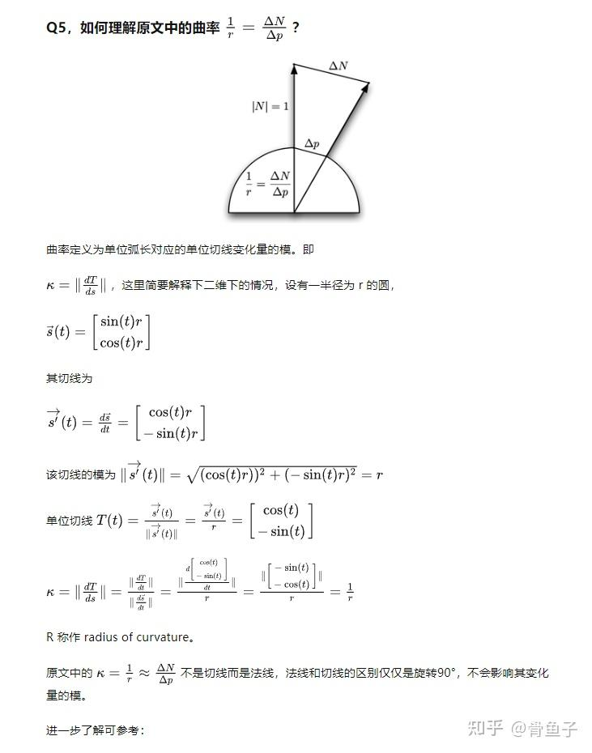

*원신의 일러스트*

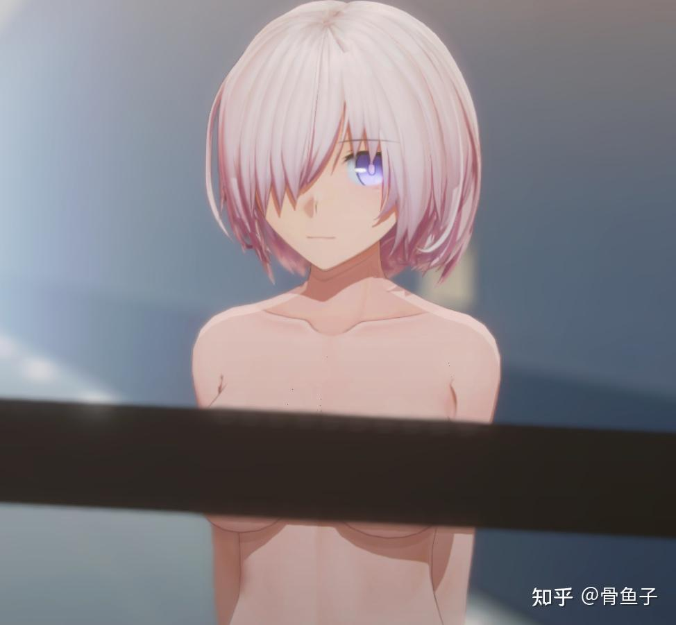

*원신 게임 내 렌더링 결과*

피부 색상을 추출해봅시다:

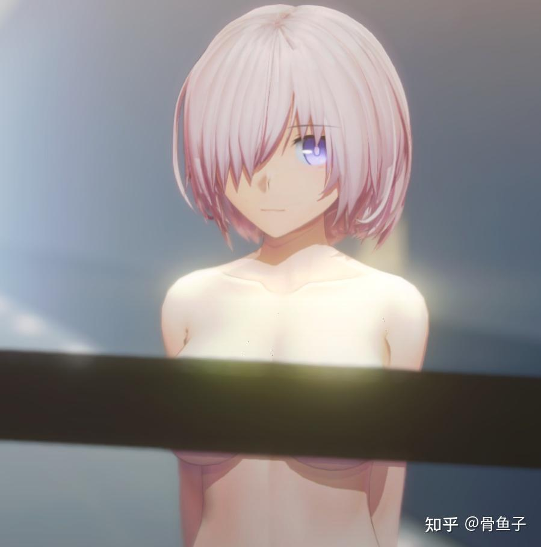

*원신 일러스트의 피부 색상*

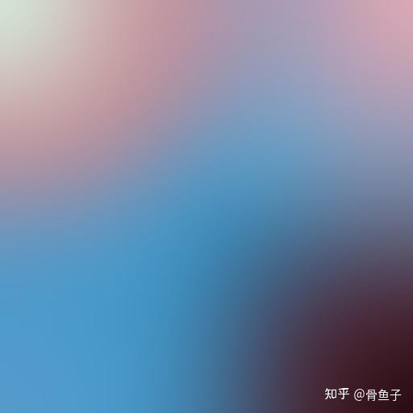

*원신 렌더링의 피부 색상*

보시다시피, 원신의 일러스트는 게임 내 렌더링 결과와 비교했을 때, 색채가 일정한 PBR 특징을 보여줍니다. 예를 들어 Specular 하이라이트, 그리고 서브서피스 스캐터링 효과가 있습니다. 하지만 화면 전체는 여전히 매우 2차원적입니다. 따라서 우리는 셀룰로이드 스타일 셰이더를 기반으로 수정하여 우리가 기대하는 후도 스타일 피부를 얻을 수 있습니다.

따라서, 우리는 원래의 셀룰로이드 스타일 렌더링 기반 위에 직접 Specular 하이라이트와 서브서피스 스캐터링을 도입합니다. PBR과 다른 점은:

1. 우리는 물리적 정확성에 너무 집착할 필요가 없습니다. 화면 보정에 도움이 되기만 하면 좋은 것입니다.
2. 모든 효과가 파라미터로 가중치를 조절할 수 있도록 보장합니다. NPR에서 시각적 아름다움을 보장하는 것이 최우선입니다.

따라서, Specular는 간단히 `SpecularColor*SpecularIntensity*dot(normal,lightDir)`로 구현할 수 있고, `SpecularColor*SpecularIntensity*dot(normal,viewDir)`를 사용할 수도 있습니다. 저는 개인적으로 후자를 선호합니다.

여기서, `SpecularColor`는 Color이고, `SpecularIntensity`는 그레이스케일 맵입니다. 물론, 물체의 SpecularColor가 부위에 따라 다르다면, `SpecularIntensity`와 함께 하나의 색상이 있는 텍스처로 합칠 수 있습니다.

서브서피스 스캐터링 측면에서는, pre-integrated 모델 사용을 고려할 수 있습니다.

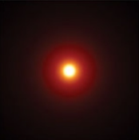

*pre-integrated 서브서피스 스캐터링*

BSSRDF와 BTDF, 그리고 pre-integrated 모델 학습: [实时皮肤渲染综述](https://zhuanlan.zhihu.com/p/42433792)

간단히 BSSRDF를 설명하겠습니다.

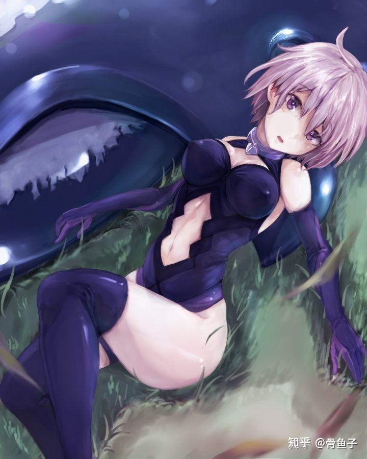

*피부로 들어온 빛이 확산 반사의 특성을 보임*

빛이 피부 표면에 닿으면, 빛은 피부 아래 지방층에서 여러 번 산란하고, 나올 때 확산 반사의 특성을 보입니다. 그런데, 왜 확산 반사의 특성을 보이냐면, 빛이 피부에 들어간 후 여러 번 산란하면 최종 값의 차이가 커지기 때문입니다. 따라서 피부 아래 지방층에는 다양한 방향으로 혼란스러운 산란이 존재하고, 최종적으로 나오는 빛은 확산 반사의 특성을 보이게 됩니다.

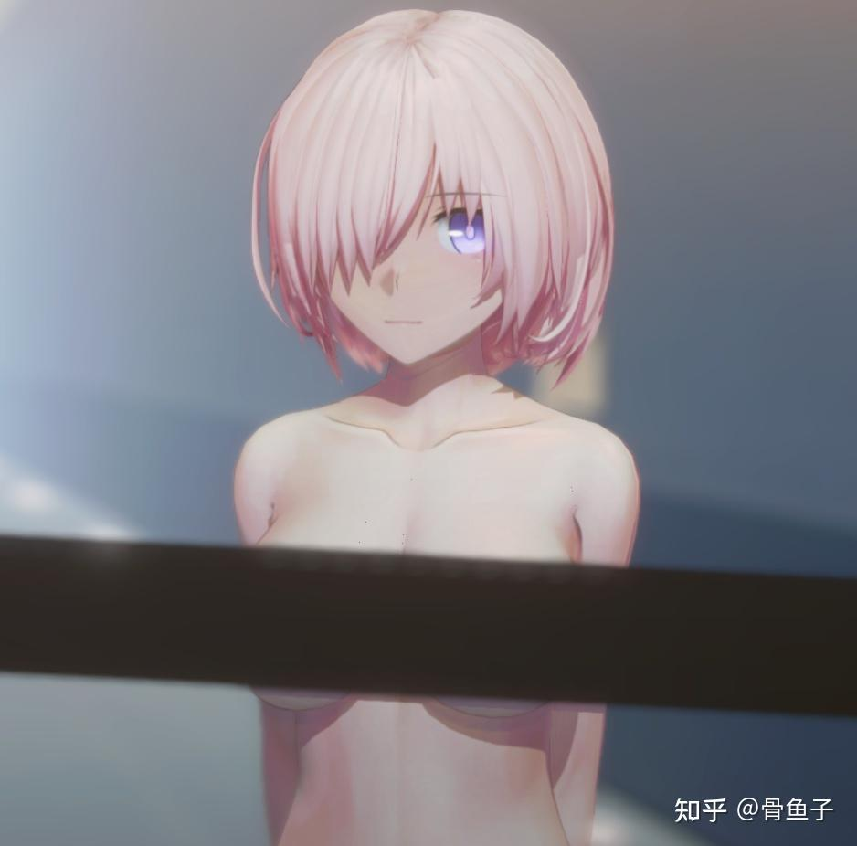

*BSSRDF로 인한 결과*

이로 인해 광선이 대략 인체 표면에 닿으면 이런 모습이 됩니다. 그렇다면 이 pre-integrated 그래프를 어떻게 얻을까요? 위 글에서 언급한 screen space blur 방법 외에도, 피팅 함수 기반 방법을 사용할 수도 있습니다.

[【译】Disney2015-将BRDF扩展至集成次表面散射的BSDF](https://zhuanlan.zhihu.com/p/57771165)

이 두 가지 방법 모두 아래 그림과 비슷한 렌더링 결과를 얻을 수 있습니다.

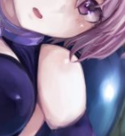

*귀여운 광환*

그런 다음 렌더링 결과에서 `1/r`로 샘플링하고, 수평 방향으로 수광 강도 `N·L`로 샘플링하면, pre-integrated 그래프를 얻을 수 있습니다.

정말 이해가 안 된다면, 다른 사람의 pre-integrated 결과를 가져다 써도 상관없습니다... 어차피 대학 시절에 다들 남의 숙제를 베껴봤을 테니까요.

*pre-integrated 텍스처*

pre-integrated 그래프를 얻은 후, 어떻게 사용할지 고려할 수 있습니다.

*pre-integrated 텍스처 좌표*

일반적인 pre-integrated 모델은 마침 `N·L`을 가로 좌표로 사용하며, 이는 우리의 RampMap과 일치합니다. 이 시점에서 우리의 셀룰로이드 스타일 RampMap은 아직 1×N 크기의 LUT일 것입니다. 이 1차원 LUT를 pre-integrated 2차원 LUT와 행별로 직접 곱하면 새로운 RampMap을 얻습니다. 하지만 1×N의 RampMap이 N×N으로 확장되었고, 세로 좌표의 `1/r`은 구면 위에 있는데, 어떻게 우리의 복잡한 메시 렌더링에 적용할까요?

[Pre-Integrated Skin Shading의 일반적인 Q&A](https://zhuanlan.zhihu.com/p/56052015) 5절을 참고하세요.

*Jeffrey Zhuang의 Q&A*

따라서, `ΔNormal/ΔPosition`을 세로 좌표로 사용하면 됩니다 (웃음).

단순히 텍스처 하나를 바꾸는 것만으로 피부의 서브서피스 스캐터링 문제가 해결됩니다.

이로써, 피부의 평활 광조 문제가 이미 해결되었습니다.

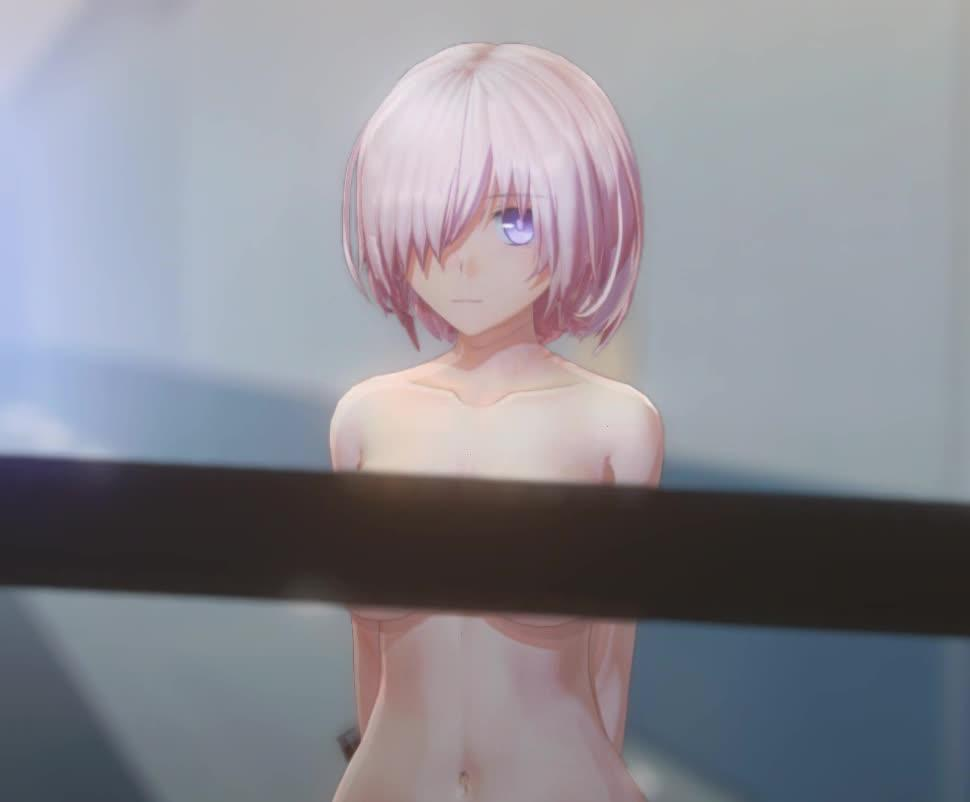

*셀룰로이드 Only*

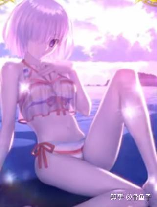

*BSSRDF와 Specular 추가 후 효과*

(여기서 머리카락과 얼굴의 렌더링은 이미 완성 버전이라, 일종의 강등 효과가 있습니다)

보시다시피, SSS와 Specular를 추가한 후, 우리의 피부에 이미 일러스트 같은 느낌이 있으며, 비용도 그리 높지 않습니다.

---

## 2. 피부의 후도화 표현

실제로 여기까지의 피부 효과는 이미 훌륭하지만, 충분히 2차원적이지 않습니다. 우리가 위에서 한 작업은 모두 PBR이기 때문입니다. 사실감이 너무 높은 것도 때로는 좋은 일이 아닙니다. 예를 들어, 다음 편에서 face normal fix라는 작업을 이야기할 텐데, 이것은 얼굴을 매우 평면적으로 만듭니다. 만약 당신의 몸의 입체감이 너무 강하면, 당신은 접합 캐릭터처럼 보이게 됩니다.

실제로, 그림을 그리는 과정에서 화가는 피부의 사실감뿐만 아니라 화면 전체의 조화도 고려해야 합니다.

만약 우리가 물리 기반의 서브서피스 스캐터링을 사용하면, 이것은 우리의 피부가 고강도 직사광 아래에서 물리적 표현이 더 뚜렷해지게 합니다. 하지만 동시에, 반사광 아래에서의 영향은 더 약해집니다.

**주의!** 아래 방법론은 매우 물리 기반이 아닙니다. 이것이 불편함을 유발할 수 있습니다!

피부의 질감을 더 제어 가능하게 하기 위해, 우리는 2장의 N×N LUT를 채택하지만, 이 LUT는 물리 기반으로 생성하지 않고, 감각에 따라 갑니다.

실제로, 우리는 산란광 강도와 직사광을 보정하는 빛이 필요하고, 이 빛이 바로 천공광(하늘 빛)입니다.

1. 천공광은 파란색이므로, 우리는 피부가 파란색의 산란감을 갖도록 고려합니다.
2. 동시에, 피부 가장자리에서 BTDF 효과를 원하는데, 2차원에서는 이 색이 핑크빛이기를 바랍니다.
3. 산란감은 직사광이 닿는 곳에서는 분명히 충분히 나타나지 않고, 직사광이 닿지 않는 곳에서 더 많습니다.
4. 2번에서 말한 BTDF도 분명히 광조 강도와 연동되어야 합니다!

위 네 가지를 종합하면, 우리가 다음에 피부 질감을 제어할 LUT는 반드시 한 차원이 `N·L`이어야 하고, 직사 강도를 나타냅니다. 피부 가장자리에 BTDF가 필요하므로, 다른 차원은 `N·V`여야 합니다.

이렇게 하면 우리는 여전히 LUT가 필요하지만, 이번 LUT는 적분이 필요 없습니다 (어차피 물리 기반도 아니니까), PS 같은 것으로 감각에 따라 아무렇게나 그리면 됩니다.

이 보정 방법의 영감은 효과가 매우 좋은 Fake SSS 셰이딩에서 왔습니다:

[Shader Forge - A visual, node-based shader editor | Page 54 - Unity Forum](https://forum.unity.com/threads/shader-forge-a-visual-node-based-shader-editor.222049/page-54)

*2차원에서 사용할 수 있는 LUT*

하늘색을 배경색으로, 직사광은 피부색을 사용하여 응답하고, 가장자리는 핑크빛 색상을 사용합니다.

이 갈색 부분은, 우리가 반람베르트 모델이므로, 일반적으로 너무 많이 샘플링되지 않습니다.

마지막 단계는 후도화입니다. 우리의 후도에 대해 다시 한번 살펴봅시다.

*후도 마슈*

후도는 서양 유화에서 유래한 회화 기법입니다. 화가가 캔버스에 매우 두꺼운 안료를 사용하여, 붓이나 팔레트 나이프로 발라서, 마치 크림을 바르듯이 표현하는 기법입니다. 그래서 "후도(厚涂)"라고 합니다.

이런 회화 공예에서, 후도의 색 블록은 매우 뚜렷합니다. 매우 두꺼운 안료를 사용하기 때문에, 그라데이션은 실제로 이산적이며, 이것이 우리의 셀룰로이드와 약간 비슷합니다.

이산적인 동시에, 두 안료의 상호 융합으로 인해, 경계는 또한 매우 부드럽습니다.

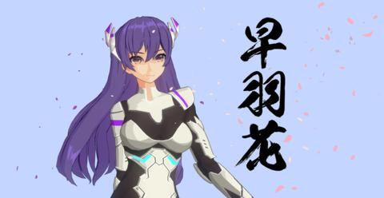

*부드러운 경계*

우리는 위의 보정 LUT에 직접 처리를 하면 됩니다. 먼저 다운샘플링하고, 단순한 방식으로 확대한 다음, 작은 반경의 평균 필터를 사용하면, 후도 특색이 있는 보정 LUT를 얻을 수 있습니다.

이 LUT를 위의 pre-integrated와 같은 방식으로 (단 세로 좌표축은 다름) 적용하면, 90%의 효과가 완성됩니다.

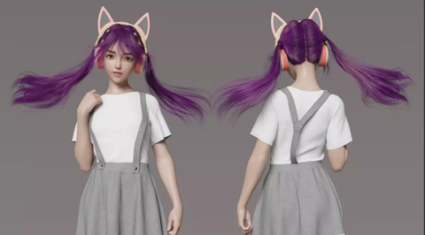

*후도화 적용 후 효과*

보시다시피 이때 효과가 이미 매우 훌륭합니다.

---

## 3. 몇 가지 작은 방법

### (1) 다른 종류의 하이라이트

*어깨에 하이라이트*

일부 2차원 후도 작품에는 명백히 물리 기반이 아닌 하이라이트가 있는데, 이는 2차원 미소녀가 모두 매끈매끈하기 때문입니다.

이 효과는 우리가 물리 기반이 아닌 보정 LUT를 사용한 후 매우 간단합니다. LUT의 좌상단에 밝은 점을 찍으면 됩니다.

### (2) 스크린 스페이스 보광

*어깨에 보광 존재*

2차원 캐릭터의 조명은 실제로 예쁘게 보이는 것이 최우선입니다. 실제로 많은 애니메이션에서 "두 사람이 마주보고 있는데, 둘 다 빛을 향해 있는" 상황이 있습니다. 2차원 미소녀에게 있어서, 보광이 많을수록 더 예뻐집니다 (농담).

[Unity URP Shader与HLSL自学笔记六 等宽屏幕空间边缘光](https://zhuanlan.zhihu.com/p/365339160)

이 글에서 이 방법을 배울 수 있습니다. 저도 남에게서 배운 것이니, 여기서 주제넘게 나서지 않겠습니다.

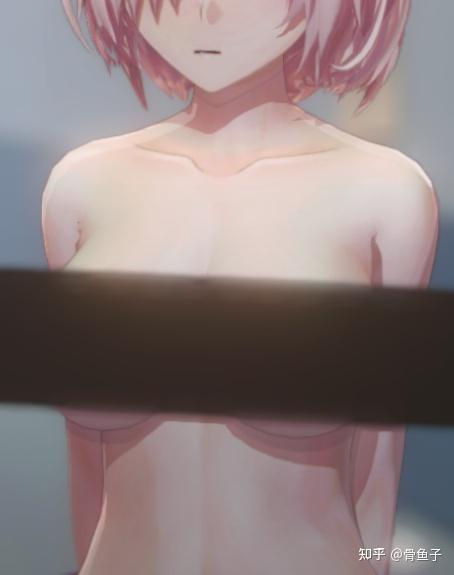

*보광 후의 효과, 사람에게 더 그림 같은 느낌을 줍니다.*

또한, 이 효과를 복제하고 `normal·viewDir`로 lerp하면, BTDF 효과를 만들 수 있습니다.

*BTDF 효과*

---

## 4. 최종 효과 미리보기

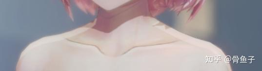

*분위기 일관성을 보장하기 위해, 캐릭터는 환경광의 영향을 크게 받습니다*

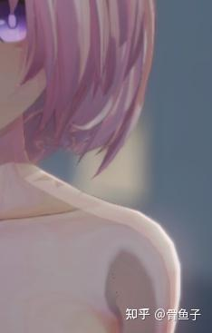

*최종 렌더링 결과*

학습해 주셔서 감사합니다! 다음 편에서는 캐릭터 얼굴 처리에 대해 업데이트하겠습니다!

---

## 참고 자료

- [Pre-Integrated Skin Shading Q&A](https://zhuanlan.zhihu.com/p/56052015)
- [实时皮肤渲染综述](https://zhuanlan.zhihu.com/p/42433792)
- [Disney2015 - BRDF를 BSDF로 확장](https://zhuanlan.zhihu.com/p/57771165)
- [等宽屏幕空间边缘光](https://zhuanlan.zhihu.com/p/365339160)
- [Shader Forge Fake SSS](https://forum.unity.com/threads/shader-forge-a-visual-node-based-shader-editor.222049/page-54)

