# Ch.02 YKPhotoScope - UE5 컬러 스코프 도구

> **원문 출처**: [YKPhotoScope--UE5颜色示波器工具 - 知乎](https://zhuanlan.zhihu.com/p/1998961472458469404)
> **저자**: 骨鱼子

---

## 1. 서론

이전에 UE에서 아이돌 마스터의 라이브 애니메이션을 재현할 때, 다빈치와 비슷한 스코프 도구를 직접 만들면 UE와 아이돌 마스터의 색상을 맞추기 편하겠다는 생각이 들었습니다. 아이돌 마스터 라이브는 10개 샷만 만들고 더 이상 진행하고 싶지 않았지만, 이 스코프 도구는 완성하면 일부 아트 담당자들에게 도움이 될 것 같았습니다.

---

## 2. 도구 사용법

### 2.1 오실로스코프 기본 기능

YKPhotoScope 플러그인을 설치한 후, 디렉토리 구조는 아래 그림과 같습니다. Blueprint 폴더를 더블클릭하여 엽니다.

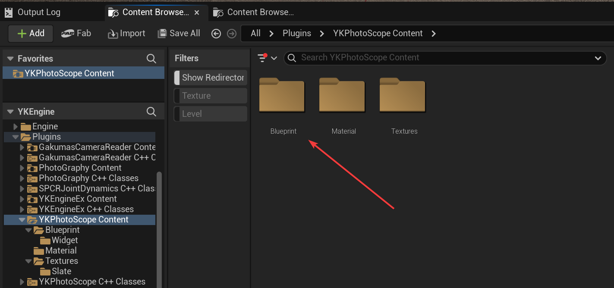

그 안에 있는 `EUW_Scopes` 블루프린트를 우클릭하고 `Run Editor Utility Widget`을 클릭하면 도구 패널이 나타납니다.

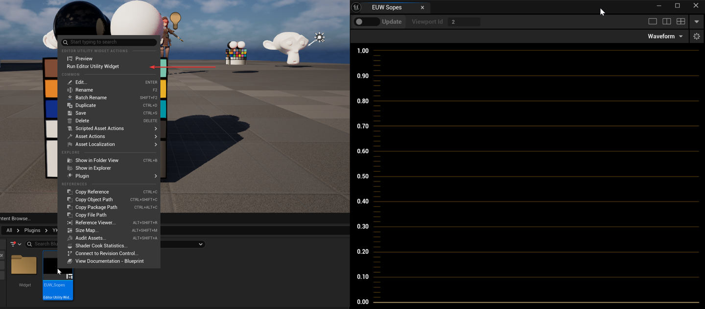

좌측 상단은 업데이트 버튼입니다. 업데이트 버튼의 왼쪽을 클릭하면 스코프가 지속적으로 업데이트되고, 오른쪽을 클릭하면 한 번만 업데이트됩니다.

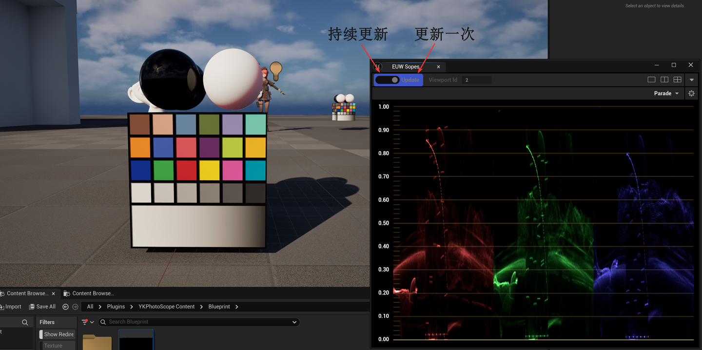

업데이트 버튼 오른쪽의 Viewport Id는 현재 스코프가 어떤 창을 그리고 있는지 표시합니다. 현재 마우스가 어떤 Viewport 위에 있는지 자동으로 인식하므로 수동 설정이 필요 없습니다.

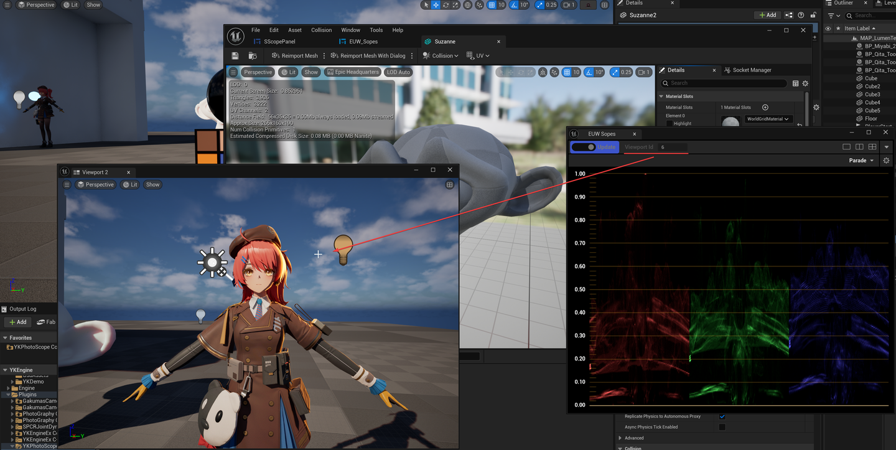

레벨 뷰포트뿐만 아니라 마우스가 메시 에디터 창 위에 있어도 인식할 수 있습니다.

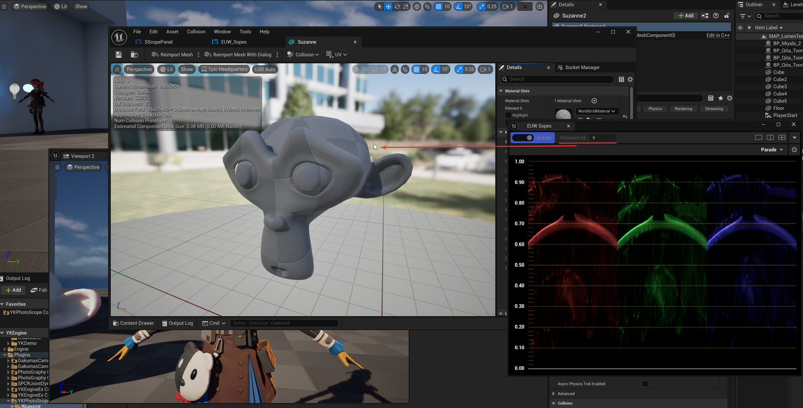

오른쪽의 세 버튼은 창 레이아웃을 전환하는 데 사용됩니다. 최대 4개의 스코프를 동시에 표시할 수 있습니다.

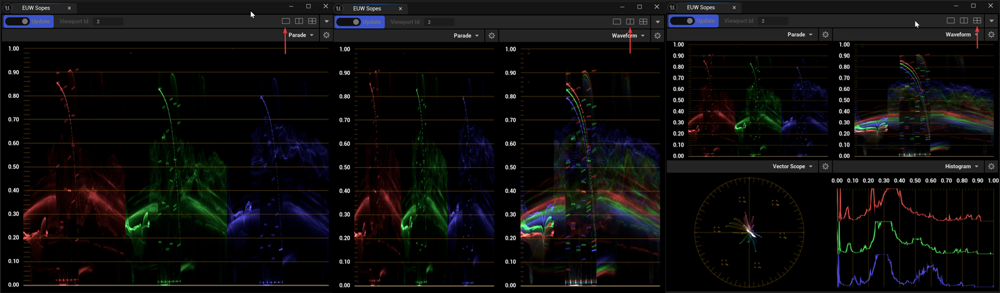

아래의 드롭다운 박스는 스코프 타입을 전환하는 데 사용됩니다:

- **Parade**: 분량도(퍼레이드)
- **Waveform**: 파형도(웨이브폼)
- **Vector Scope**: 벡터스코프
- **Histogram**: 히스토그램

스코프를 자주 사용한다면 이 네 가지 스코프 타입에 익숙할 것이므로 자세한 소개는 생략합니다.

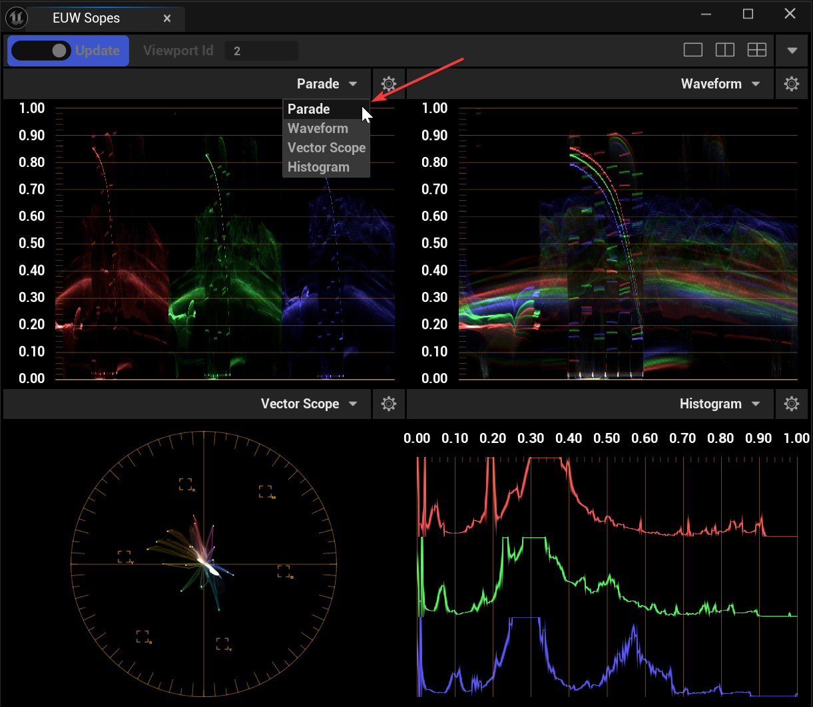

오실로스코프 우측 상단의 톱니바퀴 버튼을 클릭하면 설정 패널이 나타납니다.

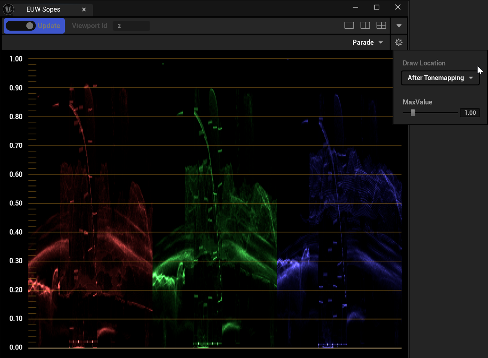

Draw Location 드롭다운을 수정하면 스코프의 그리기 타이밍을 변경할 수 있습니다. 이것이 엔진에서 스코프를 작성하는 장점으로, Tonemapping 이전의 색상 데이터에 접근할 수 있습니다:

- **After Tonemapping**: Tonemapping 이후의 색상 데이터. 색상 값 범위는 0-1 사이이며, 기본적으로 에디터 뷰포트에 표시되는 색상입니다.
- **Before PostProcess**: 모든 후처리 이전의 색상 데이터. HDR 데이터이며 색상 값 범위가 1을 초과할 수 있습니다.
- **After Motion Blur**: 모션 블러 이후의 색상 데이터. Before PostProcess와 큰 차이가 없으며 역시 HDR 데이터입니다.

예를 들어 DrawLocation을 Before PostProcess로 변경하면, 많은 색상이 이미 색상 표시 범위를 초과한 것을 볼 수 있습니다.

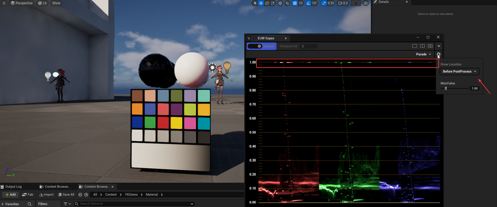

이때 MaxValue를 높이면 1을 초과하는 색상을 볼 수 있습니다.

주의할 점은 UE의 반투명은 일반적으로 후처리 단계에서 화면에 합성됩니다. 따라서 DrawLocation을 Before PostProcess로 선택하면 반투명 오브젝트가 보이지 않을 가능성이 높습니다.

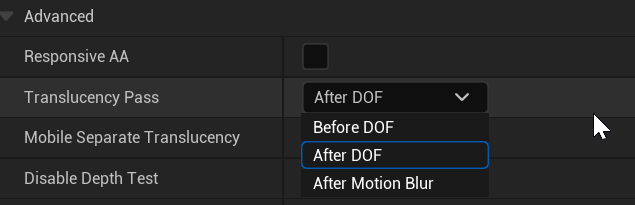

이때 Draw Location을 After Motion Blur로 변경하면 화면의 반투명 오브젝트를 볼 수 있습니다.

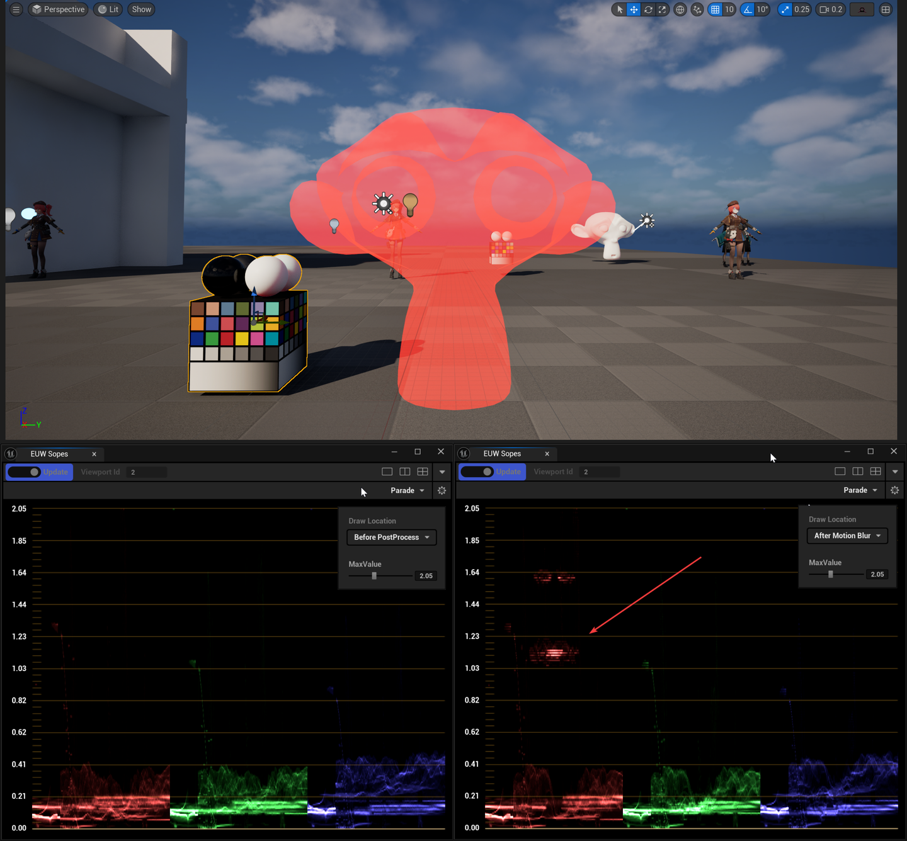

---

### 2.2 색상 피커 기능

추가로 색상 피커 기능도 만들었습니다. 도구 우측 상단의 삼각형을 클릭하면 사이드바가 나타납니다.

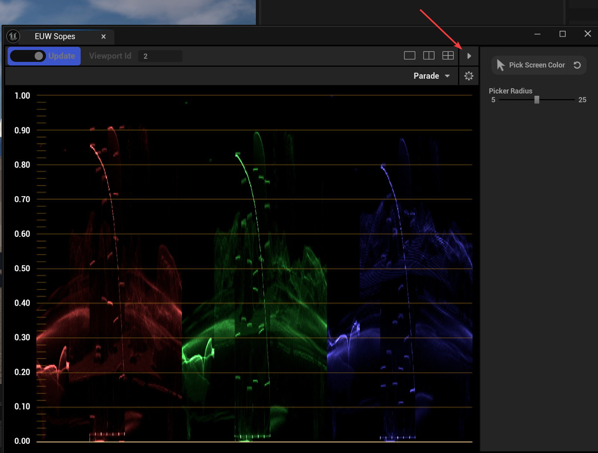

Pick Screen Color 버튼을 클릭하면 마우스 위치에 원이 나타나고, 도구가 원 범위 내 색상의 평균값을 계산합니다. 스코프 위에 색상 값이 표시되고, 스코프에서 해당 색상의 위치도 표시됩니다.

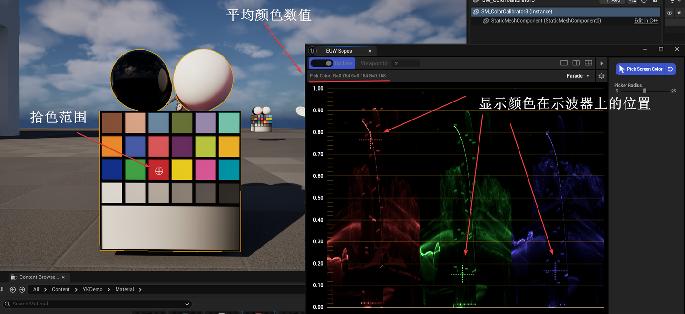

Picker Radius를 조정하여 색상 추출 범위의 반경 크기를 조절할 수도 있습니다.

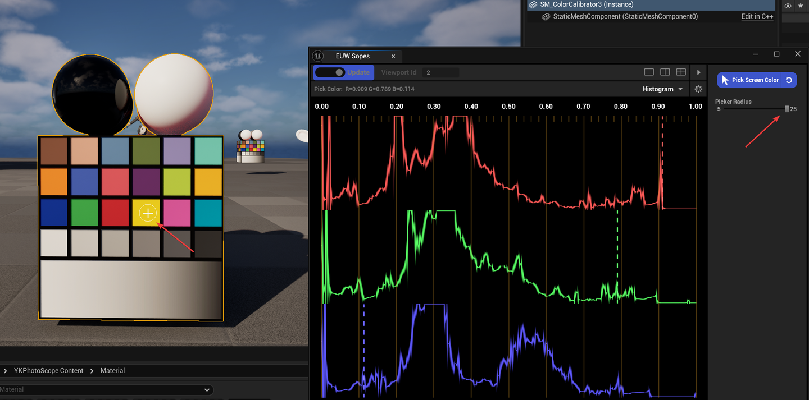

---

## 3. 마무리

### 3.1 참고 자료

- [【UE5】【Niagara】실시간 스코프(히스토그램, 파형도, 벡터도)](https://zhuanlan.zhihu.com/)
- [UE5 컬러 헌터: 다빈치에 필적하는 컬러 파형 스코프 직접 작성하기](https://zhuanlan.zhihu.com/)

### 3.2 프로젝트

도구는 UE 플러그인 형태로 Github에 공개되어 있습니다. UE5.5 버전이며, 다운로드하여 Plugins 폴더에 넣으면 사용할 수 있습니다.

**GitHub**: [https://github.com/Yu-ki016/YKPhotoScope](https://github.com/Yu-ki016/YKPhotoScope)
