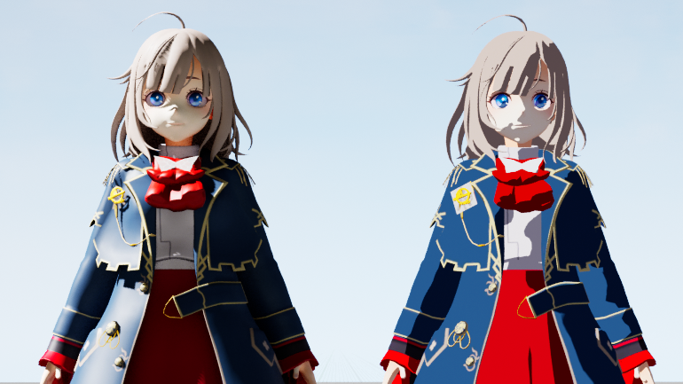

# 셀 셰이딩 입문

Unlit Shader와 내적(Dot Product)을 이용한 기본 셀 셰이딩 구현

---

안녕하세요. 주식회사 스파크 크리에이티브의 `Client Engineer` 호소이입니다.

저희 회사에서는 매달 사내 블로그를 게시하고 있는데, 이번에 `CGWORLD.jp`에 기고할 기회를 얻게 되어 사내 엔지니어 스태프들이 몇 차례에 걸쳐 `UE`에서의 셀 셰이딩에 관한 기사를 써 내려가려 합니다.

이번에는 셀 셰이딩의 기본을 복습하면서 에디터 상에서 완결할 수 있는 표현을 다뤄보겠습니다. 처음에는 `UE` 에디터 내에서만 완결할 수 있는 방법이지만, 연재 후반부에는 엔진 개조를 포함한 표현을 기사로 정리해 보고자 합니다.

---

## 1. 셀 셰이딩이란?

이 기사를 읽고 계신 분들은 이미 알고 있다고 생각하실지도 모르겠지만, 처음 `Shader`라는 것을 접하는 분들을 위해 간단하게나마 셀 셰이딩이란 무엇인지 확인해 봅시다.

「셀 룩」, 「툰 셰이더」라고 불리기도 하는 셀 셰이더는, 셀이나 툰이라는 이름에서 연상할 수 있듯이 애니메이션의 셀화 느낌이나 만화 같은 외형을 만들기 위한 기법입니다.

그게 대체 어떤 외형이지? 하고 생각하는 분들도 계실 것 같습니다.

글로 설명하기는 참 어렵지만, 의도적으로 색상 수를 제한해서 모델의 입체감을 없애거나 실제로는 존재하지 않는 `아웃라인(주선)`을 그려 넣음으로써, 「3D인데도 손으로 그린 듯한 외형」이 됩니다.

---

## 2. UE에서 셀 Shader를 구현하려면?

UE에서 셀 Shader를 구현하기 위해서는 몇 가지 수법이 존재합니다. 그중에서도 본 연재에서는 다음 3가지에 초점을 맞춥니다.

1. **Unlit Shader**
2. **Post Process**
3. **Engine 개조**

| 수법 | Unlit Shader | Post Process | Engine 개조 |
|------|--------------|--------------|-------------|
| **개요** | UE의 Shader를 사용하지 않고 Material 내에서 자체적으로 Lighting을 구현함 | Post Process Material을 수정하여 Lighting을 구현함 | Engine Code를 수정하여 Lighting을 구현함 |
| **장점** | Material마다 Shading이나 색상을 설정할 수 있음 | UE의 Shading을 사용하면서도 커스터마이즈가 가능함 | 극단적으로 말해 리소스가 허용하는 한 모든 표현을 구현할 수 있음 |
| **단점** | UE의 Light 계산이나 그림자를 사용할 수 없음 | Material 단위로 추가적인 색상 설정 등을 하기가 어려움 | 구현 및 유지보수 비용 |

이번에는 비교적 난이도가 낮은 **'Unlit Shader'**를 이용한 표현을 진행해 보겠습니다.

---

### 작업 환경

이번 구현은 아래 환경에서 진행되었습니다.

- **Windows 10**
- **Visual Studio 2019**
- **Unreal Engine 5.1.1**

---

## 3. 내적을 통한 음영 표현

자, 셀 Shader를 작성하는 데 있어 빼놓을 수 없는 것이 바로 「내적」입니다.

모델의 `Normal(법선)`과 `Light Vector`의 내적을 구함으로써, `-1`~`0`, `0`~`1`이라는 두 가지 범위로 나눌 수 있습니다.

이 두 범위는 각각 빛이 닿는 곳과 닿지 않는 곳을 가리키며, 그 라인을 기준으로 그림자를 넣음으로써 더욱 셀 Shader다운 뚜렷한 외형이 되는 것입니다.

그림으로 설명하면 이런 느낌입니다.

-1 ~ 0 사이는 빛이 닿지 않으므로 검정, 0 ~ 1 사이는 빛이 닿고 있으므로 흰색이라는 식으로 깔끔하게 두 개로 나눌 수 있습니다!

---

## 4. 실제로 만들어 봅시다!

### STEP 1: 모델 준비

이번에는 다음 모델을 사용합니다. 이미지는 `Opaque Shader`를 사용한 외형입니다. 이 모델에 `Unlit Shader`를 적용해 보겠습니다.

먼저, [기본 Asset 작성]에서 [Material]을 선택합시다. Content Browser 내에 Material이 생성되었다면 마우스 오른쪽 버튼 클릭 → [Material Instance 작성]을 선택하고, 모델의 Material 개수만큼 Material Instance를 생성합시다.

생성이 완료되면, 모델의 Material에 각각 세팅해 봅니다. ※ 모델에 따라 여기의 Material 개수는 달라집니다.

그러면, 모델이 새카맣게 변했을 것으로 생각합니다.

여기가 시작 지점입니다.

---

### STEP 2: 노드 작성

Parent Material을 열고, 셀 Shader를 만들어 가겠습니다.

처음에 설명한 대로, 이번에는 Unlit Shader를 사용하므로 Shading Model은 [Unlit]으로 설정해 둡니다.

그러면, Light의 Vector를 가져와 봅시다.

UE의 Light에는 Directional, Point, Spot, Sky의 4종류가 있습니다.

이번에는 그중 하나인 Directional Light를 이용하여 셀 셰이딩 표현을 해보겠습니다. 즉, Directional Light가 닿는 부분은 흰색, 닿지 않는 부분은 검은색이 된다는 뜻입니다.

곧바로 노드를 만들어 보겠습니다. `SkyAtmosphereLightDirection` 이라고 검색해 보세요. 다음과 같은 노드가 생성되었을 것입니다.

이어서, 모델의 Normal(법선) 정보를 가져옵니다. 「VertexNormalWS」라고 검색합시다.

이것으로 내적을 구하기 위한 소재가 두 가지 모두 갖춰졌습니다.

그럼 내적 계산을 해봅시다! Dot 노드를 사용할 수도 있지만, 이번에는 아래 식을 Blueprint로 재현해 보겠습니다.

Vector의 성분을 가져오기 위해 Component Mask 노드를 사용합니다. R에는 위 식의 a1, b1을, G에는 a2, b2를, B에는 a3, b3가 전달됩니다. 각각을 곱한 후, 더함으로써 내적을 구할 수 있습니다.

출력 결과를 Emissive Color에 연결해 봅시다.

아래와 같은 외형이 되었을 것입니다. 조금 무섭지만, 모델에 음영이 생겼네요.

더욱 셀 Shader답게 뚜렷한 음영을 표현하기 위해, 내적 결과를 100배 하고, 그 결과를 Clamp로 0과 1의 범위로 제한합니다.

이로 인해, 내적 결과로 -1 ~ 1이 전달되던 곳에 0 또는 1이 전달되게 되었습니다.

음영이 뚜렷해진 것을 알 수 있네요.

---

### STEP 3: Texture 설정

슬슬 Texture를 설정할 수 있도록 합시다. `TextureSampleParameter2d`라고 검색하여 노드를 추가합니다.

실제로 사용하는 Texture는 처음에 생성한 Material Instance에서 각각 설정할 것이므로, 일단은 하얀 이미지를 넣어 둡니다.

또한, 그림자 색상을 조정하기 위한 노드도 추가합니다. `VectorParameter`라고 검색합시다. 그림자는 Texture 색상과 곱하지(Multiply) 않으면 단순한 단색이 되어버리므로, Multiply를 추가하여 각각 연결해 둡시다.

마지막으로 `Linear interpolate`라고 검색하여 노드를 추가합시다.

이 Lerp라는 노드는 선형 보간을 해주는 노드입니다. A, B에 Texture와 그림자 색상을 연결하고, Alpha에는 조금 전까지 Emissive Color에 연결했던 내적 결과를 연결합니다.

내적 결과는 0 또는 1이 반환되도록 되어 있으며, 선형 보간 결과 0이면 그림자 색상, 1이면 Texture가 반환됩니다.

최종적인 Blueprint는 이와 같습니다.

실제로 Material Instance에 Texture를 설정해 봅시다.

Material Instance를 열고, [`BaseTexture`]를 체크한 뒤 사용할 Texture를 설정합니다.

결과는……

그림자가 너무 짙네요. 그림자 색상을 조금 조정해 봅시다.

회색 정도로 해보았습니다. Material Instance에서 개별적으로 그림자 색상을 설정할 수도 있으니, 퀄리티를 높이고 싶다면 다양한 색상을 시도해 봅시다!

---

### STEP 4: 결과

최종 결과는 이와 같이 되었습니다.

조금 너무 밋밋해졌네요.

특히 스커트는 Unlit Shader에 의해 주름 느낌이 사라져 버렸습니다. 이는 정점의 Normal과 Directional Light의 내적 결과만을 사용하고 있기 때문입니다.

여기에 추가로 Normal Map을 더함으로써, 정점의 Normal을 이용한 음영보다 더 세밀한 음영을 표현할 수 있도록 하겠습니다.

---

## 5. Normal Map을 통한 Detail 추가

방금 전까지는 `VertexNormalWS` 노드를 사용하여 모델의 `Normal` 정보를 가져왔습니다. 하지만 그럴 경우 스커트 등 세밀한 부분을 표현하기는 어렵습니다.

| Normal Map 적용 전 | Normal Map 적용 후 |
|-------------------|-------------------|
|  |  |

`Normal Map`이란 폴리곤에 입힘으로써 폴리곤의 `Normal`과는 별개로 내부의 세밀한 기복 방향을 `Texture`로 표현할 수 있게 한 것으로, 단 한 장의 판 폴리곤조차 표면에 요철이 있는 것처럼 보이게 할 수 있습니다.

실제로 어떻게 기복의 방향을 판정하는가 하면, `Normal`과는 별도의 Vector를 준비할 필요가 있습니다.

`Vector`를 만들기 위해서는 `XYZ` 3가지 성분이 필요합니다. `Texture`에서 3가지 성분을 준비하자면…… RGB를 사용할 수 있을 것 같습니다! `Normal Map`에서는 `X` 성분을 `R`, `Y` 성분을 `G`, 그리고 `Z` 성분을 `B`로 표현하는 것이 일반적입니다. 이렇게 해서 `Normal`과는 별도의 `Vector`를 준비할 수 있었습니다.

이것을 앞서 사용한 `VertexNormalWS` 부분에 교체해 보면……

*▲ Normal Map*

스커트에 주름 느낌이 살아나기 시작했습니다.

또한, 머리카락에 Normal Map을 적용해 보면 다음과 같이 됩니다.

*▲ Normal Map*

| Normal Map 적용 전 | Normal Map 적용 후 |
|-------------------|-------------------|
|  |  |

---

## 6. RG채널만 사용한 Normal Map 적용

일반적으로 언리얼 엔진에서 노말맵 압축(BC5)을 사용하면 Z(B) 채널이 소실되어 다른 마스크 데이터를 담을 수 없습니다. 프로젝트의 최적화를 위해 **하나의 텍스처에 노말 정보(RG)와 마스크 데이터(B/A)를 동시에 패킹**해야 하는 경우, 텍스처 설정을 'Normal Map'이 아닌 'Default'로 유지해야 합니다.

이 경우 엔진의 자동 변환 기능을 사용할 수 없으므로, **수학적 연산을 통해 RG 채널을 노말 벡터 범위(-1 to 1)로 재정렬하고 소실된 Z값을 복원하는 수동 변환 로직**이 필수적으로 요구됩니다. 이는 텍스처 샘플러 비용을 줄이는 대신 산술 연산 성능을 활용하는 전략적 최적화 방식입니다.

### 6.1 RG 채널을 노말 벡터로 만들기 (수동 복구)

텍스처 압축을 건드릴 수 없으므로, 노드에서 직접 수학적으로 계산해야 합니다.

- **Step 1:** `NormalTexture`의 **R**과 **G** 핀을 각각 뽑습니다.
- **Step 2:** 각각의 핀 뒤에 `ConstantBiasScale` (Bias: -0.5, Scale: 2.0)을 연결합니다. (이걸 해야 0~1 값이 노말값인 -1~1이 됩니다.)
- **Step 3:** **AppendVector** 노드를 꺼내 R 결과와 G 결과를 합칩니다.
- **Step 4:** **DeriveNormalZ** 노드에 연결합니다. (이 노드가 RG를 가지고 사라진 B값을 계산해 완벽한 3D 화살표를 만듭니다.)

### 6.2 공간 맞추기 (Transform)

가장 중요한 단계입니다. 빛은 'World 기준'이고 노말맵은 '캐릭터 표면 기준'이라서 계산이 안 되는 것입니다.

- `SkyAtmosphereLightDirection` 뒤에 **Transform** 노드를 답니다.
    - **Source:** World
    - **Destination:** Tangent

### 6.3 최종 Dot 연산

이제 기준이 같아진 두 값을 계산합니다.

- **Dot 노드**를 꺼냅니다.
- **A:** 변환된 빛 방향 (Tangent Space)
- **B:** 복구된 노말 벡터 (DeriveNormalZ 결과)

### 최종 노드 구조 요약

1. **Light:** `LightDirection` -> `Transform (World to Tangent)` -> **Dot (A)**
2. **Normal:** `Texture RG` -> `BiasScale (-0.5, 2.0)` -> `DeriveNormalZ` -> **Dot (B)**
3. **Result:** `Dot` -> `Clamp` -> `Step` (그림자 경계 조절)

**이렇게 하면 텍스처 설정을 바꾸지 않고도 B 채널을 마스크로 쓰면서, RG만으로 정확한 툰 그림자를 만들 수 있습니다.** 혹시 `Transform` 노드를 여전히 못 찾으시겠다면, 우클릭 메뉴의 **'VectorOps'** 카테고리를 직접 뒤져보시면 그 안에 들어있을 거예요! 이 노드 없이 그림자를 계산하려면 수학이 훨씬 복잡해집니다.

---

## 7. 마지막으로

실제로 만들어 보면, 기본적인 음영에 의한 셀 Shader의 구현 절차는 많지 않다는 것을 알 수 있습니다.

하지만 완성된 모델을 보고, 내가 알고 있는 그 게임의 캐릭터는 더 멋있었다거나, 귀여웠다거나 하는 생각이 들었을지도 모릅니다.

이번에 구현한 것은 어디까지나 기본 중의 기본입니다. 다음 회차부터는 당사의 Graphics Engineer가 사용하는 다양한 기법을 통해, 더욱 멋진 셀 셰이딩을 소개해 드릴 수 있도록 하겠습니다.

---

## 참고

- [원문: CGWORLD - UE5セルシェーディング入門 第1回](https://cgworld.jp/regular/202306-ue5toon-01.html)
- 저자: 호소이 히로하 (Spark Creative Inc.)
